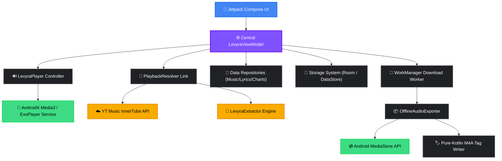

<div align="center">
 

 
 
# 🎶
 
**A high-performance, native Android music client designed for pristine playback and complete audio control.**
 
*Fast discovery · Immersive visualizer · Resilient background downloading · Offline-first tag manager.*
 
---
 
<p>
  
  
  
  
  
  
</p>
 
[⬇️ Download](#-download-levyra) • [📱 Inside Levyra](#-inside-levyra) • [✨ Key Features](#-key-features) • [🌐 Architecture](#-architecture) • [🛠️ Technical Stack](#%EF%B8%8F-technical-stack) • [🚀 Getting Started](#-getting-started) • [🔒 Permissions](#-permissions-and-privacy) • [📝 License](#-disclaimers--license)
 
<br>
 

 
</div>
 
<br>
 
## ✦ Download Levyra

<div align="center">
  <a href="https://github.com/LUC4N3X/Levyra-deepsound/releases/latest">
    
  </a>
  <br><br>
  <sub>Official stable APK · Signed release · Android 8.0 or newer</sub>
  <br><br>
  <a href="https://github.com/LUC4N3X/Levyra-deepsound/releases/latest">
    
  </a>
  <a href="https://github.com/LUC4N3X/Levyra-deepsound/releases">
    
  </a>
</div>

<br>

## ✦ What is Levyra?
 
Unlike typical wrapper or web-reskin apps, **Levyra** is a native, ground-up Android audio application. It queries, resolves, and streams music dynamically using YouTube Music's InnerTube API with a LevyraExtractor-powered fallback, routes audio via an optimized **AndroidX Media3/ExoPlayer** background service, and outputs full tracks straight into your local storage. 
 
Every track you download is fully parsed, tagged, and structured as a clean M4A file in your system `Music/Levyra` directory, complete with embedded metadata, titles, artists, and album artwork. 
 
```text
📦 Application Specifications
├── Package Name      com.luc4n3x.levyra
├── Target SDK        35 (Android 15)
├── Min SDK           26 (Android 8.0)
├── Primary Language  100% Kotlin
├── UI Framework      Jetpack Compose + Material 3 (M3)
└── Audio Foundation  AndroidX Media3 / ExoPlayer Engine
```
 
<br>
 
## ✦ Inside Levyra
 
<p align="center">
  <strong>Four views. One continuous listening experience.</strong><br>
  <sub>Discovery, playback, intelligent lyrics, and private listening insights — designed as a single native Android journey.</sub>
</p>
 
<br>
 
<table width="100%">
  <tr>
    <td width="25%" align="center" valign="top">
      <a href="https://i.ibb.co/ynBG2ZQX/Whats-App-Image-2026-07-12-at-12-28-57.jpg">
        
      </a>
      <br><br>
      <strong>01 · Your Orbit</strong><br>
      <sub>Personal discovery, living recommendations, and sections shaped around the way you listen.</sub>
    </td>
    <td width="25%" align="center" valign="top">
      <a href="https://i.ibb.co/tp5gW9ZY/Whats-App-Image-2026-07-12-at-12-30-01.jpg">
        
      </a>
      <br><br>
      <strong>02 · Immersive Player</strong><br>
      <sub>A focused now-playing view with visual feedback, full controls, and instant Song / Video switching.</sub>
    </td>
    <td width="25%" align="center" valign="top">
      <a href="https://i.ibb.co/LXGYw6Yb/Whats-App-Image-2026-07-12-at-12-30-55.jpg">
        
      </a>
      <br><br>
      <strong>03 · Intelligent Lyrics</strong><br>
      <sub>Source-aware synchronized lyrics with optional transcript translation and graceful fallbacks.</sub>
    </td>
    <td width="25%" align="center" valign="top">
      <a href="https://i.ibb.co/twTrmtDL/Whats-App-Image-2026-07-12-at-12-31-58.jpg">
        
      </a>
      <br><br>
      <strong>04 · Listening Pulse</strong><br>
      <sub>Private on-device statistics, real listening history, streaks, completion, and top artists.</sub>
    </td>
  </tr>
</table>
 
<p align="center">
  <sub>Open any preview to view it at full resolution.</sub>
</p>
 
<br>
 
## ✦ Key Features
 
<table width="100%">
  <tr>
    <th width="50%" align="left">🎨 Dynamic & Modern Interface</th>
    <th width="50%" align="left">⚡ Robust Playback Engine</th>
  </tr>
  <tr>
    <td valign="top">
      <ul>
        <li><strong>Dark-First Polish:</strong> Clean, high-contrast dark theme optimized for OLED screens.</li>
        <li><strong>Fluid Transitions:</strong> Bottom navigation layout connecting Home, Search, Library, and Player with custom micro-animations.</li>
        <li><strong>Dual-State Player:</strong> Swap seamlessly between an unobtrusive mini-player and an immersive fullscreen interface.</li>
        <li><strong>Dynamic Material 3:</strong> Optional system-wide dynamic color adaptation and visual animation toggle.</li>
      </ul>
    </td>
    <td valign="top">
      <ul>
        <li><strong>Foreground Media Service:</strong> Powered by Media3 and MediaSession controls to handle playback even when the screen is off.</li>
        <li><strong>Smart Playback Controls:</strong> Loop (all/single), track shuffle, playback speed tuner, and custom sleep timers (15/30/60m).</li>
        <li><strong>Audio Tuning:</strong> In-app audio normalization, silence skipping, and custom quality selectors (Auto/High/Low).</li>
        <li><strong>SponsorBlock Integration:</strong> Automatically skips non-music or sponsored segments in real time.</li>
      </ul>
    </td>
  </tr>
  <tr>
    <th width="50%" align="left">📥 Offline Export Pipeline</th>
    <th width="50%" align="left">🔍 Stream Resolving & Search</th>
  </tr>
  <tr>
    <td valign="top">
      <ul>
        <li><strong>No Cache Blobs:</strong> Exports actual media files directly to the public <code>Music/Levyra</code> directory.</li>
        <li><strong>Pure-Kotlin Tagging:</strong> Embeds high-res album covers, song titles, album names, and artist metadata on completion.</li>
        <li><strong>WorkManager Daemon:</strong> Background tasks persist through system reboots, handling network changes with smart retries.</li>
        <li><strong>Truncation Shield:</strong> Rigid Content-Length checks discard corrupted or incomplete files and schedule auto-retries.</li>
      </ul>
    </td>
    <td valign="top">
      <ul>
        <li><strong>InnerTube + LevyraExtractor Resolver:</strong> Dual-channel media resolution with smarter Opus/M4A selection, fresh URL caching, and stronger fallback when YouTube changes stream signatures.</li>
        <li><strong>Intelligent Caching:</strong> TTL-based playback stream cache prevents duplicate server requests and speeds up loading.</li>
        <li><strong>Smart Search:</strong> Predictive search suggestions, categorized filters, and instant top-result matching.</li>
        <li><strong>Prefetching Engine:</strong> Ahead-of-time loading for top charts and queued songs to guarantee zero-gap playback.</li>
      </ul>
    </td>
  </tr>
  <tr>
    <th colspan="2" align="left">📊 Listening Pulse — Private Stats</th>
  </tr>
  <tr>
    <td colspan="2">
      <ul>
        <li><strong>On-Device Listening Statistics:</strong> Listening-session metrics used by Pulse are stored locally in Room and are not uploaded as analytics or developer telemetry. Search, artwork, lyrics, playback, SponsorBlock, and optional account features still contact third-party services and may transmit ordinary network/request data.</li>
        <li><strong>Pulse Dashboard:</strong> Total minutes, plays, day streak, completion rate, peak listening hour and a 7-day rhythm chart inside the Library.</li>
        <li><strong>Top Artists & True History:</strong> Most-listened artists ranked by real playtime plus a history of what you actually played, not just what you searched.</li>
      </ul>
    </td>
  </tr>
  <tr>
    <th colspan="2" align="left">🎵 Synced & Offline Lyrics</th>
  </tr>
  <tr>
    <td colspan="2">
      <ul>
        <li><strong>LRCLIB Integration:</strong> Instant lookup of synced and static lyrics based on track metadata.</li>
        <li><strong>Active Tracker:</strong> Smooth, time-synced scrolling highlights lines in sync with the ExoPlayer track position.</li>
        <li><strong>Graceful Degradation:</strong> Automated fallback to static text views when timestamped lyrics are unavailable.</li>
      </ul>
    </td>
  </tr>
</table>
 
<br>
 
## ✦ Architecture
 
Levyra strictly follows unidirectional data flow (UDF) guidelines. Jetpack Compose handles rendering, while state lives in a centralized ViewModel. Downstream repositories and services act as decoupled boundaries, preventing network or database operations from blocking the main thread.
 

 
### Component Layout
 
| Layer | Responsibility | Project Directory |
|:---|:---|:---|
| **UI Presentation** | Composable screens, mini-player layouts, layout triggers, theme engines | [`ui/`](file:///C:/Users/Luca%20Drogo/Desktop/Levyra-deepsound/app/src/main/java/com/luc4n3x/levyra/ui) |
| **State Management** | Centralized ViewModel orchestrating single-source UI state | [`viewmodel/`](file:///C:/Users/Luca%20Drogo/Desktop/Levyra-deepsound/app/src/main/java/com/luc4n3x/levyra/viewmodel) |
| **Domain Logic** | Abstract domain entities, data models, validation boundaries | [`domain/`](file:///C:/Users/Luca%20Drogo/Desktop/Levyra-deepsound/app/src/main/java/com/luc4n3x/levyra/domain) |
| **Data & Network** | Web endpoints, charts API client, lyrics parser, preferences config | [`data/`](file:///C:/Users/Luca%20Drogo/Desktop/Levyra-deepsound/app/src/main/java/com/luc4n3x/levyra/data) |
| **Audio Pipeline** | Media3 foreground service, HLS, prefetching queue control | [`player/`](file:///C:/Users/Luca%20Drogo/Desktop/Levyra-deepsound/app/src/main/java/com/luc4n3x/levyra/player) |
| **Background Exports** | WorkManager pipeline, metadata tagging, MediaStore registrations | [`player/offline/`](file:///C:/Users/Luca%20Drogo/Desktop/Levyra-deepsound/app/src/main/java/com/luc4n3x/levyra/player/offline) |
| **Local Cache** | SQLite database, Room entities, and key-value preference stores | [`data/local/`](file:///C:/Users/Luca%20Drogo/Desktop/Levyra-deepsound/app/src/main/java/com/luc4n3x/levyra/data/local) |
 
<br>
 
## ✦ Technical Stack
 
*   **Language:** Kotlin 2.4.0
*   **User Interface:** Jetpack Compose, Material 3 Design Components, Compose BOM
*   **Media Playback:** AndroidX Media3, ExoPlayer, HLS Playback, MediaSession
*   **Network Transport:** OkHttp 5, Brotli compression module
*   **Image Caching:** Coil 3 (Compose-optimized asynchronous image loading)
*   **Data Persistence:** Room Database, DataStore Preferences
*   **Background Jobs:** Android WorkManager Daemon
*   **Serialization:** kotlinx.serialization (JSON)
*   **Build Pipeline:** Gradle Kotlin DSL (`.gradle.kts`), Version Catalogs (`libs.versions.toml`), KSP (Kotlin Symbol Processing)
*   **APK Size Guard:** Spotify Ruler report workflow for bundle size analysis and dependency weight tracking
*   **Player Architecture:** Mobius-sample-inspired `Model / Event / Effect / Update` foundation for safe player refactoring
*   **Extraction Layer:** InnerTube resolver plus GPL-3.0 LevyraExtractor playback core via JitPack
 
<br>
 
## ✦ Getting Started
 
### Prerequisites
*   Android Studio Jellyfish (or newer)
*   Java Development Kit (JDK) 17
*   Android SDK Platform 37 (`compileSdk = 37`, `targetSdk = 35`)
*   Gradle 9.6.1 through the repository Gradle Wrapper
 
### Building the Project
Clone the repository and compile the debug configuration directly to a connected Android device or emulator:
 
```bash
# Clone the repository
git clone https://github.com/LUC4N3X/Levyra-deepsound.git
cd Levyra-deepsound
 
# Build and install the debug app on your connected device
./gradlew installDebug
 
# Compile a clean, optimized release build
./gradlew clean assembleRelease
 
# Analyze bundle size with Spotify Ruler
./gradlew :app:analyzeDebugBundle
```
 
The resulting signed/unsigned release APK will be located in:
`app/build/outputs/apk/release/app-release.apk`
 
Architecture and size-control notes:
 
```text
docs/APK_SIZE_RULER.md
docs/PLAYER_MOBIUS_SAMPLE_ARCHITECTURE.md
```
 
### Version Control & CI overrides
The application's version numbering is centralized inside `gradle.properties`:
```properties
levyraVersionName=2.3.8
levyraVersionCode=2030800
```
*Version code logic is calculated sequentially to prevent duplicate deployment IDs:*
`versionCode = major * 1_000_000 + minor * 10_000 + patch * 100 + build`
 
Our automated GitHub Action workflow parses this schema, checks target versions using `aapt`, verifies structural integrity, compiles the binary, names the artifact `LEVYRA-<version>.apk`, and ships it directly to **GitHub Releases**.
 
<br>
 
## ✦ Permissions and Privacy
 
Levyra does not include analytics frameworks, tracking SDKs, or developer-operated telemetry. Listening statistics generated by Pulse remain on the device. To provide search, artwork, lyrics, playback, SponsorBlock, and optional account features, the app contacts third-party services; those services may receive ordinary request data such as the IP address, HTTP headers, client or device information, and, where applicable, cookies or account identifiers.
 
```text
🛡️ DECLAREDS MANIFEST PERMISSIONS
├── INTERNET & ACCESS_NETWORK_STATE       Streams music data and queries metadata
├── FOREGROUND_SERVICE_MEDIA_PLAYBACK     Ensures audio playback survives app backgrounding
├── POST_NOTIFICATIONS                     Displays the Media3 media controller notification
├── WAKE_LOCK                              Prevents playback stutters when the CPU goes to sleep
└── WRITE_EXTERNAL_STORAGE (≤ SDK 28)     Legacy permission for offline file export
```
 
<br>
 
## ✦ Contributing to the Fork
 
If you intend to distribute custom builds of Levyra:
1. **Signing Keys:** Generate and rotate your own Android keystores before publishing public packages.
2. **Build Name:** Follow the standard release schema: `LEVYRA-<version>.apk` rather than default gradle outputs.
3. **Execution Offloading:** All database, disk write, and network resolutions must run on background dispatchers (`Dispatchers.IO`). Keep UI threads clear.
4. **Resiliency:** Ensure API queries route via the fallback channel if they timeout.
 
<br>
 
## ✦ Credits
 
<table>
  <tr>
    <td width="100" align="center">
      <a href="https://github.com/LUC4N3X">
        
      </a>
    </td>
    <td>
      <strong>LUC4N3X</strong> — <em>Creator & Lead Architect</em>
      <p>System architecture, ExoPlayer orchestration, background WorkManager export queue, automated releases pipeline, design lead.</p>
    </td>
  </tr>
</table>
 
*UI and modular styling conventions draw structural inspiration from the open-source project [Metrolist](https://github.com/MetrolistGroup/Metrolist).*
 
*The stream extraction core uses [LevyraExtractor](https://github.com/LUC4N3X/LevyraExtractor), a GPL-3.0 fork derived from [PipePipeExtractor](https://github.com/InfinityLoop1308/PipePipeExtractor) in the NewPipe/PipePipe ecosystem.*
 
---
 
## ✦ Disclaimers & License
 
> [!WARNING]  
> **Educational and Research Purposes Only**  
> Levyra is an open-source client and does not host, upload, or index copyrighted files. The app interacts solely with public, third-party content endpoints. The user takes full responsibility for any usage that may violate local laws or third-party terms of service. The developers assume no liability for service changes, system blocks, or client misuse.
 
Licensed under the **GNU General Public License v3.0** — see the [LICENSE](LICENSE) file for details.
