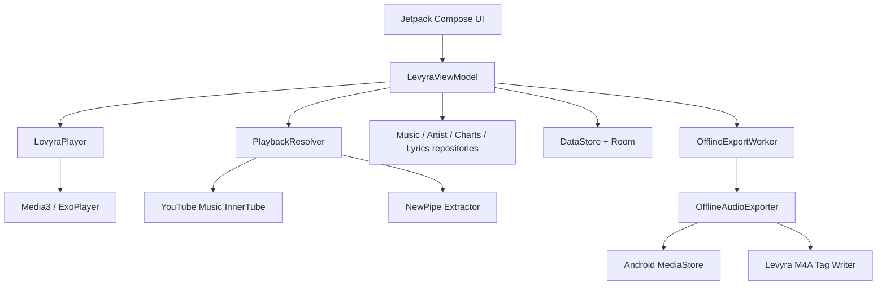

<div align="center">


# Levyra

**A native Android music client built for people who actually care about audio.**

Fast discovery · immersive playback · offline exports that survive real-world networks.

<p>
  
  
  
  
</p>

<p>
  <a href="#-what-is-levyra">What is it</a> ·
  <a href="#-feature-map">Features</a> ·
  <a href="#-architecture">Architecture</a> ·
  <a href="#-getting-started">Build</a> ·
  <a href="#-releases--ci">Releases</a> ·
  <a href="#-contributing-to-the-fork">Forking</a>
</p>


</div>

<br>

## ✦ What is Levyra

Levyra is a from-scratch Android music player, not a reskin. It resolves and streams music through YouTube Music / InnerTube with a NewPipe Extractor fallback, plays it through a proper Media3/ExoPlayer foreground service, and — when you want it offline — downloads the full track, tags it, and drops it straight into your `Music/Levyra` folder as a real file with embedded metadata and artwork.

Everything below the UI is built the way a production media app should be: state lives in one ViewModel, playback never touches the main thread, downloads run through WorkManager with retry and truncation guards, and stream resolution is centralized instead of scattered across screens.

```text
Package      com.luc4n3x.levyra
Version      2.2.0
Min SDK      26 (Android 8.0)
Target SDK   35
Compile SDK  36
Language     100% Kotlin
UI           Jetpack Compose + Material 3
Playback     AndroidX Media3 / ExoPlayer
```

<br>

## ✦ Feature map

<table>
<tr><td width="50%" valign="top">

**Interface**
- Dark-first, high-contrast Compose UI
- Bottom nav: Home · Search · Library · Player
- Floating mini-player + fullscreen player
- Waveform-style visual feedback
- Dynamic color, optional animation toggle

**Discovery**
- Real YouTube Music home feed, parsed into sections
- Search with suggestions, top result, songs/artists/albums
- Mood-based onboarding, regional charts
- Recent searches, recently played, artist pages

**Lyrics**
- Synced + unsynced lyrics via LRCLIB-style lookup
- Position-tracked active line
- Graceful fallback when sync isn't available

</td><td width="50%" valign="top">

**Playback engine**
- Media3 foreground service, MediaSession controls
- Queue-aware next/previous, autoplay, loop
- Repeat all / one, shuffle, speed control
- Sleep timer (15 / 30 / 60 min)
- Auto / High / Low audio quality
- Optional normalization, skip-silence, SponsorBlock

**Stream resolving**
- InnerTube primary path, NewPipe fallback
- Multiple client profiles for resilience
- TTL stream cache + in-flight deduplication
- Queue and top-list prefetching

**Offline export**
- Real file download to `Music/Levyra`, not a cache blob
- Content-length verification — truncated downloads are rejected and retried, never saved as "complete"
- WorkManager pipeline: progress, retry, duplicate guard
- Pure-Kotlin M4A tag writer — title, artist, album, cover art
- Room-backed download history

</td></tr>
</table>

<br>

## ✦ Architecture

Compose renders. The ViewModel decides. Everything else is a boundary the UI never reaches into directly.



| Layer | Owns | Where |
|---|---|---|
| UI | Screens, player layout, theme | `ui/` |
| ViewModel | Single source of truth for all app state | `viewmodel/` |
| Domain | Track models, mood engine, lyrics engine | `domain/` |
| Data | Discovery, charts, lyrics, preferences | `data/` |
| Playback | Media3 engine, stream cache, warmup | `player/` |
| Offline | Download pipeline, tagging, MediaStore | `player/offline/` |
| Persistence | Room entities/DAO for favorites, playlists, downloads | `data/local/` |

**46 Kotlin files, one ViewModel, zero god-activities.**

<br>

## ✦ Tech stack

| | |
|---|---|
| Language | Kotlin 2.3.20 |
| UI | Jetpack Compose, Material 3, Compose BOM |
| Playback | AndroidX Media3, ExoPlayer, MediaSession, HLS |
| Networking | OkHttp 5, Brotli |
| Images | Coil 3 |
| Persistence | Room, DataStore Preferences |
| Background work | WorkManager |
| Serialization | kotlinx.serialization |
| Build | Gradle Kotlin DSL, Version Catalog, KSP |
| Distribution | GitHub Actions → GitHub Releases |

<br>

## ✦ Getting started

**Requirements:** Android Studio Jellyfish+, JDK 17, Android SDK Platform 36, Gradle 8.14.4 (wrapper included).

```bash
git clone https://github.com/LUC4N3X/Levyra-deepsound.git
cd Levyra-deepsound
./gradlew installDebug        # debug build, straight to a connected device
./gradlew clean assembleRelease
```

Release APK lands at `app/build/outputs/apk/release/app-release.apk`.

<br>

## ✦ Versioning

Controlled from `gradle.properties`, overridable by CI:

```properties
levyraVersionName=2.2.0
levyraVersionCode=2020000
```

```text
versionCode = major * 1_000_000 + minor * 10_000 + patch * 100 + build

2.1.0   → 2010000
2.2.0   → 2020000
2.2.1   → 2020100
```

<br>

## ✦ Releases & CI

```bash
git tag v2.2.0
git push origin v2.2.0
```

The release workflow resolves the version from the tag, builds, verifies `versionName`/`versionCode` with `aapt`, renames the APK to `LEVYRA-<version>.apk`, clears stale assets, uploads, and marks the release latest. Manual dispatch is also available via **Publish LEVYRA Release**.

The in-app updater checks `api.github.com/repos/LUC4N3X/Levyra-deepsound/releases/latest` and matches the asset containing the exact target version — no accidental downgrades from a stale cached asset.

<br>

## ✦ Permissions

```text
INTERNET, ACCESS_NETWORK_STATE      streaming and metadata
FOREGROUND_SERVICE(_MEDIA_PLAYBACK) background audio
POST_NOTIFICATIONS                  playback controls
WAKE_LOCK                           uninterrupted playback
WRITE_EXTERNAL_STORAGE (≤ SDK 28)   legacy offline export path
```

No contacts, no location, no analytics SDK reading your library.

<br>

## ✦ Contributing to the fork

- Rotate your own signing keys before shipping a public build.
- Keep APK asset names versioned — `LEVYRA-2.2.0.apk`, not `app-release.apk`.
- New `versionName` → new `versionCode`, always.
- Download and export logic stays off the main thread. No exceptions.
- Stream resolution stays behind `PlaybackResolver`. Composables don't touch the network.
- Keep debug-only tooling (Chucker, verbose Timber) out of release builds.

<br>

## ✦ Credits

<table>
<tr>
<td width="90"><a href="https://github.com/LUC4N3X"></a></td>
<td>

**LUC4N3X** — Creator & Lead Engineer
Product direction, playback engine, offline pipeline, release automation. Solo project, full stack.

</td>
</tr>
</table>

Architecture and UI research nodded to [Metrolist](https://github.com/MetrolistGroup/Metrolist) and [MusicApp-KMP](https://github.com/SEAbdulbasit/MusicApp-KMP). Everything in this repository — UI, playback engine, offline pipeline, updater — is Levyra's own implementation.

<br>

> [!WARNING]
> **Educational and research purposes only.** Levyra doesn't host or distribute copyrighted media — it resolves metadata and streams through third-party and public endpoints. Use it in line with the laws and platform terms that apply where you live. The developer takes no liability for misuse or third-party service changes.

<br>

Licensed under **GPL-3.0** — see [`LICENSE`](LICENSE).
