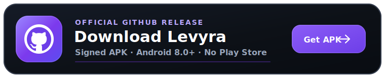
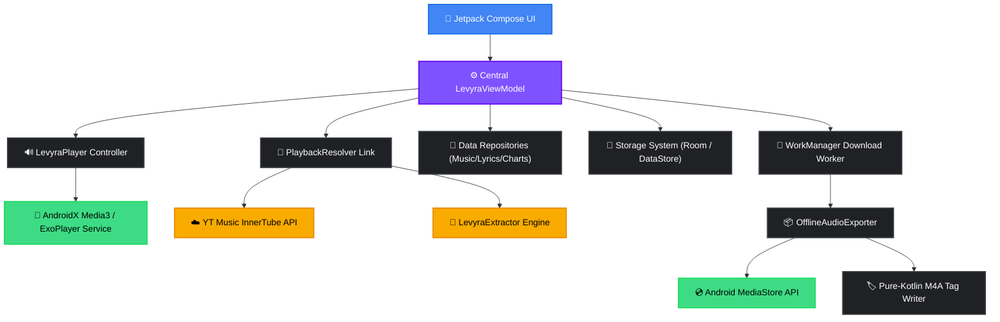

<div align="center">


# 🎶

### Stream everything. Keep what you love. Own every note.

<a href="https://github.com/LUC4N3X/Levyra-deepsound/releases/latest"></a>
<a href="https://github.com/LUC4N3X/Levyra-deepsound/releases"></a>
<a href="LICENSE"></a>
<a href="https://github.com/LUC4N3X/Levyra-deepsound/stargazers"></a>

<br>

<a href="https://github.com/LUC4N3X/Levyra-deepsound/releases/latest">
  
</a>

<sub>**One APK. No Play Store. No account. No ads.** · Official signed build · Android 8.0+</sub>

</div>

---

## ✦ About Levyra

<div align="center">

🎵 **Levyra** isn't another website wearing an app icon. It's a native Android music client,<br>
written from the ground up in 100% Kotlin, for people who are tired of renting their own music library.

It streams instantly, plays flawlessly in the background, and when you hit download it gives you<br>
something almost no app dares to anymore: a **real M4A file**, tagged and covered, sitting in<br>
`Music/Levyra` where it belongs. **Yours. In any player. Forever.**

<sub>*Every screen, every animation, every retry-on-bad-wifi was built by one developer who actually uses this app every day — and it shows.*</sub>

<br>

🛡️ &nbsp;**Privacy by Default** &nbsp;—&nbsp; <sub>Listening stats stay in a local database. No trackers, no telemetry, no analytics.</sub>

📥 &nbsp;**Real Files, Really Yours** &nbsp;—&nbsp; <sub>Tagged M4A exports with embedded artwork, not cache blobs locked inside the app.</sub>

⚡ &nbsp;**Native Audio Engine** &nbsp;—&nbsp; <sub>Media3 / ExoPlayer foreground service. Screen off, pocket, music never stops.</sub>

<br>

`100% Kotlin` &nbsp;·&nbsp; `Jetpack Compose` &nbsp;·&nbsp; `Material 3`

</div>

---

## ✦ Features

<table width="100%">
<tr>
<td width="50%" valign="top">

### 🎨 Expressive Interface

**Dark-First, OLED-True:** Deep blacks and high contrast, built dark from day one — not dimmed as an afterthought.
**Fluid Navigation:** Home, Search, Library and Player tied together by custom micro-animations.
**Dual-State Player:** A discreet mini-player one swipe away from an immersive fullscreen experience.
**Dynamic Material 3:** Optional system-wide dynamic color so the app matches your phone, not the other way around.

</td>
<td width="50%" valign="top">

### ⚡ Rock-Solid Playback

**True Background Service:** Media3 + MediaSession keep playing with the screen off and the app minimized.
**Total Control:** Loop all/single, shuffle, playback speed tuning, sleep timers (15/30/60m).
**Audio Tuning:** In-app normalization, silence skipping, quality selectors (Auto/High/Low).
**SponsorBlock Built In:** Non-music and sponsored segments skipped automatically, in real time.

</td>
</tr>
<tr>
<td width="50%" valign="top">

### 📥 Downloads Done Right

**Real Media Files:** Exported straight to the public `Music/Levyra` directory. Move them, back them up, keep them.
**Pure-Kotlin Tagging:** High-res covers, titles, albums and artists embedded on completion.
**Unstoppable Pipeline:** WorkManager downloads survive reboots and network drops, then retry on their own.
**Truncation Shield:** Strict Content-Length checks discard corrupted files and re-queue them automatically.

</td>
<td width="50%" valign="top">

### 🔍 Search & Stream Resolving

**Dual-Channel Resolver:** InnerTube + LevyraExtractor with smart Opus/M4A selection — when YouTube changes signatures, Levyra doesn't flinch.
**Intelligent Caching:** TTL-based stream cache cuts duplicate requests and loads tracks before you finish tapping.
**Predictive Search:** Live suggestions, categorized filters, instant top-result matching.
**Prefetching Engine:** Charts and queued songs load ahead of time. Zero-gap playback, every time.

</td>
</tr>
<tr>
<td width="50%" valign="top">

### 📊 Listening Pulse

**On-Device Stats:** Every Pulse metric is stored locally in Room — never uploaded as analytics or telemetry.
**Pulse Dashboard:** Total minutes, plays, day streak, completion rate, peak hour and a 7-day rhythm chart.
**True History:** Top artists ranked by real playtime, plus what you actually played — not what you searched once.

</td>
<td width="50%" valign="top">

### 🎵 Synced Lyrics

**LRCLIB Integration:** Synced and static lyrics fetched instantly from track metadata.
**Live Tracker:** Karaoke-precise scrolling locked to the ExoPlayer position.
**Graceful Fallback:** No timestamps? Clean static text. Never a blank screen.

</td>
</tr>
</table>

---

## ✦ A Look Inside

<div align="center">

<br>


<sub>*Home, charts, genre spaces and artist pages in Levyra's dark-first interface.*</sub>

<br>

</div>

---

## ✦ Architecture

Levyra runs on strict unidirectional data flow: Compose renders, a central ViewModel owns state, and decoupled repositories and services make sure no network call or database write ever touches the main thread.

```text
📦 Application Specifications
├── Package Name      com.luc4n3x.levyra
├── Target SDK        35 (Android 15)
├── Min SDK           26 (Android 8.0)
├── Primary Language  100% Kotlin
├── UI Framework      Jetpack Compose + Material 3 (M3)
└── Audio Foundation  AndroidX Media3 / ExoPlayer Engine
```



| Layer | Responsibility | Project Directory |
|:---|:---|:---|
| **UI Presentation** | Composable screens, mini-player layouts, layout triggers, theme engines | [`ui/`](app/src/main/java/com/luc4n3x/levyra/ui) |
| **State Management** | Centralized ViewModel orchestrating single-source UI state | [`viewmodel/`](app/src/main/java/com/luc4n3x/levyra/viewmodel) |
| **Domain Logic** | Abstract domain entities, data models, validation boundaries | [`domain/`](app/src/main/java/com/luc4n3x/levyra/domain) |
| **Data & Network** | Web endpoints, charts API client, lyrics parser, preferences config | [`data/`](app/src/main/java/com/luc4n3x/levyra/data) |
| **Audio Pipeline** | Media3 foreground service, HLS, prefetching queue control | [`player/`](app/src/main/java/com/luc4n3x/levyra/player) |
| **Background Exports** | WorkManager pipeline, metadata tagging, MediaStore registrations | [`player/offline/`](app/src/main/java/com/luc4n3x/levyra/player/offline) |
| **Local Cache** | SQLite database, Room entities, and key-value preference stores | [`data/local/`](app/src/main/java/com/luc4n3x/levyra/data/local) |

---

## ✦ Technical stack

Levyra is built natively for Android, focusing on a light runtime footprint and direct local data ownership.

```yaml
system:
  language: "Kotlin 2.4.0"
  interface: "Jetpack Compose (Material 3)"
  state: "Mobius MVI"
audio:
  core: "AndroidX Media3 / ExoPlayer"
  resolver: "LevyraExtractor"
data:
  client: "OkHttp 5 (Brotli)"
  image_cache: "Coil 3"
  database: "Room (SQLite) + DataStore"
  downloads: "WorkManager Daemon"
build:
  engine: "Gradle Kotlin DSL + KSP"
  size_audit: "Spotify Ruler"
```

### 📱 Core and UI
* **Kotlin 2.4.0**: A 100% native codebase built with coroutines and flow APIs for asynchronous streaming.
* **Jetpack Compose** (via Compose BOM): Declarative layouts with Material 3 components and system-wide dynamic color adaptation.
* **Mobius architecture**: A unidirectional data flow design (Model-Event-Effect-Update) for reliable player state transitions.

### 🎧 Audio pipeline
* **Media3 and ExoPlayer**: A foreground playback service that handles HTTP live streaming, ExoPlayer caching, and background controller sync.
* **LevyraExtractor**: A custom resolver hosted on JitPack to parse playback streams from InnerTube endpoints.

### 📦 Storage and networking
* **OkHttp 5**: The underlying network client, using Brotli compression to save mobile bandwidth.
* **Room Database and DataStore**: Local SQLite and key-value storage for player history (Pulse metrics) and user preferences.
* **Coil 3**: Asynchronous image loading optimized for Jetpack Compose.
* **WorkManager**: A background daemon that schedules and runs offline audio downloads, resuming automatically if the device restarts.

### 🛠️ Build and bundle tools
* **Gradle Kotlin DSL**: Build configuration using version catalogs, KSP, and Kotlin script files.
* **Spotify Ruler**: A build analyzer that runs size audits and tracks dependency weights to keep the APK compact.

---

## ✦ Building from source

### Prerequisites

Ensure your development environment meets the following requirements:

* **💻 Build Environment**
  * **Android Studio:** Jellyfish or newer
  * **Java Development Kit:** JDK 17
  * **Gradle Version:** 9.6.1 (loaded automatically via the Gradle Wrapper)
* **📱 Android SDK Specifications**
  * **compileSdk:** 37 (Android 15)
  * **targetSdk:** 35 (Android 15)
  * **minSdk:** 26 (Android 8.0+)

### ⚙️ Build & Install

Run these commands in your terminal to compile and run the application.

1. Clone the repository and navigate into the folder:
```bash
git clone https://github.com/LUC4N3X/Levyra-deepsound.git
cd Levyra-deepsound
```

2. Compile and install the debug build on your connected device or emulator:
```bash
./gradlew installDebug
```

3. Compile a clean, optimized release build:
```bash
./gradlew clean assembleRelease
```
The compiled release APK will be saved at:
`app/build/outputs/apk/release/app-release.apk`

4. (Optional) Run size profiling via Spotify Ruler to inspect dependencies:
```bash
./gradlew :app:analyzeDebugBundle
```
For notes on architecture and size control, check [APK_SIZE_RULER.md](docs/APK_SIZE_RULER.md) and [PLAYER_MOBIUS_SAMPLE_ARCHITECTURE.md](docs/PLAYER_MOBIUS_SAMPLE_ARCHITECTURE.md).

### 🚀 Versioning & CI

Version numbers are defined in `gradle.properties`:

```properties
levyraVersionName=2.3.11
levyraVersionCode=2031100
```

The release version code is calculated using the following formula to prevent collisions:

`versionCode = major * 1_000_000 + minor * 10_000 + patch * 100 + build`

For example, version `2.3.11` corresponds to code `2031100`.

The GitHub Actions workflow parses this configuration, runs structural tests with `aapt`, compiles the signed binaries, and uploads the output as `LEVYRA-<version>.apk`.

---

## ✦ Building from Source

### Prerequisites
*   Android Studio Jellyfish (or newer)
*   Java Development Kit (JDK) 17
*   Android SDK Platform 37 (`compileSdk = 37`, `targetSdk = 35`)
*   Gradle 9.6.1 through the repository Gradle Wrapper

### Build & Install

```bash
# Clone the repository
git clone https://github.com/LUC4N3X/Levyra-deepsound.git
cd Levyra-deepsound

# Build and install the debug app on your connected device
./gradlew installDebug

# Compile a clean, optimized release build
./gradlew clean assembleRelease

# Analyze bundle size with Spotify Ruler
./gradlew :app:analyzeDebugBundle
```

The release APK lands in `app/build/outputs/apk/release/app-release.apk`.

Architecture and size-control notes live in `docs/APK_SIZE_RULER.md` and `docs/PLAYER_MOBIUS_SAMPLE_ARCHITECTURE.md`.

### Versioning & CI

Version numbering is centralized in `gradle.properties`:

```properties
levyraVersionName=2.3.12
levyraVersionCode=2031200
```

`versionCode = major * 1_000_000 + minor * 10_000 + patch * 100 + build` — calculated sequentially so no two deployments ever collide. The APK Artifact workflow parses this schema, verifies target versions with `aapt`, checks structural integrity, compiles the signed binary and publishes it as `LEVYRA-<version>.apk`.

---

## ✦  Privacy & data collection

Your listening habits are nobody's business, including mine.

* **No analytics frameworks**: There are no tracking SDKs or developer-operated telemetry services.
* **On-device statistics**: Every history entry and Pulse statistic is stored locally inside your Room database.
* **Network interactions**: Actions like searching, loading artwork, showing SponsorBlock segments, fetching lyrics, or using account features contact third-party endpoints. These connections send standard client data, including your IP address, device headers, and cookies where applicable.

### Declared manifest permissions

```text
INTERNET & ACCESS_NETWORK_STATE       Streams music data and queries metadata.
FOREGROUND_SERVICE_MEDIA_PLAYBACK     Keeps audio playing when the app is backgrounded.
POST_NOTIFICATIONS                     Displays the playback controller notification.
WAKE_LOCK                              Prevents playback stutter when the CPU goes to sleep.
WRITE_EXTERNAL_STORAGE (≤ SDK 28)     Saves offline files on older Android versions.
```

---
## ✦  Contributing

Contributions are welcome. If you want to report a bug, suggest a feature, or submit a pull request, follow these steps:

1. Fork the repository.
2. Create a feature branch:
   ```bash
   git checkout -b feature/AmazingFeature
   ```
3. Commit your changes:
   ```bash
   git commit -m "Add some AmazingFeature"
   ```
4. Push to your branch:
   ```bash
   git push origin feature/AmazingFeature
   ```
5. Open a Pull Request.

### Custom distribution guidelines

If you build and distribute your own version of Levyra, please respect these rules:
* **Signing keys**: Generate your own Android keystores. Do not reuse existing keys.
* **Build names**: Follow the release naming schema `LEVYRA-<version>.apk` rather than standard Gradle outputs.
* **Execution dispatching**: Run all database, storage, and network requests on background thread pools (`Dispatchers.IO`), keeping the UI thread responsive.
* **Resiliency**: Handle query timeouts gracefully with clear fallback routes.

---

## ✦ Credits

<table align="center">
  <tr>
    <td align="center" width="130">
      <a href="https://github.com/LUC4N3X">
        
      </a>
    </td>
    <td>
      <h3>LUC4N3X</h3>
      <strong>Creator · Lead Architect · Design Lead</strong>
      <br>
      <sub>System architecture · ExoPlayer orchestration · WorkManager export pipeline · Automated release CI · UI/UX</sub>
      <br>
      <sub><em>One developer. No team, no shortcuts — every line, every pixel.</em></sub>
      <br><br>
      <a href="https://github.com/LUC4N3X"></a>
    </td>
  </tr>
</table>

<div align="center">

#### Standing on the Shoulders of Open Source

</div>

<table align="center">
  <tr>
    <th align="left">Project</th>
    <th align="left">Contribution</th>
  </tr>
  <tr>
    <td><a href="https://github.com/MetrolistGroup/Metrolist"><strong>Metrolist</strong></a></td>
    <td>Structural inspiration for UI conventions and modular styling</td>
  </tr>
  <tr>
    <td><a href="https://github.com/LUC4N3X/Levyra-deepsound/tree/main/third_party/LevyraExtractor"><strong>LevyraExtractor</strong></a></td>
    <td>Stream extraction core — GPL-3.0 fork maintained for Levyra</td>
  </tr>
  <tr>
    <td><a href="https://github.com/InfinityLoop1308/PipePipeExtractor"><strong>PipePipeExtractor</strong></a></td>
    <td>Upstream extractor foundation from the NewPipe/PipePipe ecosystem</td>
  </tr>
</table>

---

## 📜 Disclaimer

> [!WARNING]
> **Educational and Research Purposes Only**
> Levyra is an open-source client and does not host, upload, or index copyrighted files. The app interacts solely with public, third-party content endpoints. The user takes full responsibility for any usage that may violate local laws or third-party terms of service. The developers assume no liability for service changes, system blocks, or client misuse.

This project is **not affiliated with, funded, authorized, endorsed by, or in any way associated with** YouTube, Google LLC, or any of their affiliates and subsidiaries. All trademarks referenced belong to their respective owners.


---

<div align="center">

**Built independently. Engineered with purpose. Refined for listeners who expect more.**

⭐ **If Levyra has earned a place in your daily listening, support its development by starring the repository.**

</div>
