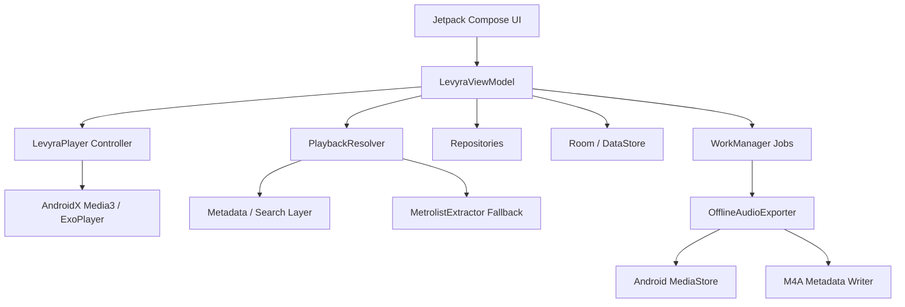

<div align="center">


# 🎶 Levyra

**A high-performance native Android music client built for clean playback, private listening stats, resilient stream resolution, and full local audio control.**

*Fast discovery · Media3 playback · Offline export · Real metadata · GPL-3.0 open source*

---

<p>
  
  
  
  
  
  
</p>

[Key Features](#-key-features) • [Architecture](#-architecture) • [Technical Stack](#-technical-stack) • [Build](#-build) • [Privacy](#-permissions-and-privacy) • [Credits](#-credits) • [License](#-license-and-legal-notices)

<br>


</div>

<br>

## ✦ What is Levyra?

**Levyra** is a native Android audio app written in Kotlin and Jetpack Compose. It is not a web wrapper: playback is handled through an AndroidX Media3 / ExoPlayer foreground service, app state is coordinated through a centralized ViewModel, and local data is stored on-device through Room and DataStore.

The app resolves playable audio sources dynamically through its internal resolver stack. The current resolver layer combines metadata/search logic with an extractor fallback compatible with the NewPipe / PipePipe / MetrolistExtractor ecosystem. Offline exports are written into the public `Music/Levyra` directory when the user chooses to export a track.

```text
📦 Application Specifications
├── Package Name      com.luc4n3x.levyra
├── Target SDK        35
├── Min SDK           26
├── Primary Language  Kotlin
├── UI Framework      Jetpack Compose + Material 3
└── Audio Foundation  AndroidX Media3 / ExoPlayer
```

<br>

## ✦ Key Features

<table width="100%">
  <tr>
    <th width="50%" align="left">🎨 Native Interface</th>
    <th width="50%" align="left">⚡ Playback Engine</th>
  </tr>
  <tr>
    <td valign="top">
      <ul>
        <li><strong>Dark-first UI:</strong> OLED-friendly layout with strong contrast and clean typography.</li>
        <li><strong>Jetpack Compose screens:</strong> Home, Search, Explore, Library and Player are built as native composables.</li>
        <li><strong>Mini-player + fullscreen player:</strong> Fast handoff between compact playback and immersive controls.</li>
        <li><strong>Dynamic visuals:</strong> Animated backgrounds, visualizer surfaces and artwork-aware player styling.</li>
      </ul>
    </td>
    <td valign="top">
      <ul>
        <li><strong>Media3 foreground service:</strong> Playback continues reliably when the app is backgrounded or the screen is off.</li>
        <li><strong>MediaSession support:</strong> System notification, lock-screen controls and external media controls.</li>
        <li><strong>Playback tools:</strong> Queue, shuffle, repeat, speed control, sleep timer and quality preferences.</li>
        <li><strong>Low-latency resolving:</strong> URL cache, candidate probing and fallback resolution reduce failed loads and stuck buffering.</li>
      </ul>
    </td>
  </tr>
  <tr>
    <th width="50%" align="left">📥 Offline Export Pipeline</th>
    <th width="50%" align="left">🔍 Search & Discovery</th>
  </tr>
  <tr>
    <td valign="top">
      <ul>
        <li><strong>Real media export:</strong> Tracks are exported as playable local audio files, not opaque cache blobs.</li>
        <li><strong>Metadata tagging:</strong> Titles, artists, album names and artwork are embedded when available.</li>
        <li><strong>WorkManager jobs:</strong> Downloads can survive process death, connectivity changes and device restarts.</li>
        <li><strong>Integrity checks:</strong> Incomplete or corrupted downloads are discarded before MediaStore registration.</li>
      </ul>
    </td>
    <td valign="top">
      <ul>
        <li><strong>Charts and quick discovery:</strong> Top tracks, country tabs, personal orbit sections and recent listening surfaces.</li>
        <li><strong>Smart artwork handling:</strong> Album artwork is preferred over video thumbnails for library and orbit cards.</li>
        <li><strong>Fallback search:</strong> Blocked or unavailable sources can be retried through official alternate candidates when available.</li>
        <li><strong>Prefetching:</strong> Controlled preloading improves perceived speed without saturating the playback path.</li>
      </ul>
    </td>
  </tr>
  <tr>
    <th colspan="2" align="left">📊 Private Listening Pulse</th>
  </tr>
  <tr>
    <td colspan="2">
      <ul>
        <li><strong>On-device stats:</strong> Listening history, play time and completion data stay local.</li>
        <li><strong>No telemetry:</strong> Levyra does not include third-party analytics SDKs or tracking frameworks.</li>
        <li><strong>Library insights:</strong> Top artists, listening streaks, recent plays and rhythm charts are generated from local playback data.</li>
      </ul>
    </td>
  </tr>
  <tr>
    <th colspan="2" align="left">🎵 Lyrics</th>
  </tr>
  <tr>
    <td colspan="2">
      <ul>
        <li><strong>Synced lyrics:</strong> Timestamped lyrics are shown when matching data is available.</li>
        <li><strong>Static fallback:</strong> Plain text lyrics are used when synced lyrics are unavailable.</li>
        <li><strong>Smooth tracker:</strong> The active lyric line follows the Media3 playback position.</li>
      </ul>
    </td>
  </tr>
</table>

<br>

## ✦ Architecture

Levyra follows a unidirectional data flow structure: Compose renders state, the ViewModel owns state transitions, repositories isolate network/database work, and the Media3 service owns playback execution.



### Component Layout

| Layer | Responsibility | Project Directory |
|:---|:---|:---|
| **UI Presentation** | Composable screens, mini-player, player screen, navigation and theme surfaces | [`app/src/main/java/com/luc4n3x/levyra/ui`](app/src/main/java/com/luc4n3x/levyra/ui) |
| **State Management** | Central UI state, playback intents, screen events and data orchestration | [`app/src/main/java/com/luc4n3x/levyra/viewmodel`](app/src/main/java/com/luc4n3x/levyra/viewmodel) |
| **Domain Logic** | Track models, queue models, orbit logic and validation boundaries | [`app/src/main/java/com/luc4n3x/levyra/domain`](app/src/main/java/com/luc4n3x/levyra/domain) |
| **Data & Network** | Resolver, repositories, API clients, artwork cache and preferences | [`app/src/main/java/com/luc4n3x/levyra/data`](app/src/main/java/com/luc4n3x/levyra/data) |
| **Audio Pipeline** | Media3 controller, playback service, queue logic and prefetch flow | [`app/src/main/java/com/luc4n3x/levyra/player`](app/src/main/java/com/luc4n3x/levyra/player) |
| **Offline Exports** | WorkManager export jobs, metadata writing and MediaStore registration | [`app/src/main/java/com/luc4n3x/levyra/player/offline`](app/src/main/java/com/luc4n3x/levyra/player/offline) |
| **Local Cache** | Room entities, DAO interfaces and database wiring | [`app/src/main/java/com/luc4n3x/levyra/data/local`](app/src/main/java/com/luc4n3x/levyra/data/local) |

<br>

## ✦ Technical Stack

| Area | Stack |
|:---|:---|
| Language | Kotlin |
| UI | Jetpack Compose, Material 3, Compose BOM |
| Playback | AndroidX Media3, ExoPlayer, MediaSession |
| Networking | OkHttp, Brotli |
| Images | Coil |
| Persistence | Room, DataStore Preferences |
| Background Jobs | AndroidX WorkManager |
| Serialization | kotlinx.serialization |
| Build | Gradle Kotlin DSL, Version Catalogs, KSP |
| Extraction fallback | MetrolistExtractor / NewPipe-family extractor layer |
| Lyrics | LRCLIB-compatible lookup flow |
| Segment metadata | SponsorBlock-compatible skip metadata where supported |

<br>

## ✦ Build

### Requirements

```text
Android Studio Jellyfish or newer
JDK 17
Android SDK 35 or newer
Gradle wrapper from this repository
```

### Commands

```bash
git clone https://github.com/LUC4N3X/Levyra-deepsound.git
cd Levyra-deepsound
./gradlew installDebug
```

```bash
./gradlew clean assembleRelease
```

Release APK output:

```text
app/build/outputs/apk/release/app-release.apk
```

### Versioning

Version fields are centralized in `gradle.properties`.

```properties
levyraVersionName=2.3.3
levyraVersionCode=2030300
```

Version code schema:

```text
versionCode = major * 1_000_000 + minor * 10_000 + patch * 100 + build
```

<br>

## ✦ Permissions and Privacy

Levyra is designed as a local-first Android app. Listening history, playback stats and library state are stored on the device.

```text
🛡️ Manifest Permissions
├── INTERNET                         Network requests for metadata, resolving and playback
├── ACCESS_NETWORK_STATE             Connectivity-aware playback and background work
├── FOREGROUND_SERVICE               Required for stable background services
├── FOREGROUND_SERVICE_MEDIA_PLAYBACK Required for Android media playback service mode
├── POST_NOTIFICATIONS               Media notification on supported Android versions
├── WAKE_LOCK                        Prevents playback interruption during sleep states
└── WRITE_EXTERNAL_STORAGE           Legacy export support on Android 9 and below
```

Levyra does not include third-party analytics SDKs, advertising SDKs, spyware modules, or external telemetry pipelines.

<br>

## ✦ Credits

<table>
  <tr>
    <td width="96" align="center">
      <a href="https://github.com/LUC4N3X">
        
      </a>
    </td>
    <td>
      <strong>LUC4N3X</strong><br>
      Creator and lead maintainer of Levyra.<br>
      Architecture, Android implementation, Compose UI, Media3 playback flow, offline export pipeline, release workflow and project direction.
    </td>
  </tr>
</table>

### Open-source acknowledgements

Levyra is released under the **GNU General Public License v3.0** and uses, integrates with, references, or draws inspiration from open-source projects and public developer ecosystems.

| Project / Ecosystem | Role in Levyra | License / Notice |
|:---|:---|:---|
| [MetrolistExtractor](https://github.com/MetrolistGroup/MetrolistExtractor) | Extractor fallback used by the resolver layer | GPL-3.0 |
| [Metrolist](https://github.com/MetrolistGroup/Metrolist) | Android music client ecosystem and architectural reference | GPL-3.0 |
| [NewPipeExtractor](https://github.com/TeamNewPipe/NewPipeExtractor) | Upstream extractor ecosystem reference | GPL-compatible notice preserved where applicable |
| [PipePipeExtractor](https://github.com/InfinityLoop1308/PipePipeExtractor) | Extractor ecosystem reference for compatibility analysis | GPL-compatible notice preserved where applicable |
| [MusicApp-KMP](https://github.com/SEAbdulbasit/MusicApp-KMP) | UI and modular styling inspiration only | Original project license remains with its authors |
| AndroidX / Jetpack / Media3 | Android platform libraries | Original Google / AndroidX licenses apply |
| Kotlin / kotlinx.serialization | Language and serialization stack | Original JetBrains / Kotlin licenses apply |
| OkHttp / Coil / Room / WorkManager | Networking, image loading, persistence and background jobs | Original upstream licenses apply |
| LRCLIB-compatible metadata | Lyrics lookup compatibility | Third-party lyrics and metadata rights remain with their owners |
| SponsorBlock-compatible metadata | Segment metadata compatibility where supported | Original service/project terms apply |

Original copyright notices, file headers and license texts from upstream projects must remain intact when their code is used, copied, modified, vendored, or redistributed.

For a dedicated notices file, see [`THIRD_PARTY_NOTICES.md`](THIRD_PARTY_NOTICES.md).

<br>

## ✦ GPL-3.0 Compliance for Forks and APK Distribution

If you distribute a modified APK, fork, binary, release artifact, or public build of Levyra, keep the project GPL-clean:

```text
Required for GPL-3.0 distribution
├── Keep the LICENSE file with the full GPL-3.0 text
├── Keep original copyright notices and upstream license notices
├── State that the project was modified and identify the maintainer of the modified version
├── Provide the complete corresponding source code for the distributed build
├── Publish build scripts, Gradle files and dependency configuration needed to rebuild the APK
├── Keep THIRD_PARTY_NOTICES.md or an equivalent attribution file
├── Do not remove license headers from copied or modified upstream files
└── Release derivative source code under GPL-3.0-compatible terms
```

Recommended modified-version notice:

```text
This build is a modified version of Levyra maintained by LUC4N3X.
It includes changes to playback resolution, UI, offline export, caching, artwork handling and release automation.
The complete corresponding source code is available in this repository under the GNU General Public License v3.0.
```

<br>

## ✦ Legal Notices

### License

Levyra is licensed under the **GNU General Public License v3.0**.

See [`LICENSE`](LICENSE) for the full license text.

Unless a file explicitly states otherwise, Levyra source files are distributed under GPL-3.0 terms. Third-party dependencies retain their own copyright notices and license terms.

### No affiliation

Levyra is an independent open-source project. It is not affiliated with, endorsed by, sponsored by, or officially connected to Google, YouTube, YouTube Music, Apple, Apple Music, Spotify, LRCLIB, SponsorBlock, Metrolist, NewPipe, PipePipe, or any other third-party service or project mentioned in this repository.

All trademarks, service marks, logos, album covers, artist names, track names and platform names belong to their respective owners.

### Content and service responsibility

Levyra does not host, upload, sell, index, or provide copyrighted audio files from its own servers.

Levyra is a client application. Users are responsible for using it only where they have the legal right to access, stream, export, store, or play content, and only in compliance with applicable law and third-party service terms.

Levyra is not intended to bypass DRM, paywalls, authentication walls, geographic restrictions, subscription requirements, private content restrictions, or any other access-control mechanism.

### Warranty

This software is provided **as is**, without warranty of any kind, express or implied. The maintainers are not responsible for misuse, account restrictions, data loss, service changes, legal consequences, or damage resulting from the use or redistribution of this software.

<br>

<div align="center">

**Built by [LUC4N3X](https://github.com/LUC4N3X) · Released under GPL-3.0**

</div>
