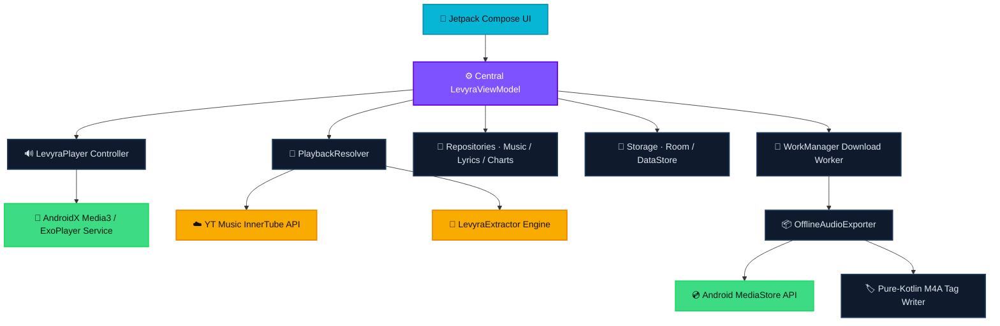

<div align="center">


<br>

# Levyra

### Music that lives on your device — not on someone else's server.

Levyra is a native Android music client built from scratch for people who care about how their audio actually sounds, where it's stored, and who's watching. No web reskin. No telemetry. Just a fast, offline-first player that streams cleanly and downloads real, fully-tagged files straight into your library.

<br>

<p>
  
  
  
  
  
  
</p>

<p>
  <a href="#-features">Features</a> ·
  <a href="#-architecture">Architecture</a> ·
  <a href="#-tech-stack">Stack</a> ·
  <a href="#-getting-started">Build</a> ·
  <a href="#-privacy">Privacy</a> ·
  <a href="#-license--legal">License</a>
</p>

<br>


</div>

<br>

## The short version

Most "music apps" on the store are thin wrappers around a webview. Levyra isn't. It's a ground-up Kotlin/Compose app that queries and resolves tracks through YouTube Music's InnerTube API — with a **LevyraExtractor** fallback for when stream signatures change — routes everything through an optimized **Media3 / ExoPlayer** background service, and exports full-length tracks as clean `.m4a` files with embedded artwork, titles, artists, and album metadata.

Every download lands in your public `Music/Levyra` folder as a proper file you own. Not a cache blob. Not a hidden database entry. A real song you can copy, back up, or move anywhere.

```text
Application at a glance
├── Package        com.luc4n3x.levyra
├── Target SDK     35  (Android 15)
├── Min SDK        26  (Android 8.0)
├── Language       100% Kotlin
├── UI             Jetpack Compose + Material 3
└── Audio          AndroidX Media3 / ExoPlayer
```

<br>

## ✦ Features

<table width="100%">
  <tr>
    <th width="50%" align="left">🎨 &nbsp;Interface that gets out of the way</th>
    <th width="50%" align="left">⚡ &nbsp;A playback engine you can trust</th>
  </tr>
  <tr>
    <td valign="top">
      <ul>
        <li><strong>Built for OLED.</strong> A dark-first, high-contrast theme that looks right in a dark room and saves your battery.</li>
        <li><strong>Fluid by design.</strong> Home, Search, Library and Player tied together with custom micro-animations — nothing janky, nothing sudden.</li>
        <li><strong>One player, two moods.</strong> Slide between a tucked-away mini-player and a full-screen, immersive now-playing view.</li>
        <li><strong>Your color, your call.</strong> Optional Material 3 dynamic color that follows your system palette, with an animation toggle if you prefer things still.</li>
      </ul>
    </td>
    <td valign="top">
      <ul>
        <li><strong>Keeps playing, screen off.</strong> A Media3 foreground service with proper MediaSession controls — audio survives backgrounding and lock.</li>
        <li><strong>Controls that matter.</strong> Loop (all or single), shuffle, a speed tuner, and sleep timers at 15 / 30 / 60 minutes.</li>
        <li><strong>Tune the sound.</strong> In-app normalization, silence skipping, and quality selection (Auto / High / Low).</li>
        <li><strong>SponsorBlock, built in.</strong> Non-music and sponsored segments get skipped automatically, in real time.</li>
      </ul>
    </td>
  </tr>
  <tr>
    <th width="50%" align="left">📥 &nbsp;Downloads that don't fall apart</th>
    <th width="50%" align="left">🔍 &nbsp;Search & resolving that keeps up</th>
  </tr>
  <tr>
    <td valign="top">
      <ul>
        <li><strong>Real files, real folder.</strong> Exports straight to public <code>Music/Levyra</code> — no proprietary cache to reverse-engineer later.</li>
        <li><strong>Tagged in pure Kotlin.</strong> High-res cover art, title, album and artist embedded the moment the download finishes.</li>
        <li><strong>Survives reboots.</strong> A WorkManager-backed queue that rides out network drops and restarts with smart retries.</li>
        <li><strong>No half-files.</strong> Strict Content-Length checks throw out corrupted or truncated downloads and reschedule them automatically.</li>
      </ul>
    </td>
    <td valign="top">
      <ul>
        <li><strong>Dual-channel resolving.</strong> InnerTube first, LevyraExtractor as backup — smarter Opus/M4A selection and fresh-URL caching that holds up when YouTube shifts signatures.</li>
        <li><strong>Cached, not re-fetched.</strong> A TTL-based stream cache kills duplicate server calls and makes tracks load faster the second time.</li>
        <li><strong>Search that guesses right.</strong> Predictive suggestions, category filters, and instant top-result matching.</li>
        <li><strong>Zero-gap playback.</strong> A prefetch engine loads charts and queued tracks ahead of time so nothing stalls between songs.</li>
      </ul>
    </td>
  </tr>
  <tr>
    <th colspan="2" align="left">📊 &nbsp;Listening Pulse — stats that stay yours</th>
  </tr>
  <tr>
    <td colspan="2">
      <ul>
        <li><strong>Measured on-device.</strong> Real sessions counted second by second, stored in Room. No cloud, no telemetry — ever.</li>
        <li><strong>A dashboard, not a report.</strong> Total minutes, plays, day streak, completion rate, peak hour, and a 7-day rhythm chart, right inside your Library.</li>
        <li><strong>What you actually played.</strong> Top artists ranked by real playtime, plus a true history — not a list of things you searched and skipped.</li>
      </ul>
    </td>
  </tr>
  <tr>
    <th colspan="2" align="left">🎵 &nbsp;Lyrics, synced and offline-friendly</th>
  </tr>
  <tr>
    <td colspan="2">
      <ul>
        <li><strong>LRCLIB lookup.</strong> Synced or static lyrics pulled instantly from track metadata.</li>
        <li><strong>Line-by-line sync.</strong> Smooth scrolling that highlights each line against the live ExoPlayer position.</li>
        <li><strong>Never a dead end.</strong> Falls back gracefully to plain text when timestamped lyrics aren't available.</li>
      </ul>
    </td>
  </tr>
</table>

<br>

## ✦ Architecture

Levyra sticks to a strict unidirectional data flow. Compose does the rendering, a single central ViewModel owns the state, and everything downstream — repositories, services, storage — sits behind clean boundaries so network and database work never touches the main thread.



### Where things live

| Layer | What it does | Directory |
|:---|:---|:---|
| **UI** | Composable screens, mini-player, theme engine, layout triggers | `ui/` |
| **State** | Central ViewModel — single source of truth for UI state | `viewmodel/` |
| **Domain** | Entities, data models, validation boundaries | `domain/` |
| **Data & Network** | Endpoints, charts client, lyrics parser, preferences | `data/` |
| **Audio** | Media3 foreground service, HLS, prefetch queue | `player/` |
| **Exports** | WorkManager pipeline, tagging, MediaStore registration | `player/offline/` |
| **Local cache** | Room entities, SQLite, key-value preference stores | `data/local/` |

<br>

## ✦ Tech Stack

- **Language** — Kotlin 2.3.20
- **UI** — Jetpack Compose, Material 3, Compose BOM
- **Playback** — AndroidX Media3, ExoPlayer, HLS, MediaSession
- **Network** — OkHttp 5 with Brotli compression
- **Images** — Coil 3, tuned for async Compose loading
- **Persistence** — Room + DataStore Preferences
- **Background** — Android WorkManager
- **Serialization** — kotlinx.serialization (JSON)
- **Build** — Gradle Kotlin DSL, version catalogs (`libs.versions.toml`), KSP
- **Size guard** — Spotify Ruler workflow for bundle-size and dependency tracking
- **Player design** — a Mobius-inspired `Model / Event / Effect / Update` core for safe refactoring
- **Extraction** — InnerTube resolver + GPL-3.0 LevyraExtractor playback core via JitPack

<br>

## ✦ Getting Started

**You'll need**

- Android Studio Jellyfish or newer
- JDK 17
- Android SDK Platform 35 / 36
- Gradle 9.4.1 (used in CI via GitHub Actions)

**Build it**

```bash
# Clone
git clone https://github.com/LUC4N3X/Levyra-deepsound.git
cd Levyra-deepsound

# Debug build straight to a connected device
./gradlew installDebug

# Clean, optimized release build
./gradlew clean assembleRelease

# Inspect bundle size with Spotify Ruler
./gradlew :app:analyzeDebugBundle
```

The release APK lands at:

```text
app/build/outputs/apk/release/app-release.apk
```

Deeper notes on architecture and size control:

```text
docs/APK_SIZE_RULER.md
docs/PLAYER_MOBIUS_SAMPLE_ARCHITECTURE.md
```

**Versioning**

Version numbers live in one place — `gradle.properties`:

```properties
levyraVersionName=2.3.6
levyraVersionCode=2030600
```

The version code is derived so two builds can never collide:

```text
versionCode = major·1_000_000 + minor·10_000 + patch·100 + build
```

CI parses this schema, checks the target version with `aapt`, verifies structural integrity, builds the binary, names the artifact `LEVYRA-<version>.apk`, and pushes it straight to **GitHub Releases**.

<br>

## ✦ Privacy

Privacy isn't a feature bolted on afterward — it's the default. Levyra ships with **no analytics frameworks, no tracking SDKs, no third-party telemetry.** Nothing about how you listen leaves your phone.

```text
Manifest permissions — and why each one exists
├── INTERNET · ACCESS_NETWORK_STATE       Stream audio and fetch metadata
├── FOREGROUND_SERVICE_MEDIA_PLAYBACK     Keep playback alive in the background
├── POST_NOTIFICATIONS                    Show the Media3 media controls
├── WAKE_LOCK                             Prevent stutters when the CPU sleeps
└── WRITE_EXTERNAL_STORAGE (≤ SDK 28)     Legacy path for offline export
```

<br>

## ✦ Forking & Contributing

Planning to ship your own build? A few ground rules:

1. **Use your own keys.** Generate and rotate your own Android keystores before publishing anything public.
2. **Name it clearly.** Follow the `LEVYRA-<version>.apk` release schema instead of default Gradle output names.
3. **Keep the main thread clean.** Every disk write, database call, and network resolve runs on `Dispatchers.IO`. No exceptions.
4. **Stay resilient.** If a query times out, route it through the fallback channel — don't let it fail silently.

<br>

## ✦ Credits

<table>
  <tr>
    <td width="100" align="center">
      <a href="https://github.com/LUC4N3X">
        
      </a>
    </td>
    <td>
      <strong>LUC4N3X</strong> — <em>Creator & Lead Architect</em>
      <p>System architecture, ExoPlayer orchestration, the background WorkManager export queue, the automated release pipeline, and design direction.</p>
    </td>
  </tr>
</table>

*UI structure and modular styling take inspiration from the open-source [Metrolist](https://github.com/MetrolistGroup/Metrolist).*

*The extraction core is [LevyraExtractor](https://github.com/LUC4N3X/LevyraExtractor) — a GPL-3.0 fork of [PipePipeExtractor](https://github.com/InfinityLoop1308/PipePipeExtractor) from the NewPipe / PipePipe ecosystem.*

---

## ✦ License & Legal

> [!IMPORTANT]
> **Levyra is an independent, community-developed open-source project.** It is not affiliated with, authorized by, endorsed by, sponsored by, or connected to Google, YouTube, YouTube Music, Android, NewPipe, PipePipe, Metrolist, or any other third party. Third-party names, logos, and trademarks appear only for identification, compatibility, and attribution, and remain the property of their respective owners.

### No hosting, no content ownership

Levyra doesn't host media, upload anything to remote servers, sell access to content, or maintain a catalogue of its own. It's a client that runs on your device. When you ask it to, it talks to independent third-party services and works with whatever those services return. Availability, licensing, regional rules, and takedowns all stay under the control of those providers and rights holders. The presence of a search result, link, or stream inside the app does **not** mean the maintainers host, license, or control it.

### Your use, your responsibility

You are responsible for how you install, configure, modify, distribute, and use Levyra — and for making sure your use complies with:

- copyright, IP, privacy, computer-misuse, export, and telecom law;
- the terms of service and technical restrictions of any third-party provider;
- any territorial, contractual, subscription, age, or access requirements on the content you request;
- all permissions needed to download, store, convert, share, or redistribute content.

Levyra grants no license to access or exploit third-party content. Don't use it to infringe copyright, evade payment, bypass DRM, defeat access controls, or violate any law or agreement. Download features are general-purpose tools — their existence is not confirmation that a given item may lawfully be downloaded or kept.

### Third-party services & account risk

Levyra depends on unaffiliated services, APIs, and extraction components that can change, restrict, block, rate-limit, or disappear at any time without notice. The maintainers don't control that infrastructure and can't guarantee stream availability, metadata accuracy, account compatibility, or uninterrupted operation. Accessing those services may transmit the usual technical data (IP, headers, device info, cookies, account identifiers). The maintainers are not responsible for warnings, suspensions, bans, rate limits, regional blocks, expired links, or any enforcement action taken by a third party.

### No warranty

To the maximum extent permitted by law, Levyra and everything related to it — source, binaries, docs, workflows, dependencies, extraction logic, download features — is provided **"AS IS"** and **"AS AVAILABLE,"** without warranty of any kind, express or implied. No promise is made about merchantability, fitness for a purpose, title, non-infringement, reliability, security, accuracy, availability, error-free operation, or data preservation. You assume the full risk of installing, building, signing, modifying, distributing, and using it, and should verify downloaded files, permissions, backups, and the legality of every operation yourself.

### Limitation of liability

To the maximum extent permitted by law, the project owner, maintainers, contributors, copyright holders, upstream projects, and distributors are not liable for any direct, indirect, incidental, special, exemplary, punitive, or consequential damage arising from Levyra, including (without limitation):

- loss, corruption, deletion, or disclosure of data;
- lost revenue, profit, business, opportunity, or reputation;
- device malfunction, battery drain, storage exhaustion, or network charges;
- failed, incomplete, corrupted, or mistagged downloads;
- interruption or modification of third-party services;
- account suspension, rate limiting, or other provider enforcement;
- copyright, trademark, privacy, contractual, or regulatory claims;
- reliance on inaccurate metadata, results, lyrics, or artwork;
- forks, unofficial builds, repackaged APKs, or compromised signing keys produced by others.

These limits apply regardless of legal theory and even if a contributor was warned such damage was possible. Nothing here excludes liability that can't lawfully be excluded — including fraud, wilful misconduct, gross negligence, death or personal injury where applicable, or non-waivable consumer rights.

### Unofficial builds

Only source and releases published through the official Levyra repository are maintained here. The maintainers aren't responsible for forks, mirrors, modified builds, third-party stores, altered extraction logic, removed notices, bundled malware, or leaked signing material. Anyone redistributing a modified build must comply with the GPL-3.0, preserve notices, clearly mark their changes, use their own signing credentials, and must not imply official status.

### Rights-holder requests

No third-party media files are intentionally included in this repository. A rights holder who believes a repository asset infringes their rights may contact the project owner through the issue tracker with: identification of the work or right, the exact repository URL or path, evidence of ownership or authorization, a clear explanation of the alleged infringement, valid contact details, and a good-faith statement of accuracy. The maintainer may review, restrict, replace, or remove repository material where reasonable — and doing so is not an admission of liability or of control over externally hosted content.

### License scope

Levyra is released under the **GNU General Public License v3.0** — see [LICENSE](LICENSE) for the full terms. The GPL-3.0 covers the source code and does **not** grant rights to third-party trademarks, media, metadata, artwork, lyrics, APIs, or externally hosted content, which stay subject to their own licenses.

### Severability

If any part of this notice is found invalid or unenforceable, it will be limited to the minimum extent needed to make it enforceable, and the rest continues to apply. By downloading, building, installing, modifying, distributing, or using Levyra, you acknowledge the technical and legal risks described here and accept responsibility for lawful use, to the extent that acknowledgement is legally effective.

<div align="center">
<br>

**Built with care by [LUC4N3X](https://github.com/LUC4N3X)** · GPL-3.0

</div>
