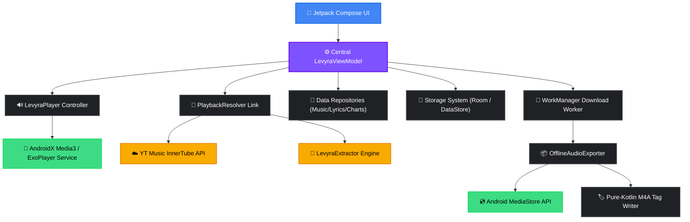

<div align="center">


# 🎶

**A high-performance, native Android music client designed for pristine playback and complete audio control.**

*Fast discovery · Immersive visualizer · Resilient background downloading · Offline-first tag manager.*

---

<p>
  
  
  
  
  
  
</p>

[✨ Key Features](#-key-features) • [🌐 Architecture](#-architecture) • [🛠️ Technical Stack](#%EF%B8%8F-technical-stack) • [🚀 Getting Started](#-getting-started) • [🔒 Permissions](#-permissions-and-privacy) • [📝 License](#-disclaimers--license)

<br>


</div>

<br>

## ✦ What is Levyra?

Unlike typical wrapper or web-reskin apps, **Levyra** is a native, ground-up Android audio application. It queries, resolves, and streams music dynamically using YouTube Music's InnerTube API with a LevyraExtractor-powered fallback, routes audio via an optimized **AndroidX Media3/ExoPlayer** background service, and outputs full tracks straight into your local storage. 

Every track you download is fully parsed, tagged, and structured as a clean M4A file in your system `Music/Levyra` directory, complete with embedded metadata, titles, artists, and album artwork. 

```text
📦 Application Specifications
├── Package Name      com.luc4n3x.levyra
├── Target SDK        35 (Android 15)
├── Min SDK           26 (Android 8.0)
├── Primary Language  100% Kotlin
├── UI Framework      Jetpack Compose + Material 3 (M3)
└── Audio Foundation  AndroidX Media3 / ExoPlayer Engine
```

<br>

## ✦ Key Features

<table width="100%">
  <tr>
    <th width="50%" align="left">🎨 Dynamic & Modern Interface</th>
    <th width="50%" align="left">⚡ Robust Playback Engine</th>
  </tr>
  <tr>
    <td valign="top">
      <ul>
        <li><strong>Dark-First Polish:</strong> Clean, high-contrast dark theme optimized for OLED screens.</li>
        <li><strong>Fluid Transitions:</strong> Bottom navigation layout connecting Home, Search, Library, and Player with custom micro-animations.</li>
        <li><strong>Dual-State Player:</strong> Swap seamlessly between an unobtrusive mini-player and an immersive fullscreen interface.</li>
        <li><strong>Dynamic Material 3:</strong> Optional system-wide dynamic color adaptation and visual animation toggle.</li>
      </ul>
    </td>
    <td valign="top">
      <ul>
        <li><strong>Foreground Media Service:</strong> Powered by Media3 and MediaSession controls to handle playback even when the screen is off.</li>
        <li><strong>Smart Playback Controls:</strong> Loop (all/single), track shuffle, playback speed tuner, and custom sleep timers (15/30/60m).</li>
        <li><strong>Audio Tuning:</strong> In-app audio normalization, silence skipping, and custom quality selectors (Auto/High/Low).</li>
        <li><strong>SponsorBlock Integration:</strong> Automatically skips non-music or sponsored segments in real time.</li>
      </ul>
    </td>
  </tr>
  <tr>
    <th width="50%" align="left">📥 Offline Export Pipeline</th>
    <th width="50%" align="left">🔍 Stream Resolving & Search</th>
  </tr>
  <tr>
    <td valign="top">
      <ul>
        <li><strong>No Cache Blobs:</strong> Exports actual media files directly to the public <code>Music/Levyra</code> directory.</li>
        <li><strong>Pure-Kotlin Tagging:</strong> Embeds high-res album covers, song titles, album names, and artist metadata on completion.</li>
        <li><strong>WorkManager Daemon:</strong> Background tasks persist through system reboots, handling network changes with smart retries.</li>
        <li><strong>Truncation Shield:</strong> Rigid Content-Length checks discard corrupted or incomplete files and schedule auto-retries.</li>
      </ul>
    </td>
    <td valign="top">
      <ul>
        <li><strong>InnerTube + LevyraExtractor Resolver:</strong> Dual-channel media resolution with smarter Opus/M4A selection, fresh URL caching, and stronger fallback when YouTube changes stream signatures.</li>
        <li><strong>Intelligent Caching:</strong> TTL-based playback stream cache prevents duplicate server requests and speeds up loading.</li>
        <li><strong>Smart Search:</strong> Predictive search suggestions, categorized filters, and instant top-result matching.</li>
        <li><strong>Prefetching Engine:</strong> Ahead-of-time loading for top charts and queued songs to guarantee zero-gap playback.</li>
      </ul>
    </td>
  </tr>
  <tr>
    <th colspan="2" align="left">📊 Listening Pulse — Private Stats</th>
  </tr>
  <tr>
    <td colspan="2">
      <ul>
        <li><strong>On-Device Analytics:</strong> Real listening sessions are measured second by second and stored in Room — no cloud, no telemetry, ever.</li>
        <li><strong>Pulse Dashboard:</strong> Total minutes, plays, day streak, completion rate, peak listening hour and a 7-day rhythm chart inside the Library.</li>
        <li><strong>Top Artists & True History:</strong> Most-listened artists ranked by real playtime plus a history of what you actually played, not just what you searched.</li>
      </ul>
    </td>
  </tr>
  <tr>
    <th colspan="2" align="left">🎵 Synced & Offline Lyrics</th>
  </tr>
  <tr>
    <td colspan="2">
      <ul>
        <li><strong>LRCLIB Integration:</strong> Instant lookup of synced and static lyrics based on track metadata.</li>
        <li><strong>Active Tracker:</strong> Smooth, time-synced scrolling highlights lines in sync with the ExoPlayer track position.</li>
        <li><strong>Graceful Degradation:</strong> Automated fallback to static text views when timestamped lyrics are unavailable.</li>
      </ul>
    </td>
  </tr>
</table>

<br>

## ✦ Architecture

Levyra strictly follows unidirectional data flow (UDF) guidelines. Jetpack Compose handles rendering, while state lives in a centralized ViewModel. Downstream repositories and services act as decoupled boundaries, preventing network or database operations from blocking the main thread.



### Component Layout

| Layer | Responsibility | Project Directory |
|:---|:---|:---|
| **UI Presentation** | Composable screens, mini-player layouts, layout triggers, theme engines | [`ui/`](file:///C:/Users/Luca%20Drogo/Desktop/Levyra-deepsound/app/src/main/java/com/luc4n3x/levyra/ui) |
| **State Management** | Centralized ViewModel orchestrating single-source UI state | [`viewmodel/`](file:///C:/Users/Luca%20Drogo/Desktop/Levyra-deepsound/app/src/main/java/com/luc4n3x/levyra/viewmodel) |
| **Domain Logic** | Abstract domain entities, data models, validation boundaries | [`domain/`](file:///C:/Users/Luca%20Drogo/Desktop/Levyra-deepsound/app/src/main/java/com/luc4n3x/levyra/domain) |
| **Data & Network** | Web endpoints, charts API client, lyrics parser, preferences config | [`data/`](file:///C:/Users/Luca%20Drogo/Desktop/Levyra-deepsound/app/src/main/java/com/luc4n3x/levyra/data) |
| **Audio Pipeline** | Media3 foreground service, HLS, prefetching queue control | [`player/`](file:///C:/Users/Luca%20Drogo/Desktop/Levyra-deepsound/app/src/main/java/com/luc4n3x/levyra/player) |
| **Background Exports** | WorkManager pipeline, metadata tagging, MediaStore registrations | [`player/offline/`](file:///C:/Users/Luca%20Drogo/Desktop/Levyra-deepsound/app/src/main/java/com/luc4n3x/levyra/player/offline) |
| **Local Cache** | SQLite database, Room entities, and key-value preference stores | [`data/local/`](file:///C:/Users/Luca%20Drogo/Desktop/Levyra-deepsound/app/src/main/java/com/luc4n3x/levyra/data/local) |

<br>

## ✦ Technical Stack

*   **Language:** Kotlin 2.3.20
*   **User Interface:** Jetpack Compose, Material 3 Design Components, Compose BOM
*   **Media Playback:** AndroidX Media3, ExoPlayer, HLS Playback, MediaSession
*   **Network Transport:** OkHttp 5, Brotli compression module
*   **Image Caching:** Coil 3 (Compose-optimized asynchronous image loading)
*   **Data Persistence:** Room Database, DataStore Preferences
*   **Background Jobs:** Android WorkManager Daemon
*   **Serialization:** kotlinx.serialization (JSON)
*   **Build Pipeline:** Gradle Kotlin DSL (`.gradle.kts`), Version Catalogs (`libs.versions.toml`), KSP (Kotlin Symbol Processing)
*   **APK Size Guard:** Spotify Ruler report workflow for bundle size analysis and dependency weight tracking
*   **Player Architecture:** Mobius-sample-inspired `Model / Event / Effect / Update` foundation for safe player refactoring
*   **Extraction Layer:** InnerTube resolver plus GPL-3.0 LevyraExtractor playback core via JitPack

<br>

## ✦ Getting Started

### Prerequisites
*   Android Studio Jellyfish (or newer)
*   Java Development Kit (JDK) 17
*   Android SDK Platform 35 / 36
*   Gradle 9.4.1 in CI via GitHub Actions

### Building the Project
Clone the repository and compile the debug configuration directly to a connected Android device or emulator:

```bash
# Clone the repository
git clone https://github.com/LUC4N3X/Levyra-deepsound.git
cd Levyra-deepsound

# Build and install the debug app on your connected device
./gradlew installDebug

# Compile a clean, optimized release build
./gradlew clean assembleRelease

# Analyze bundle size with Spotify Ruler
./gradlew :app:analyzeDebugBundle
```

The resulting signed/unsigned release APK will be located in:
`app/build/outputs/apk/release/app-release.apk`

Architecture and size-control notes:

```text
docs/APK_SIZE_RULER.md
docs/PLAYER_MOBIUS_SAMPLE_ARCHITECTURE.md
```

### Version Control & CI overrides
The application's version numbering is centralized inside `gradle.properties`:
```properties
levyraVersionName=2.3.6
levyraVersionCode=2030600
```
*Version code logic is calculated sequentially to prevent duplicate deployment IDs:*
`versionCode = major * 1_000_000 + minor * 10_000 + patch * 100 + build`

Our automated GitHub Action workflow parses this schema, checks target versions using `aapt`, verifies structural integrity, compiles the binary, names the artifact `LEVYRA-<version>.apk`, and ships it directly to **GitHub Releases**.

<br>

## ✦ Permissions and Privacy

Levyra is built from the ground up to respect user privacy. The application is completely free of analytic frameworks, tracking SDKs, or third-party telemetry.

```text
🛡️ DECLAREDS MANIFEST PERMISSIONS
├── INTERNET & ACCESS_NETWORK_STATE       Streams music data and queries metadata
├── FOREGROUND_SERVICE_MEDIA_PLAYBACK     Ensures audio playback survives app backgrounding
├── POST_NOTIFICATIONS                     Displays the Media3 media controller notification
├── WAKE_LOCK                              Prevents playback stutters when the CPU goes to sleep
└── WRITE_EXTERNAL_STORAGE (≤ SDK 28)     Legacy permission for offline file export
```

<br>

## ✦ Contributing to the Fork

If you intend to distribute custom builds of Levyra:
1. **Signing Keys:** Generate and rotate your own Android keystores before publishing public packages.
2. **Build Name:** Follow the standard release schema: `LEVYRA-<version>.apk` rather than default gradle outputs.
3. **Execution Offloading:** All database, disk write, and network resolutions must run on background dispatchers (`Dispatchers.IO`). Keep UI threads clear.
4. **Resiliency:** Ensure API queries route via the fallback channel if they timeout.

<br>

## ✦ Credits

<table>
  <tr>
    <td width="100" align="center">
      <a href="https://github.com/LUC4N3X">
        
      </a>
    </td>
    <td>
      <strong>LUC4N3X</strong> — <em>Creator & Lead Architect</em>
      <p>System architecture, ExoPlayer orchestration, background WorkManager export queue, automated releases pipeline, design lead.</p>
    </td>
  </tr>
</table>

*UI and modular styling conventions draw structural inspiration from the open-source project [Metrolist](https://github.com/MetrolistGroup/Metrolist).*

*The stream extraction core uses [LevyraExtractor](https://github.com/LUC4N3X/LevyraExtractor), a GPL-3.0 fork derived from [PipePipeExtractor](https://github.com/InfinityLoop1308/PipePipeExtractor) in the NewPipe/PipePipe ecosystem.*

---

## ✦ Legal Notice, Disclaimer & License

> [!IMPORTANT]
> **Levyra is an independent, community-developed, open-source software project.** It is not affiliated with, authorized by, endorsed by, sponsored by, or officially connected to Google, YouTube, YouTube Music, Android, NewPipe, PipePipe, Metrolist, or any other third-party platform, service, company, or trademark owner. Third-party names, logos, products, and trademarks are referenced solely for identification, compatibility, interoperability, and attribution purposes and remain the property of their respective owners.

### No Hosting, Distribution, or Content Ownership

Levyra does not operate a media hosting platform, upload media to remote servers, sell access to media, maintain a proprietary content catalogue, or claim ownership of third-party audio, video, artwork, metadata, lyrics, or other material.

The software acts only as a client running on the user's device. At the user's request, it communicates with independent third-party services and processes information or media locations returned by those services. All content availability, licensing, territorial restrictions, access rules, and removal decisions remain under the control of the relevant service providers and rights holders.

The presence of search results, metadata, artwork, lyrics, links, identifiers, or playable streams inside the application does not mean that the Levyra maintainers host, publish, authorize, license, endorse, or control that material.

### User Responsibility and Lawful Use

Users are solely responsible for how they install, configure, modify, distribute, and use Levyra, and for verifying that their use complies with:

- applicable copyright, intellectual-property, privacy, computer-misuse, export, and telecommunications laws;
- the terms of service, account rules, licences, and technical restrictions imposed by third-party providers;
- any territorial, contractual, subscription, age, or access requirements applicable to the requested content;
- all permissions required to download, copy, store, convert, share, publicly perform, or redistribute content.

Levyra does not grant any licence or permission to access, download, reproduce, distribute, or exploit third-party content. Users must not use the software to infringe copyright, evade payment requirements, bypass digital-rights-management systems, defeat access controls, circumvent technical protection measures, access accounts or content without authorization, or violate any law or binding agreement.

Downloading or offline-export functionality is provided as a general-purpose technical feature. Its availability must not be interpreted as confirmation that a particular item may lawfully be downloaded, retained, converted, or redistributed.

### Third-Party Services and Account Risk

Levyra depends on unaffiliated third-party services, APIs, websites, network responses, libraries, and extraction components. These services may change, restrict, block, rate-limit, suspend, remove, or discontinue access at any time and without notice.

The maintainers do not control third-party infrastructure and cannot guarantee stream availability, metadata accuracy, account compatibility, uninterrupted operation, geographic accessibility, or continued support for any provider.

Use of Levyra may cause third-party services to receive technical information normally transmitted during network access, including IP addresses, request headers, device information, cookies, account identifiers, or usage data. Users remain responsible for reviewing the privacy policies and terms of the services they access.

The maintainers are not responsible for account warnings, suspensions, bans, rate limits, regional restrictions, blocked requests, expired links, removed content, service-side changes, or enforcement actions taken by third parties.

### No Warranty

To the maximum extent permitted by applicable law, Levyra and all related source code, binaries, documentation, workflows, dependencies, extraction logic, download features, and other materials are provided **“AS IS”** and **“AS AVAILABLE”**, without warranties or conditions of any kind, whether express, implied, statutory, or otherwise.

No warranty is given regarding merchantability, fitness for a particular purpose, title, non-infringement, reliability, security, accuracy, completeness, compatibility, availability, performance, error-free operation, uninterrupted operation, preservation of data, or correction of defects.

Users assume the entire risk arising from installation, compilation, signing, modification, distribution, and use of the software. Users should independently verify downloaded files, metadata, storage permissions, backups, device compatibility, and the legality of every requested operation.

### Limitation of Liability

To the maximum extent permitted by applicable law, the project owner, maintainers, contributors, copyright holders, upstream projects, and distributors shall not be liable for any direct, indirect, incidental, special, exemplary, punitive, or consequential loss or damage arising from or connected with Levyra.

This limitation includes, without limitation:

- loss, corruption, deletion, or disclosure of data;
- loss of revenue, profit, business, opportunity, reputation, or expected savings;
- device malfunction, battery drain, storage exhaustion, network charges, or software incompatibility;
- failed, incomplete, corrupted, incorrectly tagged, or unavailable downloads;
- interruption, removal, restriction, or modification of third-party services;
- account suspension, termination, rate limiting, blocking, or other provider enforcement;
- copyright, trademark, privacy, contractual, regulatory, or other third-party claims;
- reliance on inaccurate metadata, search results, lyrics, artwork, stream information, or documentation;
- modifications, forks, unofficial builds, repackaged APKs, compromised signing keys, or distributions produced by third parties.

These limitations apply regardless of the legal theory asserted and even if a contributor was informed that such damage was possible.

Nothing in this notice excludes or limits liability that cannot lawfully be excluded or limited, including liability arising from fraud, wilful misconduct, gross negligence, death or personal injury where applicable, violations of mandatory public-order rules, or non-waivable consumer rights.

### Unofficial Builds and Modifications

Only source code and releases published through the official Levyra repository are maintained by this project. The maintainers are not responsible for forks, mirrors, modified builds, unofficial APKs, third-party stores, redistributed packages, altered extraction logic, removed notices, bundled malware, leaked signing material, or changes introduced by other parties.

Anyone redistributing a modified build must comply with the GNU General Public License v3.0, preserve applicable notices, clearly identify their modifications, use their own signing credentials, and must not imply endorsement or official status.

### Copyright and Rights-Holder Requests

No third-party media files are intentionally included in this repository.

A rights holder who believes that repository-hosted source code, documentation, artwork, or another repository asset infringes their rights may contact the project owner through the repository's issue tracker and provide:

- identification of the protected work or right;
- the exact repository URL or path concerned;
- evidence of ownership or authorization to act;
- a clear explanation of the alleged infringement;
- valid contact information;
- a good-faith statement that the complaint is accurate.

The maintainer may review, restrict, replace, or remove repository material when reasonably appropriate. Any voluntary review or removal does not constitute an admission of liability, wrongdoing, control over third-party services, or ownership of externally hosted content.

### License Scope

Levyra is distributed under the **GNU General Public License v3.0**. See the [LICENSE](LICENSE) file for the complete licence terms.

The GPL-3.0 governs the covered source code and does not grant rights to third-party trademarks, service marks, media, metadata, artwork, lyrics, APIs, websites, accounts, or externally hosted content. Third-party components and assets remain subject to their respective licences and notices.

### Severability and Mandatory Rights

If any part of this notice is found invalid, unlawful, or unenforceable, it shall be interpreted or limited to the minimum extent necessary to make it enforceable, while the remaining provisions continue to apply.

By downloading, building, installing, modifying, distributing, or using Levyra, the user acknowledges the technical and legal risks described above and accepts responsibility for lawful use, to the extent such acknowledgement is legally effective.
