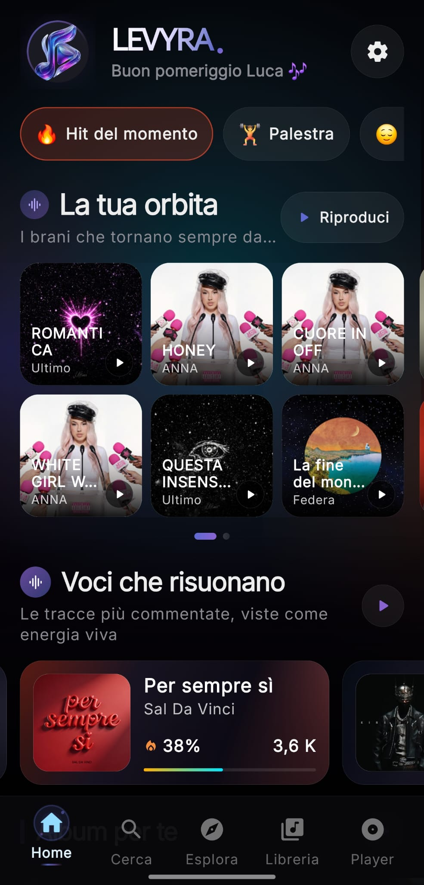
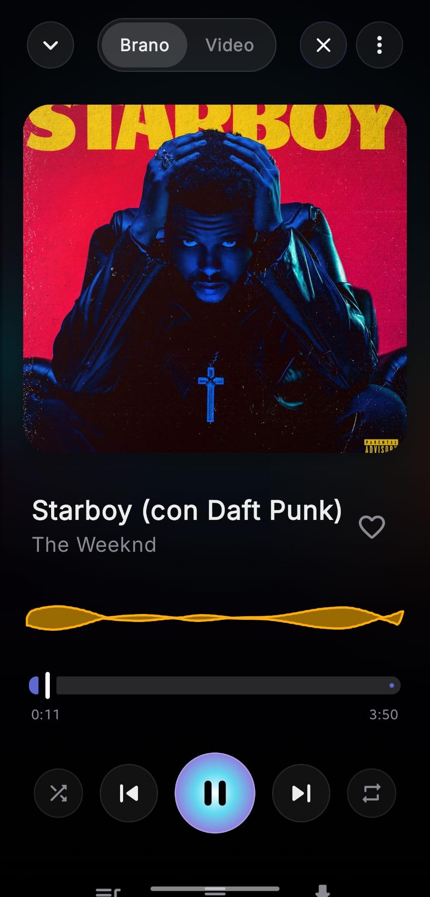
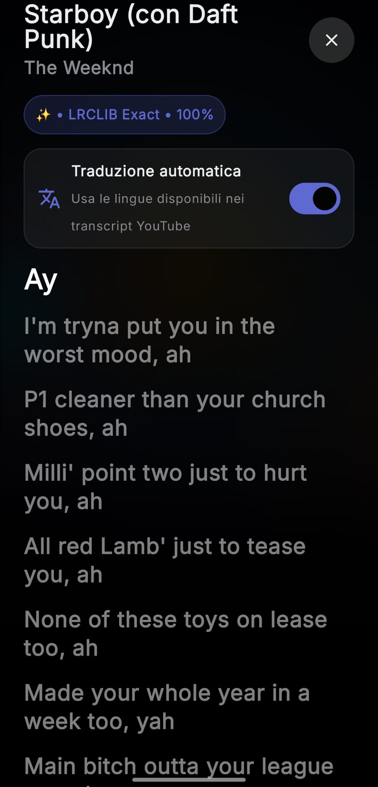
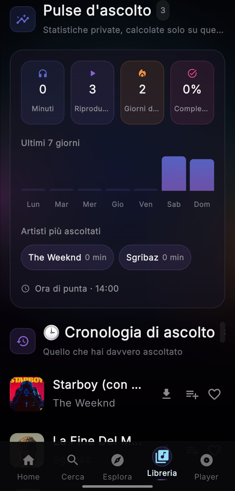
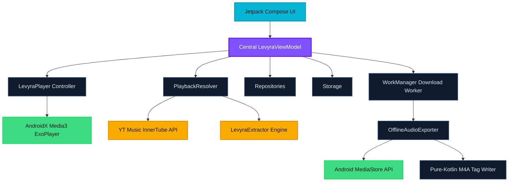

<div align="center">


<br><br>

# L E V Y R A

### Your music. Your files. Your phone. Nobody else's business.

Levyra is a native Android music player built from the ground up in Kotlin. No webviews, no wrappers, and absolutely no tracking.
Stream instantly, download real tagged files to your own storage, and view your listening history without a single byte leaving your device.

<br>

<p>
  
  
  
  
  
  
</p>

<br>

### ⬇️ &nbsp;[Download the latest APK](https://github.com/LUC4N3X/Levyra-deepsound/releases/latest) &nbsp;·&nbsp; [See what's new](https://github.com/LUC4N3X/Levyra-deepsound/releases) &nbsp;·&nbsp; [Report a bug](https://github.com/LUC4N3X/Levyra-deepsound/issues)

<br>

<a href="#features">Features</a> &nbsp;•&nbsp;
<a href="#screens">Screens</a> &nbsp;•&nbsp;
<a href="#architecture">Architecture</a> &nbsp;•&nbsp;
<a href="#tech-stack">Stack</a> &nbsp;•&nbsp;
<a href="#build-instructions">Build</a> &nbsp;•&nbsp;
<a href="#privacy">Privacy</a> &nbsp;•&nbsp;
<a href="#license-and-legal">License</a>

<br>


</div>

<br>

---

<div align="center">

## Why you will actually keep it installed

</div>

Most "free music" apps are just webviews in a trench coat: slow, ad-riddled, and quietly logging everything you touch. Levyra is the exact opposite.

It is a real Android app. It resolves tracks through YouTube Music's InnerTube API, falls back to the LevyraExtractor engine the moment stream signatures change, and pushes every second of audio through an optimized Media3 ExoPlayer service that keeps playing when the screen is off. 

When you download a song, you get a genuine `.m4a` file with the cover art, title, artist, and album baked in. It drops straight into your public `Music/Levyra` folder. That is a file you actually own, not a cache blob you will never find again.

<table width="100%">
<tr>
<td width="33%" valign="top" align="center">

### Instant and light

Written in Kotlin and Compose. It opens fast, scrolls smoothly, and stays out of your way.

</td>
<td width="33%" valign="top" align="center">

### Downloads you own

Real tagged files in your Music folder. No lock-in, no hidden database, and no expiration dates.

</td>
<td width="33%" valign="top" align="center">

### Nothing leaves your phone

Zero analytics. Zero tracking SDKs. Your listening stats are computed and stored strictly on your device.

</td>
</tr>
</table>

```text
com.luc4n3x.levyra   ·   Android 8.0 to 15   ·   100% Kotlin   ·   Compose Material 3   ·   Media3 ExoPlayer
```

<br>

---

## Features

### An interface that gets out of the way
Built for OLED screens. The dark-first, high-contrast theme looks right in a dark room and saves battery. Navigation between Home, Search, Library, and Player is tied together with custom micro-animations so nothing feels abrupt. You can slide between a tucked-away mini-player and a full-screen immersive view. It also supports Material 3 dynamic colors that follow your system palette.

### A playback engine you can trust
Audio survives backgrounding and screen locks thanks to a Media3 foreground service with real MediaSession controls. You get the tools that matter: loop, shuffle, a speed tuner, and sleep timers at 15, 30, or 60 minutes. You can also tune the sound with in-app normalization, silence skipping, and quality selection. SponsorBlock is built in, skipping non-music and sponsored segments automatically.

### Downloads that do not fall apart
Downloads go straight to your public `Music/Levyra` folder instead of a proprietary cache. High-res cover art and metadata are embedded the moment a download finishes. The WorkManager queue survives network drops and reboots with smart retries. Strict content-length checks throw out corrupted downloads and reschedule them automatically.

### Search and resolving that keeps up
Dual-channel resolving uses InnerTube first and LevyraExtractor as a backup. This provides smarter Opus and M4A selection along with URL caching that holds up when YouTube shifts signatures. A TTL-based stream cache prevents duplicate calls so tracks load faster the second time. The prefetch engine loads charts and queued tracks ahead of time for zero-gap playback.

### Listening Pulse
Real sessions are counted second by second and stored in Room. No cloud is involved. Your Library includes a dashboard showing total minutes, plays, day streaks, completion rates, peak hours, and a 7-day rhythm chart. You see your true listening history and top artists ranked by actual playtime.

### Synced lyrics
Lyrics are pulled instantly from track metadata using LRCLIB. Smooth scrolling highlights each line against the live ExoPlayer position. If timestamped lyrics are missing, it falls back to plain text gracefully.

<br>

---

## Screens

<div align="center">

<em>A quick look at Levyra in motion.</em>

<br><br>

<p align="center">
  <a href="docs/screenshots/home.jpeg"></a> &nbsp;
  <a href="docs/screenshots/player.jpeg"></a> &nbsp;
  <a href="docs/screenshots/lyrics.jpeg"></a> &nbsp;
  <a href="docs/screenshots/pulse.jpeg"></a>
</p>

<p align="center">
  <sub style="width: 23%; display: inline-block; text-align: center;"><strong>Home</strong></sub> &nbsp;
  <sub style="width: 23%; display: inline-block; text-align: center;"><strong>Full Player</strong></sub> &nbsp;
  <sub style="width: 23%; display: inline-block; text-align: center;"><strong>Synced Lyrics</strong></sub> &nbsp;
  <sub style="width: 23%; display: inline-block; text-align: center;"><strong>Listening Pulse</strong></sub>
</p>

</div>

<br>

---

## Architecture

Levyra sticks to a strict unidirectional data flow. Compose does the rendering, a single central ViewModel owns the state, and everything downstream sits behind clean boundaries so network and database work never touches the main thread.



### Where things live

| Layer | What it does | Directory |
|:---|:---|:---|
| UI | Composable screens, mini-player, theme engine, layout triggers | `ui/` |
| State | Central ViewModel for UI state | `viewmodel/` |
| Domain | Entities, data models, validation boundaries | `domain/` |
| Data & Network | Endpoints, charts client, lyrics parser, preferences | `data/` |
| Audio | Media3 foreground service, HLS, prefetch queue | `player/` |
| Exports | WorkManager pipeline, tagging, MediaStore registration | `player/offline/` |
| Local cache | Room entities, SQLite, key-value preference stores | `data/local/` |

<br>

---

## Tech Stack

* Kotlin 2.3.20
* Jetpack Compose, Material 3, Compose BOM
* AndroidX Media3, ExoPlayer, HLS, MediaSession
* OkHttp 5 with Brotli compression
* Coil 3 for async image loading
* Room and DataStore Preferences
* Android WorkManager
* kotlinx.serialization
* Gradle Kotlin DSL, version catalogs, KSP
* Spotify Ruler for bundle size tracking
* Mobius-inspired Model, Event, Effect, Update core for safe refactoring
* InnerTube resolver and LevyraExtractor playback core

<br>

---

## Build instructions

You will need Android Studio Jellyfish or newer, JDK 17, Android SDK Platform 35 or 36, and Gradle 9.4.1.

```bash
git clone https://github.com/LUC4N3X/Levyra-deepsound.git
cd Levyra-deepsound

# Debug build straight to a connected device
./gradlew installDebug

# Clean, optimized release build
./gradlew clean assembleRelease

# Inspect bundle size with Spotify Ruler
./gradlew :app:analyzeDebugBundle
```

The release APK lands at `app/build/outputs/apk/release/app-release.apk`.

Versioning lives in `gradle.properties`. The version code is derived so two builds can never collide. CI parses this schema, checks the target version with `aapt`, verifies structural integrity, builds the binary, and pushes it straight to GitHub Releases.

<br>

---

## Privacy

Privacy is the default. Levyra ships with no analytics frameworks and no tracking SDKs. Nothing about how you listen ever leaves your phone.

Permissions used:
* `INTERNET` and `ACCESS_NETWORK_STATE`: Stream audio and fetch metadata.
* `FOREGROUND_SERVICE_MEDIA_PLAYBACK`: Keep playback alive in the background.
* `POST_NOTIFICATIONS`: Show the Media3 media controls.
* `WAKE_LOCK`: Prevent stutters when the CPU sleeps.
* `WRITE_EXTERNAL_STORAGE` (SDK 28 and older): Legacy path for offline export.

<br>

---

## Forking and Contributing

If you plan to ship your own build, please follow these rules:

1. Generate and rotate your own Android keystores before publishing anything public.
2. Follow the release schema instead of default Gradle output names.
3. Keep the main thread clean. Every disk write, database call, and network resolve runs on `Dispatchers.IO`. No exceptions.
4. If a query times out, route it through the fallback channel rather than letting it fail silently.

<br>

---

## Credits

<table>
  <tr>
    <td width="100" align="center">
      <a href="https://github.com/LUC4N3X">
        
      </a>
    </td>
    <td>
      <strong>LUC4N3X</strong> (Creator & Lead Architect)
      <p>System architecture, ExoPlayer orchestration, the background WorkManager export queue, the automated release pipeline, and design direction.</p>
    </td>
  </tr>
</table>

UI structure and modular styling take inspiration from the open-source Metrolist.

The extraction core is LevyraExtractor, a GPL-3.0 fork of PipePipeExtractor from the NewPipe and PipePipe ecosystem.

<br>

---

## License and Legal

Levyra is an independent, community-developed open-source project. It is not affiliated with, authorized by, endorsed by, sponsored by, or connected to Google, YouTube, YouTube Music, Android, NewPipe, PipePipe, Metrolist, or any other third party. Third-party names, logos, and trademarks appear only for identification, compatibility, and attribution, and remain the property of their respective owners.

### No hosting, no content ownership
Levyra does not host media, upload anything to remote servers, sell access to content, or maintain a catalogue of its own. It is a client that runs on your device. When you ask it to, it talks to independent third-party services and works with whatever those services return. Availability, licensing, regional rules, and takedowns all stay under the control of those providers and rights holders. The presence of a search result, link, or stream inside the app does not mean the maintainers host, license, or control it.

### Your use, your responsibility
You are responsible for how you install, configure, modify, distribute, and use Levyra, and for making sure your use complies with:
* copyright, IP, privacy, computer-misuse, export, and telecom law;
* the terms of service and technical restrictions of any third-party provider;
* any territorial, contractual, subscription, age, or access requirements on the content you request;
* all permissions needed to download, store, convert, share, or redistribute content.

Levyra grants no license to access or exploit third-party content. Do not use it to infringe copyright, evade payment, bypass DRM, defeat access controls, or violate any law or agreement. Download features are general-purpose tools, and their existence is not confirmation that a given item may lawfully be downloaded or kept.

### Third-party services and account risk
Levyra depends on unaffiliated services, APIs, and extraction components that can change, restrict, block, rate-limit, or disappear at any time without notice. The maintainers do not control that infrastructure and cannot guarantee stream availability, metadata accuracy, account compatibility, or uninterrupted operation. Accessing those services may transmit the usual technical data (IP, headers, device info, cookies, account identifiers). The maintainers are not responsible for warnings, suspensions, bans, rate limits, regional blocks, expired links, or any enforcement action taken by a third party.

### No warranty
To the maximum extent permitted by law, Levyra and everything related to it is provided "AS IS" and "AS AVAILABLE," without warranty of any kind, express or implied. No promise is made about merchantability, fitness for a purpose, title, non-infringement, reliability, security, accuracy, availability, error-free operation, or data preservation. You assume the full risk of installing, building, signing, modifying, distributing, and using it, and should verify downloaded files, permissions, backups, and the legality of every operation yourself.

### Limitation of liability
To the maximum extent permitted by law, the project owner, maintainers, contributors, copyright holders, upstream projects, and distributors are not liable for any direct, indirect, incidental, special, exemplary, punitive, or consequential damage arising from Levyra, including loss of data, lost revenue, device malfunction, or copyright claims. These limits apply regardless of legal theory.

### Unofficial builds
Only source and releases published through the official Levyra repository are maintained here. The maintainers are not responsible for forks, mirrors, modified builds, third-party stores, altered extraction logic, removed notices, bundled malware, or leaked signing material. Anyone redistributing a modified build must comply with the GPL-3.0, preserve notices, clearly mark their changes, use their own signing credentials, and must not imply official status.

### Rights-holder requests
No third-party media files are intentionally included in this repository. A rights holder who believes a repository asset infringes their rights may contact the project owner through the issue tracker.

### License scope
Levyra is released under the GNU General Public License v3.0. See the LICENSE file for the full terms. The GPL-3.0 covers the source code and does not grant rights to third-party trademarks, media, metadata, artwork, lyrics, APIs, or externally hosted content, which stay subject to their own licenses.

### Severability
If any part of this notice is found invalid or unenforceable, it will be limited to the minimum extent needed to make it enforceable, and the rest continues to apply. By downloading, building, installing, modifying, distributing, or using Levyra, you acknowledge the technical and legal risks described here and accept responsibility for lawful use, to the extent that acknowledgement is legally effective.

<br>

<div align="center">

**Built with care by [LUC4N3X](https://github.com/LUC4N3X)**

If Levyra earns a spot on your phone, a ⭐ on the repo means a lot.

<br>
</div>
