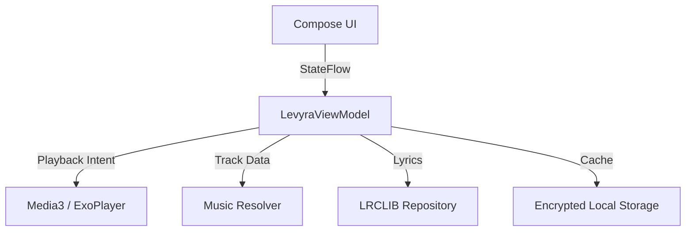

<div align="center">


<br>

<h3>Modern Android music player built for fast discovery, rich artwork and immersive playback.</h3>

<p>
  <strong>Deep Music. Real Experience.</strong>
</p>

<p>
  <a href="https://kotlinlang.org/">
    
  </a>
  <a href="https://developer.android.com/jetpack/compose">
    
  </a>
  <a href="https://developer.android.com/media/media3">
    
  </a>
  <a href="LICENSE">
    
  </a>
</p>

<p>
  <a href="#-key-features"><strong>Features</strong></a>
  ·
  <a href="#-architecture"><strong>Architecture</strong></a>
  ·
  <a href="#-getting-started"><strong>Getting Started</strong></a>
  ·
  <a href="#-credits"><strong>Credits</strong></a>
  ·
  <a href="#-legal-disclaimer"><strong>Disclaimer</strong></a>
</p>

</div>

---

**Levyra** is a modern Android music player focused on speed, clean design, rich artwork, and immersive playback.  
It combines a polished dark interface with smart discovery, background audio, synced lyrics, and a production-ready Android architecture.

<br>

## ✦ Key Features

### 1. Premium Android Interface
- **Clean dark UI:** deep black surfaces, soft contrast, glass-style cards, and readable typography.
- **Artwork-first experience:** album covers, gradients, and ambient visuals are treated as part of the player.
- **Smooth navigation:** fast search, compact sections, and a layout designed to feel native on Android.

### 2. Smart Music Discovery
- **Instant search:** quick suggestions and responsive query handling.
- **Recent listening shelf:** clean horizontal cards for recently played tracks.
- **Voice-ready flow:** search and playback flows built to support fast interaction.

### 3. Immersive Playback
- **Media3 / ExoPlayer:** reliable foreground playback service with background audio support.
- **Queue-aware playback:** preloading and queue handling for smoother track transitions.
- **Synced lyrics:** lyric rendering designed around playback position and smooth scrolling.
- **Playback tools:** skip-silence logic and optional non-music segment skipping where supported.

---

## ✦ Architecture

Levyra is built with modern Android patterns, separating UI, domain logic, playback control, and data access into clear layers.

<div align="center">



</div>

| Layer | Description | Stack |
| :--- | :--- | :--- |
| **Presentation** | Declarative screens driven by a unified UI state. | `Jetpack Compose` |
| **Domain** | Playback commands, media models, queue logic, and app use-cases. | `Kotlin Coroutines`, `StateFlow` |
| **Data** | Remote resolving, artwork loading, caching, and local persistence. | `Retrofit`, `OkHttp`, `Coil` |
| **Playback** | Audio session, notification controls, queue handling, and background service. | `Media3`, `ExoPlayer` |

---

## ✦ Getting Started

### Requirements

- Android Studio Jellyfish or newer
- Android SDK 34+
- JDK 17

### Build

```bash
git clone https://github.com/LUC4N3X/LevyraPlayer.git
cd LevyraPlayer
./gradlew installDebug
```

### Release build

```bash
./gradlew clean assembleRelease
```

---

## ✦ Credits

<table>
  <tr>
    <td align="center" valign="middle" width="120">
      <a href="https://github.com/LUC4N3X">
        
      </a>
    </td>
    <td valign="middle">
      <h3>LUC4N3X</h3>
      <p><strong>Creator & Lead Engineer</strong></p>
      <p>UI architecture, playback engine, background services, cache pipeline, and Android integration.</p>
    </td>
  </tr>
</table>

**Inspiration:**  
Special thanks to [Metrolist](https://github.com/MetrolistGroup/Metrolist) for its open-source work around music client architecture and catalog navigation.

---

## ✦ Legal Disclaimer

> [!WARNING]
> **Educational and research purposes only.**
>
> Levyra is an open-source media client. It does not host, store, or distribute copyrighted media.
>
> Audio streams, metadata, lyrics, and artwork may be resolved through third-party services or public endpoints. Use the app responsibly and comply with the laws and platform terms that apply in your region.
>
> The developer assumes no liability for misuse, account issues, copyright infringement, or third-party service limitations.
