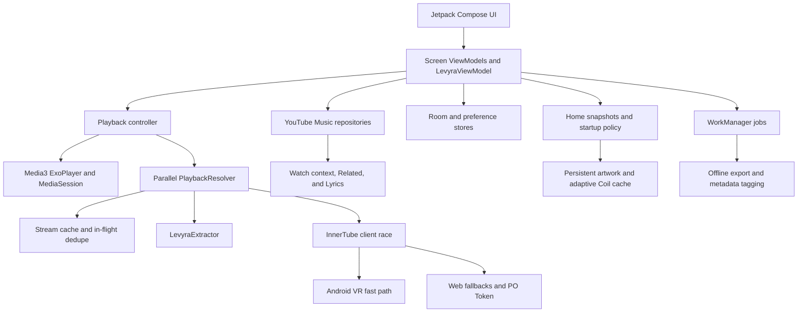

<div align="center">


# 🎶 

**A high-performance native Android music client built for fast playback, resilient discovery, intelligent lyrics, and complete local control.**

*Native YouTube Music context · Parallel stream resolution · Offline exports · Persistent queues · Adaptive startup performance.*

---

<p>
  
  
  
  
  
  
</p>


<br>


</div>

<br>

## ✦ Download Levyra

<div align="center">
  <a href="https://github.com/LUC4N3X/Levyra-deepsound/releases/latest">
    
  </a>
  <br><br>
  <sub>Official signed APK · Android 8.0 or newer · Current version 2.3.9</sub>
  <br><br>
  <a href="https://github.com/LUC4N3X/Levyra-deepsound/releases/latest">
    
  </a>
  <a href="https://github.com/LUC4N3X/Levyra-deepsound/releases">
    
  </a>
</div>

<br>

## ✦ What is Levyra?

Levyra is a native Android music application written in Kotlin and Jetpack Compose. It does not wrap a website: discovery, queue generation, lyrics, playback resolution, downloads, local history, and media-session integration are implemented as native application layers.

The standard playback path races LevyraExtractor against YouTube Music InnerTube clients, with Android VR retained as the primary low-latency profile. Expensive systems such as PO Token generation, BotGuard execution, and JavaScript transformations remain available only when fallback clients actually require them.

Downloaded tracks are exported as real media files to the public `Music/Levyra` directory, with embedded titles, artists, albums, and artwork.

```text
Application specifications
├── Package name      com.luc4n3x.levyra
├── Current version   2.3.9
├── Compile SDK       37
├── Target SDK        35
├── Minimum SDK       26 · Android 8.0
├── Primary language  Kotlin
├── UI framework      Jetpack Compose + Material 3
└── Audio foundation  AndroidX Media3 / ExoPlayer
```

<br>

## ✦ Inside Levyra

<p align="center">
  <strong>Discovery, playback, lyrics, and private listening insights in one continuous native experience.</strong>
</p>

<br>

<table width="100%">
  <tr>
    <td width="25%" align="center" valign="top">
      <a href="https://i.ibb.co/ynBG2ZQX/Whats-App-Image-2026-07-12-at-12-28-57.jpg">
        
      </a>
      <br><br>
      <strong>01 · Your Orbit</strong><br>
      <sub>Personal discovery, recent listening, native recommendations, and a Home shaped around your activity.</sub>
    </td>
    <td width="25%" align="center" valign="top">
      <a href="https://i.ibb.co/tp5gW9ZY/Whats-App-Image-2026-07-12-at-12-30-01.jpg">
        
      </a>
      <br><br>
      <strong>02 · Immersive Player</strong><br>
      <sub>Media3 playback, full controls, queue persistence, audio/video switching, and Picture-in-Picture.</sub>
    </td>
    <td width="25%" align="center" valign="top">
      <a href="https://i.ibb.co/LXGYw6Yb/Whats-App-Image-2026-07-12-at-12-30-55.jpg">
        
      </a>
      <br><br>
      <strong>03 · Intelligent Lyrics</strong><br>
      <sub>Native YouTube Music lyrics, LRCLIB, transcripts, synchronized lines, and graceful fallbacks.</sub>
    </td>
    <td width="25%" align="center" valign="top">
      <a href="https://i.ibb.co/twTrmtDL/Whats-App-Image-2026-07-12-at-12-31-58.jpg">
        
      </a>
      <br><br>
      <strong>04 · Listening Pulse</strong><br>
      <sub>Private on-device history, playtime, streaks, completion, and top artists.</sub>
    </td>
  </tr>
</table>

<p align="center"><sub>Open any preview to view it at full resolution.</sub></p>

<br>

## ✦ Key Features

### 🎧 Playback and queue

- **Parallel resolver:** LevyraExtractor and InnerTube start in an immediate race for low tap-to-play latency.
- **Android VR fast path:** tokenless primary profile that does not wait for BotGuard, PO Token generation, visitor-data prefetch, or JavaScript-player downloads.
- **Persistent queue:** queue contents, active index, playback position, shuffle state, and repeat state survive process restarts.
- **Audio/video switching:** select audio or video playback with adaptive codec and stream selection.
- **Picture-in-Picture:** native compact video playback outside the main application window.
- **MediaSession integration:** lock-screen, notification, headset, Bluetooth, and Android media controls.
- **SponsorBlock:** optional automatic skipping of supported non-music segments.
- **Playback controls:** shuffle, repeat, speed, sleep timer, silence skipping, and quality selection.

### 🎼 Native YouTube Music context

Levyra reads the native YouTube Music `/youtubei/v1/next` context for the selected track and extracts:

- radio queue and radio playlist ID;
- queue continuations;
- related-content browse ID;
- lyrics browse ID;
- album and artist browse IDs;
- audio/video counterparts;
- artwork, duration, explicit state, and music-video type.

Radio generation follows this order:

```text
Native Watch queue
→ Related tab tracks
→ Text search fallback
```

Unwanted alternate variants such as karaoke, nightcore, slowed, sped-up, and reaction videos are filtered consistently while legitimate titles such as `Reaction` and `Chain Reaction` are preserved.

### 📝 Multi-provider lyrics

Provider order:

```text
1. Synchronized YouTube Music lyrics
2. Synchronized LRCLIB lyrics
3. Plain YouTube Music lyrics
4. Plain LRCLIB lyrics
5. YouTube transcript
6. Lyrics.ovh
```

Levyra supports synchronized and plain lyrics, source attribution, timestamp detection, multiple text runs, line-break preservation, and offline reuse where available.

### 📥 Downloads and offline library

- Exports real audio files instead of opaque application cache blobs.
- Stores completed tracks in `Music/Levyra` through Android MediaStore.
- Embeds title, artist, album, duration, and artwork metadata.
- Uses WorkManager for resilient background execution and retry handling.
- Validates downloads to reject incomplete or truncated media files.
- Tracks active and completed downloads through the local Room database.

### 🎨 Apple Music-inspired interface

Version 2.3.9 introduces an `APPLE_MUSIC` preset while preserving Levyra’s dark cinematic identity:

- default `#FF2D55` pink/red accent;
- cleaner bottom navigation without the active Material pill;
- consistent `12.dp` action-button corners;
- restrained surfaces and reduced visual chrome;
- cached content kept visible during background refresh;
- shimmer shown only when no usable real content exists.

### 📊 Private listening intelligence

- Listening Pulse stores listening events locally in Room.
- Tracks minutes listened, plays, completion, streaks, peak hour, history, and top artists.
- Personal Orbit and discovery shelves adapt to local listening activity.
- Levyra does not include developer-operated analytics or advertising SDKs.

<br>

## ✦ Performance and Device Adaptation

Levyra separates user-critical playback work from secondary Home work. Starting a track is never blocked by Home scrolling, artwork enrichment, charts, or Release Radar.

### Fast playback path

```text
Track selected
├── valid cached URL
├── existing in-flight request
└── immediate race
    ├── LevyraExtractor
    └── InnerTube
        ├── Android VR
        ├── Android Music
        ├── Android
        ├── iOS
        └── Web fallbacks with PO Token
```

The resolver includes:

- TTL-based stream caching;
- in-flight request deduplication;
- per-client health and latency statistics;
- signature decipher and `n` transformation only when required;
- guest-session rotation after eligible bot, token, or repeated HTTP failures;
- advanced Web fallbacks with locally generated PO Tokens.

### Smooth Home startup

At launch, Levyra restores usable Home data and persistent artwork first. Secondary work is postponed while the user is actively scrolling and resumes only after an idle window.

```text
Application start
├── restore saved Home snapshot
├── restore persistent artwork paths
├── render usable content immediately
└── refresh in background
    ├── wait while Home is scrolling
    ├── fetch updated sections
    ├── enrich a bounded number of artworks
    └── publish only changed content
```

### Older and low-RAM devices

Levyra detects device memory and power constraints, then adapts:

- artwork memory-cache budget;
- number of priority images;
- enrichment concurrency;
- chart warm-up volume;
- persistent artwork writes;
- secondary startup delay;
- Release Radar workload.

Low-RAM devices use smaller caches and less startup concurrency while user-triggered playback remains immediate.

### Artwork stability

Artwork source order:

```text
Persistent local file
→ Coil memory cache
→ Coil disk cache
→ Network source
```

The image cache uses a bounded adaptive policy rather than a fixed heap percentage:

```text
Minimum budget       24 MB
Maximum budget      112 MB
Maximum heap share   25%
```

Startup diagnostics track first real artwork time, persistent-cache hits, remote requests, model changes, late placeholders, Home emissions, and shimmer regressions.

<br>

## ✦ Audio Quality and Normalization

The stream resolver reads YouTube audio metadata from:

```text
playerConfig.audioConfig.loudnessDb
playerConfig.audioConfig.perceptualLoudnessDb
```

The values flow through resolved streams, track persistence, MediaItem extras, PlaybackService, and `NormalizationAudioProcessor`.

The processor:

- prefers perceptual loudness metadata;
- falls back to standard loudness metadata;
- attenuates overly loud masters;
- avoids unsafe boosting;
- uses RMS normalization when YouTube metadata is unavailable;
- applies gradual transitions to prevent abrupt volume changes.

Existing ReplayGain, normalization, and loudness-enhancer options remain available.

<br>

## ✦ Architecture

Levyra follows unidirectional data flow. Compose renders immutable projections, ViewModels coordinate UI state, repositories isolate remote and local data sources, and Media3 owns the long-running playback lifecycle.



| Layer | Responsibility | Directory |
|:---|:---|:---|
| **Application UI** | Compose screens, navigation, themes, cards, player surfaces | [`app/src/main/java/com/luc4n3x/levyra/ui`](app/src/main/java/com/luc4n3x/levyra/ui) |
| **State and orchestration** | Screen projections, application state, navigation coordination | [`app/src/main/java/com/luc4n3x/levyra/viewmodel`](app/src/main/java/com/luc4n3x/levyra/viewmodel) |
| **Domain** | Track, album, artist, settings, mood, and local-intelligence models | [`app/src/main/java/com/luc4n3x/levyra/domain`](app/src/main/java/com/luc4n3x/levyra/domain) |
| **Data and network** | InnerTube, Watch Context, lyrics, artwork, caches, preferences | [`app/src/main/java/com/luc4n3x/levyra/data`](app/src/main/java/com/luc4n3x/levyra/data) |
| **Playback** | Media3 service, MediaItem mapping, normalization, adaptive policy | [`app/src/main/java/com/luc4n3x/levyra/player`](app/src/main/java/com/luc4n3x/levyra/player) |
| **Local persistence** | Room entities and DAOs for history, queue, favorites, playlists, downloads | [`app/src/main/java/com/luc4n3x/levyra/data/local`](app/src/main/java/com/luc4n3x/levyra/data/local) |
| **Offline pipeline** | WorkManager downloading, MediaStore export, metadata tagging | [`app/src/main/java/com/luc4n3x/levyra/player/offline`](app/src/main/java/com/luc4n3x/levyra/player/offline) |
| **Extraction core** | Embedded LevyraExtractor modules | [`LevyraExtractor`](LevyraExtractor) |

Detailed engineering documentation is available in [`docs/ARCHITECTURE.md`](docs/ARCHITECTURE.md).

<br>

## ✦ Technical Stack

- **Language:** Kotlin 2.4.0
- **User interface:** Jetpack Compose and Material 3
- **Playback:** AndroidX Media3, ExoPlayer, MediaSession, HLS
- **Networking:** OkHttp with Brotli support
- **Images:** Coil 3 with adaptive memory and disk caching
- **Persistence:** Room and DataStore-style preferences
- **Background work:** Android WorkManager
- **Serialization:** kotlinx.serialization and JSON payload codecs
- **Build:** Gradle Kotlin DSL, Version Catalogs, KSP
- **Extraction:** LevyraExtractor plus InnerTube client profiles
- **Testing:** Kotlin/JUnit unit coverage and GitHub Actions release checks

<br>

## ✦ Getting Started

### Prerequisites

- Android Studio with current Android Gradle Plugin support
- JDK 17
- Android SDK Platform 37
- Gradle 9.6.1 through the repository wrapper

### Build the project

```bash
git clone https://github.com/LUC4N3X/Levyra-deepsound.git
cd Levyra-deepsound

./gradlew installDebug
./gradlew :app:lintRelease
./gradlew testReleaseUnitTest
./gradlew assembleRelease
```

Release APK output:

```text
app/build/outputs/apk/release/app-release.apk
```

Versioning is centralized in `gradle.properties`:

```properties
levyraVersionName=2.3.9
levyraVersionCode=2030900
```

The version-code schema is:

```text
major × 1,000,000 + minor × 10,000 + patch × 100 + build
```

GitHub Actions validates version metadata, APK structure, release naming, workflow duplication, and artifact safety before publishing.


## ✦ Permissions and Privacy

Levyra does not include advertising SDKs, analytics frameworks, or developer-operated telemetry. Listening statistics generated by Pulse remain on the device.

Search, artwork, lyrics, playback, SponsorBlock, downloads, and optional account features contact third-party services. Those services may receive ordinary request data such as IP address, HTTP headers, client information, cookies, or account identifiers where applicable.

```text
Manifest permissions
├── INTERNET and ACCESS_NETWORK_STATE       Search, metadata, artwork, lyrics, and streams
├── FOREGROUND_SERVICE_MEDIA_PLAYBACK       Background audio playback
├── POST_NOTIFICATIONS                      Media controller and download notifications
├── WAKE_LOCK                               Stable playback while the screen is off
└── WRITE_EXTERNAL_STORAGE · SDK 28 or less Legacy offline export support
```

<br>

## ✦ Contributing

Before submitting changes:

1. Run `:app:lintRelease`, release unit tests, and `assembleRelease`.
2. Keep network, database, image persistence, and file operations off the main thread.
3. Preserve immediate user-triggered playback; startup optimizations must not delay tap-to-play.
4. Use stable Compose keys and avoid publishing identical Home state.
5. Test changes on both modern and low-RAM devices.
6. Add regression coverage for resolver timing, queue persistence, artwork stability, or navigation changes.
7. Use your own signing keys for redistributed builds.

<br>

## ✦ Credits
 
<table>
  <tr>
    <td width="100" align="center">
      <a href="https://github.com/LUC4N3X">
        
      </a>
    </td>
    <td>
      <strong>LUC4N3X</strong> — <em>Creator & Lead Architect</em>
      <p>System architecture, ExoPlayer orchestration, background WorkManager export queue, automated releases pipeline, design lead.</p>
    </td>
  </tr>
</table>
 
*UI and modular styling conventions draw structural inspiration from the open-source project [Metrolist](https://github.com/MetrolistGroup/Metrolist).*
 
*The stream extraction core uses [LevyraExtractor](https://github.com/LUC4N3X/LevyraExtractor), a GPL-3.0 fork derived from [PipePipeExtractor](https://github.com/InfinityLoop1308/PipePipeExtractor) in the NewPipe/PipePipe ecosystem.*

---

## ✦ Disclaimers and License

> [!WARNING]
> **Educational and research purposes only**
>
> Levyra is an open-source client and does not host, upload, or index copyrighted media. It interacts with third-party services whose availability, responses, restrictions, and terms may change. Users are responsible for complying with applicable law and third-party terms. The project maintainers are not responsible for service changes, account restrictions, unavailable content, or misuse of the application.

Licensed under the **GNU General Public License v3.0**. See [`LICENSE`](LICENSE).
