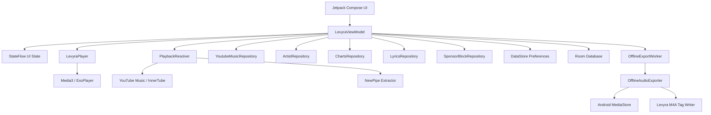

<div align="center">


<br>

<h3>Modern Android music player with fast discovery, immersive playback, offline exports and a polished Spotify-style experience.</h3>

<p>
  <strong>Deep Music. Real Experience.</strong>
</p>

<p>
  <a href="https://kotlinlang.org/">
    
  </a>
  <a href="https://developer.android.com/jetpack/compose">
    
  </a>
  <a href="https://developer.android.com/media/media3">
    
  </a>
  <a href="LICENSE">
    
  </a>
</p>

<p>
  <a href="#-overview"><strong>Overview</strong></a>
  ·
  <a href="#-features"><strong>Features</strong></a>
  ·
  <a href="#-architecture"><strong>Architecture</strong></a>
  ·
  <a href="#-build"><strong>Build</strong></a>
  ·
  <a href="#-release-flow"><strong>Release</strong></a>
  ·
  <a href="#-credits"><strong>Credits</strong></a>
</p>

<br>


<br>
<br>

</div>

---

## ✦ Overview

**Levyra** is a native Android music client built around a premium dark interface, fast YouTube Music discovery, background playback, synced lyrics, playlist management and offline export.

The app is designed like a real production music player: UI state is centralized, playback is isolated behind a Media3 engine, searches and stream resolution run off the main thread, downloads are handled by WorkManager, and local data is persisted through Room and DataStore.

```text
Current version: 2.2.0
Package name:    com.luc4n3x.levyra
Min SDK:         26
Compile SDK:     36
Target SDK:      35
Language:        Kotlin
UI:              Jetpack Compose + Material 3
Playback:        AndroidX Media3 / ExoPlayer
```

---

## ✦ Features

### Premium Android UI

- Dark-first interface with deep surfaces, soft borders, glass cards and high-contrast typography.
- Spotify / YouTube Music inspired bottom navigation with Home, Search, Library and Player sections.
- Floating mini-player with quick playback controls.
- Fullscreen player with large artwork, waveform-style visual feedback, queue tools and readable controls.
- Adaptive Android launcher icon and internal Levyra branding.
- Smooth Compose transitions, animated cards and optional dynamic color support.

### Music discovery

- YouTube Music home feed parsed into real sections.
- Fast search with suggestions, top result, songs, artists and albums.
- Mood and taste-based onboarding for personalized discovery.
- Regional charts with selectable countries.
- Recent searches and recently played tracks stored locally.
- Artist profile pages with top songs, releases and metadata where available.

### Playback engine

- AndroidX Media3 / ExoPlayer foreground service.
- Background audio with MediaSession notification controls.
- Audio and video playback mode switching.
- Queue-aware playback with next / previous controls.
- Playlist autoplay with loop-on-completion behavior.
- Repeat all, repeat one and shuffle modes.
- Playback speed selector.
- Sleep timer with 15, 30 and 60 minute presets.
- Audio quality selector: Auto, High and Low.
- Optional audio normalization.
- Optional skip-silence mode.
- Optional SponsorBlock segment skipping when segments are available.

### Fast stream resolving

- YouTube Music / InnerTube based metadata and stream resolving.
- NewPipe Extractor fallback path for playback resolution.
- Multiple client profiles for better playback resilience.
- In-memory and persisted stream cache with TTL validation.
- In-flight request deduplication to avoid resolving the same track multiple times.
- Network warmup for YouTube endpoints.
- Queue prefetching around the current track for faster transitions.
- Top-list prefetching for home, charts and search results.

### Lyrics

- Synced and unsynced lyrics support through LRCLIB-style lookup.
- Active lyric line tracking based on playback position.
- Lyrics panel integrated with the player experience.
- Safe fallback when synced lyrics are not available.

### Library

- Favorites stored locally.
- User playlists with create, rename, delete, add track and remove track actions.
- Playlist playback starts from any selected track.
- Playlist completion loops automatically when launched as a playlist session.
- Download history stored with file metadata.

### Offline export

- One-tap track export into the public `Music/Levyra` folder.
- WorkManager-based background export with network constraint and retry behavior.
- Download progress tracking per track.
- Duplicate download guard for already-running exports.
- Room-backed download history.
- Android MediaStore integration.
- Pure Kotlin M4A metadata writer for compatible M4A / MP4 audio files.
- Embedded title, artist, album, album artist, year and cover art when the container supports it.
- Safe fallback to Android metadata when embedded tagging is not possible.

Supported embedded artwork formats:

```text
JPEG
PNG
```

### Settings and updates

- Language selector with Italian and English UI support.
- Taste questionnaire reset.
- Animation toggle.
- Dynamic color toggle.
- SponsorBlock toggle.
- Skip silence toggle.
- Audio quality selector.
- In-app update check against GitHub Releases.
- Version-aware APK selection so the app prefers the correct release asset.

---

## ✦ Architecture

Levyra follows a layered Android architecture. Compose renders state, the ViewModel owns orchestration, repositories isolate data sources, and playback/export logic stays outside the UI layer.



| Layer | Responsibility | Main files |
| :--- | :--- | :--- |
| **UI** | Compose screens, player layout, bottom navigation, settings, dialogs and visual components. | `ui/LevyraApp.kt`, `ui/WaveformVisualizer.kt`, `ui/theme/LevyraTheme.kt` |
| **ViewModel** | Single source of truth for playback state, navigation state, search state, downloads, lyrics and updates. | `viewmodel/LevyraViewModel.kt`, `viewmodel/LevyraUiState.kt` |
| **Domain** | Track models, moods, language catalog, lyrics engine, app update model and playlist model. | `domain/Models.kt`, `domain/MoodEngine.kt`, `domain/LyricsEngine.kt`, `domain/LevyraLanguage.kt` |
| **Data** | YouTube Music discovery, artist data, charts, lyrics, preferences, favorites, playlists and update checks. | `data/*` |
| **Playback** | Media3 player, audio processors, stream cache, playback warmup and foreground service. | `player/*` |
| **Offline** | Background download/export pipeline, MediaStore saving and M4A metadata writing. | `player/offline/*` |
| **Persistence** | Room entities/DAO/database for favorites, playlists and download history. | `data/local/*` |

---

## ✦ Project structure

```text
Levyra-deepsound/
├── .github/
│   └── workflows/
│       ├── android-apk.yml
│       └── release-apk.yml
├── app/
│   ├── build.gradle.kts
│   ├── proguard-rules.pro
│   └── src/main/
│       ├── AndroidManifest.xml
│       ├── java/com/luc4n3x/levyra/
│       │   ├── data/
│       │   ├── domain/
│       │   ├── player/
│       │   ├── ui/
│       │   └── viewmodel/
│       └── res/
├── gradle/
│   └── libs.versions.toml
├── build.gradle.kts
├── gradle.properties
├── settings.gradle.kts
├── LICENSE
└── README.md
```

---

## ✦ Tech stack

| Area | Stack |
| :--- | :--- |
| Language | Kotlin 2.3.20 |
| UI | Jetpack Compose, Material 3, Compose BOM |
| Playback | AndroidX Media3, ExoPlayer, MediaSession, HLS, OkHttp data source |
| Concurrency | Kotlin Coroutines, StateFlow |
| Networking | OkHttp 5, Brotli, HttpURLConnection for selected InnerTube calls |
| Metadata / images | Coil 3 |
| Persistence | Room, DataStore Preferences |
| Background work | WorkManager |
| Serialization | kotlinx.serialization |
| Debug tooling | Chucker in debug builds, Timber logging |
| Build system | Gradle Kotlin DSL, Version Catalog, KSP |
| Distribution | GitHub Actions, GitHub Releases, versioned APK artifact |

---

## ✦ Build

### Requirements

```text
Android Studio Jellyfish or newer
JDK 17
Android SDK Platform 36
Android Build Tools 36.0.0
Gradle 8.14.4 or wrapper equivalent
```

### Clone

```bash
git clone https://github.com/LUC4N3X/Levyra-deepsound.git
cd Levyra-deepsound
```

### Debug build

```bash
./gradlew installDebug
```

Windows PowerShell:

```powershell
.\gradlew.bat installDebug
```

### Release build

```bash
./gradlew clean assembleRelease
```

Windows PowerShell:

```powershell
.\gradlew.bat clean assembleRelease
```

The generated APK is written to:

```text
app/build/outputs/apk/release/app-release.apk
```

---

## ✦ Versioning

The app version is controlled from `gradle.properties` and can also be overridden by CI through Gradle properties or environment variables.

```properties
levyraVersionName=2.2.0
levyraVersionCode=2020000
```

Version code format:

```text
major * 1_000_000 + minor * 10_000 + patch * 100 + build
```

Examples:

```text
2.1.0  -> 2010000
2.2.0  -> 2020000
2.2.1  -> 2020100
2.2.0.4 -> 2020004
```

CI gives priority to release tags and explicit version inputs, so a tag like `v2.2.0` builds an APK with `versionName = 2.2.0` and `versionCode = 2020000`.

---

## ✦ Release flow

Levyra ships APKs through GitHub Releases.

### Automatic release from tag

```bash
git tag v2.2.0
git push origin v2.2.0
```

The release workflow will:

```text
1. Resolve the version from the tag.
2. Build the release APK.
3. Verify versionName and versionCode with aapt.
4. Rename the APK to LEVYRA-<version>.apk.
5. Delete old APK assets from the same release.
6. Upload the fresh APK.
7. Mark the release as latest.
```

Expected release asset name:

```text
LEVYRA-2.2.0.apk
```

### Manual release workflow

The `Publish LEVYRA Release` workflow also supports `workflow_dispatch` with a tag input.

```text
v2.2.0
```

### App update checker

The Android app checks:

```text
https://api.github.com/repos/LUC4N3X/Levyra-deepsound/releases/latest
```

The update checker compares the installed app version with the latest GitHub Release tag and prefers APK assets that contain the exact target version in the filename.

---

## ✦ Runtime permissions

Levyra uses only the permissions needed for playback, network access, notifications and public music export.

```text
INTERNET
ACCESS_NETWORK_STATE
FOREGROUND_SERVICE
FOREGROUND_SERVICE_MEDIA_PLAYBACK
POST_NOTIFICATIONS
WAKE_LOCK
WRITE_EXTERNAL_STORAGE on Android 9 and lower only
```

---

## ✦ Notes for forks

- Replace release signing material before publishing your own public build.
- Keep APK asset names versioned, for example `LEVYRA-2.2.0.apk`.
- Publish updates as GitHub Releases instead of uploading random APKs to the same release.
- When changing `versionName`, also update `versionCode`.
- Keep download/export logic off the main thread.
- Do not move playback resolving into Composables; keep it behind `PlaybackResolver` and `LevyraViewModel`.
- Keep debug-only tooling out of release builds.

---

## ✦ Credits

<table>
  <tr>
    <td align="center" valign="middle" width="120">
      <a href="https://github.com/LUC4N3X">
        
      </a>
    </td>
    <td valign="middle">
      <h3>LUC4N3X</h3>
      <p><strong>Creator & Lead Engineer</strong></p>
      <p>Product direction, Android UI, playback engine, offline export pipeline, update flow and release automation.</p>
    </td>
  </tr>
</table>

### Inspiration

Special thanks to the open-source Android music ecosystem. Levyra takes design and architecture inspiration from modern music clients such as Metrolist and Compose-based player references, while keeping Levyra-specific UI, playback, export and app logic inside this project.

---

## ✦ Legal disclaimer

> [!WARNING]
> **Educational and research purposes only.**
>
> Levyra is an open-source media client. It does not host, store or distribute copyrighted media.
>
> Metadata, artwork, lyrics and playable streams may be resolved through third-party services or public endpoints. Use the app responsibly and comply with the laws, licenses and platform terms that apply in your region.
>
> The developer assumes no liability for misuse, account issues, copyright infringement, third-party service limitations or content availability.

---

## ✦ License

This project is licensed under **GPL-3.0**. See [`LICENSE`](LICENSE) for the full license text.
