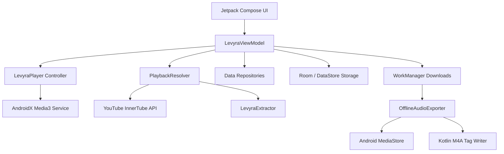

<div align="center">


# Levyra

**Native, private music streaming and offline library for Android and Windows.**

<p align="center">
  <a href="https://github.com/LUC4N3X/Levyra-deepsound/releases/latest"></a>
  <a href="https://github.com/LUC4N3X/Levyra-deepsound/releases"></a>
  <a href="LICENSE"></a>
  <a href="https://github.com/LUC4N3X/Levyra-deepsound/stargazers"></a>
</p>

### Download

<p align="center">
  <a href="https://github.com/LUC4N3X/Levyra-deepsound/releases/latest"></a>
  <a href="https://apps.obtainium.imranr.dev/redirect.html?r=obtainium://add/https://github.com/LUC4N3X/Levyra-deepsound"></a>
</p>
<p align="center">
  <a href="https://github.com/LUC4N3X/Levyra-deepsound/releases?q=Levyra+Desktop&expanded=true"></a>
</p>

</div>

---

## Overview

Levyra is an open-source music player built from scratch in Kotlin for Android and Windows. It provides fast streaming, local playback, and direct file ownership without user accounts, subscriptions, or telemetry.

On Android, downloaded tracks are saved as tagged M4A files in your public `Music/Levyra` folder so you can move or back them up freely. On Windows, Levyra maintains a persistent local library with resumable downloads and automatically prioritizes verified local files over network streams.

<table>
  <tr>
    <td width="33%" valign="top">
      <h4>Private by design</h4>
      Listening history, statistics, and preferences remain in local storage. No trackers, telemetry, or remote user profiling.
    </td>
    <td width="33%" valign="top">
      <h4>Real file ownership</h4>
      Standard M4A exports with embedded metadata and artwork, not encrypted or disposable cache blobs.
    </td>
    <td width="33%" valign="top">
      <h4>Native audio engines</h4>
      AndroidX Media3 and ExoPlayer on Android; libvlc with system tray integration and mini player on Windows.
    </td>
  </tr>
</table>

<div align="center">
  <code>Kotlin</code> &nbsp;·&nbsp; <code>Jetpack Compose</code> &nbsp;·&nbsp; <code>Compose Multiplatform</code> &nbsp;·&nbsp; <code>Media3</code> &nbsp;·&nbsp; <code>libvlc</code>
</div>

---

## Features

<table>
<tr>
<td width="50%" valign="top">

### Playback and audio control

* **Platform-native playback**: AndroidX Media3 foreground service with MediaSession on Android; libvlc, tray controls, and single-instance handling on Windows.
* **Playback controls**: Loop all, loop single, shuffle, adjustable playback speed, and sleep timers (15, 30, 60 minutes).
* **Audio processing**: Volume normalization, silence skipping, and stream quality selection (Auto, High, Low).
* **SponsorBlock integration**: Automatically skips non-music intro and promotional segments during playback.

</td>
<td width="50%" valign="top">

### Offline library and downloads

* **Android file exports**: Saves tagged M4A files to `Music/Levyra` with full metadata and embedded album art.
* **Windows offline store**: Resumable downloads with progress tracking, HTTP Range support, and cancellation.
* **Atomic writes**: Prevents partial or corrupted files from appearing as complete in your library.
* **Local-first routing**: Automatically switches to the verified offline copy when available.

</td>
</tr>
<tr>
<td width="50%" valign="top">

### Search and stream extraction

* **Dual resolver**: Combines InnerTube and LevyraExtractor with automatic Opus and M4A stream selection.
* **Stream caching**: In-memory and TTL caching reduce repeated network requests.
* **Search filters**: Live search suggestions, categorised filters, and top-match sorting.
* **Queue prefetching**: Prefetches upcoming queue items for fast, gapless track transitions.

</td>
<td width="50%" valign="top">

### Lyrics and listening metrics

* **Synchronized lyrics**: Live scrolling lyrics powered by LRCLIB, synced with the active player.
* **Static fallback**: Clean static lyrics display when timestamped lyrics are unavailable.
* **Local pulse stats**: Track total listening time, play count, daily streaks, completion rates, and peak hours.
* **Accurate history**: Artist rankings and history based on actual playtime, stored locally in SQLite.

</td>
</tr>
</table>

---

## Interface preview

<div align="center">
  
  <p><em>Levyra interface across discovery, player, collections, and local offline library.</em></p>
</div>

---

## Architecture

Levyra maintains two native clients in a single repository:

* **Android** (`app/`): Built with Jetpack Compose and Material 3, following unidirectional data flow around a centralized ViewModel and AndroidX Media3 audio service.
* **Windows Desktop** (`desktop/`): Isolated Kotlin/JVM application using Compose Multiplatform, libvlc audio output, and local JSON/file persistence under `%APPDATA%\Levyra`.

Both clients share the core extractor logic and localization resources.

```text
Android specifications
├── Package name     com.luc4n3x.levyra
├── Target SDK       37
├── Min SDK          26 (Android 8.0)
├── Language         100% Kotlin
├── UI framework     Jetpack Compose + Material 3
└── Audio engine     AndroidX Media3 / ExoPlayer
```


```mermaid
graph TD
    UI["Jetpack Compose UI"] --> VM["LevyraViewModel"]
    
    VM --> Player["LevyraPlayer Controller"]
    VM --> Resolver["PlaybackResolver"]
    VM --> Repos["Data Repositories"]
    VM --> Store["Room / DataStore Storage"]
    VM --> Work["WorkManager Downloads"]
    
    Player --> Media3["AndroidX Media3 Service"]
    
    Resolver --> InnerTube["YouTube InnerTube API"]
    Resolver --> Extractor["LevyraExtractor"]
    
    Work --> Exporter["OfflineAudioExporter"]
    Exporter --> MediaStore["Android MediaStore"]
    Exporter --> Tagger["Kotlin M4A Tag Writer"]
```

| Layer | Responsibility | Path |
|:---|:---|:---|
| **UI** | Compose screens, sheets, mini player layouts, and theming | [`ui/`](app/src/main/java/com/luc4n3x/levyra/ui) |
| **State management** | Central ViewModel coordinating immutable UI state | [`viewmodel/`](app/src/main/java/com/luc4n3x/levyra/viewmodel) |
| **Domain** | Data models, domain entities, and playback contracts | [`domain/`](app/src/main/java/com/luc4n3x/levyra/domain) |
| **Data and network** | Endpoints, charts client, lyrics parsers, and preferences | [`data/`](app/src/main/java/com/luc4n3x/levyra/data) |
| **Audio pipeline** | Media3 foreground service, queue management, and prefetching | [`player/`](app/src/main/java/com/luc4n3x/levyra/player) |
| **Offline pipeline** | WorkManager export jobs, metadata tagging, and MediaStore registration | [`player/offline/`](app/src/main/java/com/luc4n3x/levyra/player/offline) |
| **Local storage** | Room SQLite entities, DAOs, and preferences store | [`data/local/`](app/src/main/java/com/luc4n3x/levyra/data/local) |

### Windows Desktop structure

```text
desktop/
├── core/               catalog, stream resolution, downloads, and storage
├── player/             queue model and libvlc audio integration
├── app/                Compose Multiplatform UI, window lifecycle, and updater
├── packaging/          Windows application icons and jpackage scripts
└── version.properties  Desktop release version
```

For full desktop documentation, see [`desktop/README.md`](desktop/README.md).

---

## Technical stack

```yaml
android:
  language: Kotlin 2.4.10
  ui: Jetpack Compose (Material 3)
  architecture: Unidirectional Data Flow / MVI
  audio: AndroidX Media3 / ExoPlayer
  networking: OkHttp 5 (Brotli)
  images: Coil 3
  database: Room (SQLite) + DataStore
  background_jobs: WorkManager
  build: Gradle Kotlin DSL + KSP

desktop:
  language: Kotlin / JVM (JDK 21)
  ui: Compose Multiplatform
  audio: libvlc
  storage: "%APPDATA%/Levyra"
  packaging: jpackage + WiX Toolset
```

---

## Building from source

### Android prerequisites

* Android Studio with Android Gradle Plugin 9.3.1 support
* Java Development Kit (JDK) 17
* Android SDK Platform 37 (`compileSdk = 37`, `targetSdk = 37`)
* Gradle 9.7.0 via the repository wrapper

```bash
# Clone the repository
git clone https://github.com/LUC4N3X/Levyra-deepsound.git
cd Levyra-deepsound

# Build and install debug build to a connected device
./gradlew installDebug

# Build release APK
./gradlew clean assembleRelease

# Analyze bundle size
./gradlew :app:analyzeDebugBundle
```

The output APK is generated at `app/build/outputs/apk/release/app-release.apk`.

### Windows Desktop build

Prerequisites: JDK 21, Windows x64, VLC 3.0.x/libvlc, and WiX Toolset 3.14 (for MSI/EXE installers).

```powershell
git clone https://github.com/LUC4N3X/Levyra-deepsound.git
cd Levyra-deepsound\desktop
.\gradlew.bat check
.\gradlew.bat createReleaseDistributable
.\gradlew.bat packageReleaseMsi packageReleaseExe
```

Build outputs are placed in `desktop/app/build/compose/binaries/main-release/`.

### F-Droid reproducible build

To verify the reproducible F-Droid build configuration:

```bash
./gradlew --no-daemon -PlevyraFdroidBuild=true :app:assembleRelease
```

To update F-Droid metadata from release commits:

```bash
python3 scripts/render_fdroid_metadata.py \
  --commit <40-character-release-commit> \
  --output fdroid-submission/metadata/com.luc4n3x.levyra.yml
```

### Versioning

Android and Windows release cycles are independent:

```properties
# Android: gradle.properties
levyraVersionName=2.3.20
levyraVersionCode=2032000

# Windows: desktop/version.properties
levyraDesktopVersion=1.2.0
```

Version codes follow the formula `major * 1_000_000 + minor * 10_000 + patch * 100 + build` (build range: 0 to 99).

---

## Privacy and network activity

Levyra does not include third-party tracking SDKs, advertising networks, or analytics services. All user metrics and listening data remain strictly on your local device.

### External network connections

* **Playback and stream extraction**: Connects to YouTube and YouTube Music endpoints. A hidden WebView may run provider playback-security scripts locally when required for stream token decryption.
* **Metadata and artwork**: Fetched from public endpoints including Apple Music/iTunes, Deezer, Tidal, Qobuz, and Wikidata.
* **Lyrics**: Queried from YouTube Music, LRCLIB, and configured lyric providers.
* **SponsorBlock**: When enabled, queries the SponsorBlock API during playback to retrieve segment timestamps. Can be disabled in Settings.
* **Updates**: Official GitHub releases check for updates on startup. The F-Droid build disables this check.

### Android permissions

| Permission | Purpose |
|:---|:---|
| `INTERNET` & `ACCESS_NETWORK_STATE` | Streaming audio and fetching metadata |
| `FOREGROUND_SERVICE_MEDIA_PLAYBACK` | Continuous background audio playback |
| `POST_NOTIFICATIONS` | Media notification controls |
| `WAKE_LOCK` | Prevents CPU sleep during active audio playback |
| `WRITE_EXTERNAL_STORAGE` (SDK <= 28) | Writing offline audio files on older Android versions |

---

## Contributing

Contributions are welcome. To get started:

1. Fork the repository.
2. Create a focused topic branch:
   ```bash
   git checkout -b feature/your-feature-name
   ```
3. Commit your changes with clear messages:
   ```bash
   git commit -m "Add playback speed presets to settings"
   ```
4. Push to your fork:
   ```bash
   git push origin feature/your-feature-name
   ```
5. Open a Pull Request with details about what was tested.

---

## Credits and acknowledgments

<table align="center">
  <tr>
    <td align="center" width="120">
      <a href="https://github.com/LUC4N3X">
        
      </a>
    </td>
    <td>
      <strong>LUC4N3X</strong><br>
      Creator and lead developer<br>
      <sub>Architecture, playback engines, offline pipelines, and design.</sub><br>
      <a href="https://github.com/LUC4N3X"></a>
    </td>
  </tr>
</table>

### Open source foundations

* [**Metrolist**](https://github.com/MetrolistGroup/Metrolist): Design inspiration for Compose UI structure and theming.
* [**LevyraExtractor**](https://github.com/LUC4N3X/Levyra-deepsound/tree/main/third_party/LevyraExtractor): Custom stream extraction engine maintained for Levyra.
* [**PipePipeExtractor**](https://github.com/InfinityLoop1308/PipePipeExtractor): Extractor foundation from the NewPipe and PipePipe open-source community.

---

## License and disclaimer

> [!NOTE]
> **Educational and research use**
> Levyra is an open-source client application. It does not host, store, or distribute copyrighted media files. All streams and metadata are retrieved directly from public third-party endpoints.

This project is released under the **GNU General Public License v3.0 (GPL-3.0)**. See the [LICENSE](LICENSE) file for details.

This project is not affiliated with, sponsored by, or endorsed by Google LLC or YouTube. All trademarks belong to their respective owners.

<div align="center">
  <p>If you find Levyra useful, consider starring the repository on GitHub.</p>
</div>
