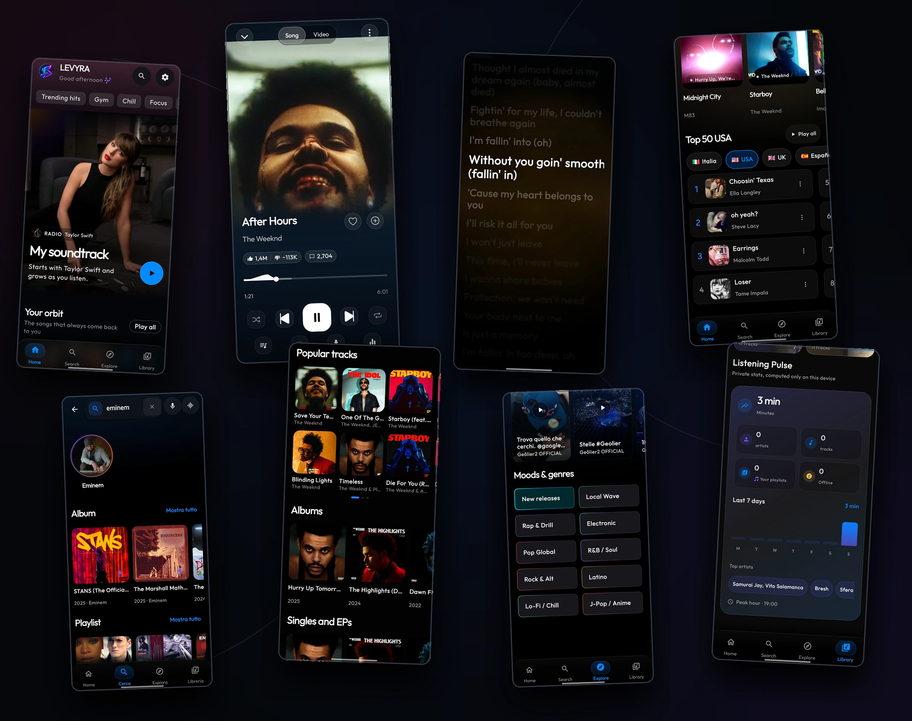

<picture>
  <source media="(prefers-color-scheme: light)" srcset="docs/assets/levyra-github-banner-light.webp">
  <source media="(prefers-color-scheme: dark)" srcset="docs/assets/levyra-github-banner.webp">
  
</picture>

# Levyra

**Open-source music player for Android and Windows.**

Play streamed music and your own files in the same app, save tracks for offline listening, and follow synced lyrics. Levyra does not need an account and does not track you.

  <a href="https://github.com/LUC4N3X/Levyra-deepsound/releases/latest"><picture><source media="(prefers-color-scheme: light)" srcset="docs/assets/levyra-release-mobile-light.svg 126w, docs/assets/levyra-release-light.svg 145w" sizes="(max-width: 480px) 126px, 145px"><source media="(prefers-color-scheme: dark)" srcset="docs/assets/levyra-release-mobile.svg 126w, docs/assets/levyra-release.svg 145w" sizes="(max-width: 480px) 126px, 145px"></picture></a>
  <a href="https://github.com/LUC4N3X/Levyra-deepsound/releases"><picture><source media="(prefers-color-scheme: light)" srcset="docs/assets/levyra-downloads-mobile-light.svg 126w, docs/assets/levyra-downloads-light.svg 145w" sizes="(max-width: 480px) 126px, 145px"><source media="(prefers-color-scheme: dark)" srcset="docs/assets/levyra-downloads-mobile.svg 126w, docs/assets/levyra-downloads.svg 145w" sizes="(max-width: 480px) 126px, 145px"></picture></a>
  <a href="LICENSE"><picture><source media="(prefers-color-scheme: light)" srcset="docs/assets/levyra-license-mobile-light.svg 126w, docs/assets/levyra-license-light.svg 145w" sizes="(max-width: 480px) 126px, 145px"><source media="(prefers-color-scheme: dark)" srcset="docs/assets/levyra-license-mobile.svg 126w, docs/assets/levyra-license.svg 145w" sizes="(max-width: 480px) 126px, 145px"></picture></a>
  <a href="https://github.com/LUC4N3X/Levyra-deepsound/stargazers"><picture><source media="(prefers-color-scheme: light)" srcset="docs/assets/levyra-stars-mobile-light.svg 126w, docs/assets/levyra-stars-light.svg 145w" sizes="(max-width: 480px) 126px, 145px"><source media="(prefers-color-scheme: dark)" srcset="docs/assets/levyra-stars-mobile.svg 126w, docs/assets/levyra-stars.svg 145w" sizes="(max-width: 480px) 126px, 145px"></picture></a>
  <a href="https://luc4n3x.github.io/Levyra-deepsound/"><picture><source media="(prefers-color-scheme: light)" srcset="docs/assets/levyra-wiki-mobile-light.svg 126w, docs/assets/levyra-wiki-light.svg 145w" sizes="(max-width: 480px) 126px, 145px"><source media="(prefers-color-scheme: dark)" srcset="docs/assets/levyra-wiki-mobile.svg 126w, docs/assets/levyra-wiki.svg 145w" sizes="(max-width: 480px) 126px, 145px"></picture></a>

<b>Download Levyra</b>

  
  
  
  

<b>More download options</b>

 

  
  
  
   
  
  
  

<b>Levyra speaks 37 languages</b> &nbsp;·&nbsp; <b>100% Android translation coverage</b>

  <code>100% Kotlin</code> &nbsp;·&nbsp; <code>Jetpack Compose</code> &nbsp;·&nbsp; <code>Compose Multiplatform</code> &nbsp;·&nbsp; <code>AndroidX Media3</code> &nbsp;·&nbsp; <code>libvlc</code> &nbsp;·&nbsp; <code>Zero Tracking</code>

---

> [!IMPORTANT]
> **Legal & responsible use · No piracy.** Levyra is independent open-source client software and does not host or distribute third-party music. It is built for lawful use and is not intended or promoted for copyright infringement, piracy, or unauthorized copying. Use Levyra only with media you are allowed to access or save, and follow the terms of any third-party service you use.
>
> For details about third-party services, lawful use, downloads, and user responsibilities, please review the complete [Legal Notice](docs/legal/LEGAL.md). It applies to Levyra alongside this README.
>
> Levyra does not grant rights to third-party content and is not affiliated with or endorsed by YouTube, Google, JioSaavn, or other referenced services.

> [!WARNING]
> **Regional availability**
>
> Some of Levyra's streaming features rely on YouTube Music. If YouTube Music is blocked or unavailable in your region, those parts of the app may not work unless you connect through a VPN or proxy in a supported region. Levyra does not bypass regional restrictions on its own.
>
> Local playback and features that do not depend on YouTube Music are not affected.

## ✦ Why Levyra

I started Levyra because I wanted one player for the music I stream and the files I already have. I wanted local tracks to feel like part of the same library, with playlists, history and downloads that do not depend on a Levyra account.

Downloaded tracks are saved as normal audio files in your device storage. Local and streamed music can share the same library, playlists and queues, while listening data stays on the device.

As I kept using Levyra, I added the things I missed in other players: synced lyrics with timing controls, romanization, SponsorBlock, Queue Spaces, AutoEQ, Android Auto, music recognition, live radio, backups and a Windows version. They all use the same library and playback flow.

Some features rely on outside services for music, lyrics, artwork and metadata. Levyra itself stays open source, and your library remains under your control.

## ✦ Project recognition

  

  
  
  

  <b>Tech &amp; developer media coverage</b>
   
  
    <a href="https://www.oschina.net/news/502584"><b>OSCHINA 开源中国</b></a>
    &nbsp;·&nbsp;
    <a href="https://blog.csdn.net/techforward/article/details/165886477"><b>CSDN</b></a>
    &nbsp;·&nbsp;
    <a href="https://www.securitylab.ru/blog/personal/SimlpeHacker/362601.php"><b>SecurityLab.ru</b></a>
    &nbsp;·&nbsp;
    <a href="https://www.geekparadize.fr/articles/levyra-lecteur-musical-open-source-android-windows"><b>GeekParadize</b></a>
    &nbsp;·&nbsp;
    <a href="https://techolay.net/levyra-android-ve-windows-icin-acik-kaynak-muzik-oynaticisi/"><b>Techolay</b></a>
    &nbsp;·&nbsp;
    <a href="https://hysenlabs.com/en/projects/luc4n3x-levyra-deepsound"><b>Hysen Labs</b></a>
  

## ✦ JioSaavn · Verified high-quality audio

When high-quality audio is enabled, Levyra can use JioSaavn as another source for the same track. The track in your library does not change.

Before switching sources, Levyra checks that it found the right recording and that the stream matches the quality it claims to have. It can try the available 320, 160 and 96 kbps versions. If a stream is advertised as 320 kbps but measures below that range, Levyra does not show it as 320 kbps.

The match uses more than the song title. Levyra also checks performers and artist roles, album and release details, duration, explicit status, language, featured artists and version markers. When needed, it compares a search result with JioSaavn's track details so it can tell an original recording from a compilation, reissue or alternate version.

When a match passes those checks, Levyra can play the audio directly from JioSaavn's CDN. If that source is temporarily unavailable, or Levyra cannot verify the recording safely, playback stays on the normal source. Successful matches can be remembered so Levyra does not have to start the lookup from scratch every time.

Artwork, lyrics, queue position, listening history and recommendations still belong to the original Levyra track.

  
<code>OFF</code> &nbsp;·&nbsp; <code>AUTOMATIC</code> &nbsp;·&nbsp; <code>PREFER&nbsp;320&nbsp;KBPS</code>

  Levyra checks the actual stream quality before using it and falls back automatically when JioSaavn is not a safe match.

---

## ✦ Interface & screenshots

  

---

## ✦ What Levyra can do

### Playback

- Playback is native on both platforms: Media3 and ExoPlayer on Android, and libVLC on Windows.
- Albums can play without gaps. You can also enable crossfade or change pitch and playback speed manually.
- A 10-band equalizer is built in, and AutoEQ can load profiles for supported headphones.
- SponsorBlock can automatically skip intros, sponsored sections and other non-music segments.
- You can switch between audio-only playback and full video, with subtitle support.
- On Android, Levyra works with Android Auto, media notifications, system playback controls and a Quick Settings tile.

### Library and offline storage

- Downloaded songs are saved in normal device storage as M4A files with tags, artwork and lyrics.
- Your own files can sit beside streamed tracks in the same library, playlists and queues.
- Queue Spaces let you keep separate listening sessions without losing the tracks you already lined up.
- Levyra Vault can save your playlists, favorites, history and settings in a single local backup file.
- You can filter the library by tags, sort playlists and exclude artists.

### Lyrics, discovery, and extras

- Tap a synced lyric line to jump to that point in the song. You can adjust the timing by hand and keep a separate offset for Bluetooth delay.
- Lyrics written in non-Latin scripts can be romanized, and selected lines can be turned into shareable lyric cards.
- The Now Playing screen can show motion artwork, with animated album art used as a fallback.
- Explore brings together live radio, international charts, genres and mood-based browsing.
- Song recognition can listen through the microphone or internal audio, and Levyra keeps recognized tracks locally.
- Levyra calculates play counts and weekly listening time on your device. Last.fm and ListenBrainz scrobbling are optional.

More technical notes and platform details are available in the [documentation](https://luc4n3x.github.io/Levyra-deepsound/).

## ✦ Under the hood

Android and Windows share Kotlin code for extraction and networking. Each platform keeps its own native interface and playback engine.

| Layer | Android | Windows |
| --- | --- | --- |
| **Interface** | Jetpack Compose + Material 3 | Compose Multiplatform (Desktop JVM) |
| **Audio engine** | AndroidX Media3 / ExoPlayer | libVLC via vlcj (native C bindings) |
| **Extraction & network** | LevyraExtractor, OkHttp (Brotli, DoH) | LevyraExtractor, OkHttp (Brotli) |
| **Persistence** | Room (SQLite), DataStore, MediaStore | Local file storage, JSON serialization |
| **OS integration** | MediaSessionService, Android Auto, Quick Settings | Native desktop windowing, system audio |
| **Optimization** | R8, ProGuard, Android Baseline Profiles | JVM 21 bytecode, zero Chromium runtime |

### Why native instead of a web wrapper

On Windows, Compose Multiplatform draws the interface and libVLC handles playback. Android uses Media3 for audio focus, Bluetooth controls, lockscreen playback, media sessions and Android Auto.

Levyra does not bundle Chromium, Electron or a WebView runtime.

## ✦ Development

Levyra is developed in public. I use AI-assisted tools when they are useful for research, debugging or review. I treat generated code like any other draft: I read it, adapt it to the project, test the parts it can affect and decide whether it should ship.

Commits, pull requests, issues and releases are public. The repository also includes the engineering rules I follow while working on the project. [Read more about how I work on Levyra](docs/site/development-notes.md).

## ✦ Privacy

Levyra has no telemetry, analytics or ads, and you do not need an account to use it.

Your play history, stats, playlists and cached metadata stay on your device. When an online feature needs another service, Levyra connects to that service directly. Streaming, lyrics and optional scrobbling work this way.

Levyra asks for microphone access only when you start song identification. You can also configure a custom proxy or DNS provider in the app.

Apptizo scanned a Levyra build from F-Droid and reported no known third-party tracker SDKs. [See the Apptizo scan](https://apptizo.com/app/levyra/). The Levyra 2.5.10 APK also returned **0/68 detections** on [VirusTotal](https://www.virustotal.com/gui/file/f4508db409560441ab1779ff00546ba709520cea567fa769c17e783372487cd9?nocache=1).

## ✦ Translations

Levyra is available in 37 languages, with community translations maintained on Weblate.

 

<a href="https://hosted.weblate.org/engage/levyra/">
  <picture>
    <source media="(max-width: 640px) and (prefers-color-scheme: light)" srcset="docs/assets/levyra-translation-pulse-mobile-light.svg">
    <source media="(max-width: 640px) and (prefers-color-scheme: dark)" srcset="docs/assets/levyra-translation-pulse-mobile.svg">
    <source media="(prefers-color-scheme: light)" srcset="docs/assets/levyra-translation-pulse-light.svg">
    <source media="(prefers-color-scheme: dark)" srcset="docs/assets/levyra-translation-pulse.svg">
    
  </picture>
</a>

 

<a href="https://hosted.weblate.org/engage/levyra/"><b>Help translate Levyra on Weblate</b></a>

## ✦ Open-source acknowledgements

Levyra builds on ideas and work from several open-source projects:

- [Metrolist](https://github.com/MetrolistGroup/Metrolist): used as a reference for renderer recovery and BetterLyrics TTML parsing.
- [PipePipeExtractor](https://github.com/InfinityLoop1308/PipePipeExtractor): the starting architecture for LevyraExtractor, later adapted with Levyra's own stream resolution and retry handling.
- [NewPipeExtractor](https://github.com/TeamNewPipe/NewPipeExtractor): upstream extractor concepts and service foundations.
- [zemer-cipher](https://github.com/ZemerTeam/zemer-cipher): open-source work used for YouTube cipher deobfuscation and PoToken generation.
- [LRCLIB](https://lrclib.net/): provides the synchronized lyrics database and API.

App logo designed by [@gauravbhindwar](https://github.com/gauravbhindwar) in [#525](https://github.com/LUC4N3X/Levyra-deepsound/issues/525).

Contributions and bug reports are welcome. Technical documentation and architecture notes are in the [project documentation](https://luc4n3x.github.io/Levyra-deepsound/).

---

## ✦ Author & credits

### LUC4N3X

**Creator & Lead Developer**

Levyra is a personal project. I maintain the Android and Windows apps, review changes and decide what goes into each release.

<a href="https://github.com/LUC4N3X"><b>GitHub</b></a>
&nbsp;&nbsp;·&nbsp;&nbsp;
<a href="https://luc4n3x.pages.dev/"><b>Website</b></a>

---

## ✦ Legal disclaimer and terms of use

### Open source. Independent. Built for lawful use.

<code>NO PIRACY</code> &nbsp;·&nbsp; <code>NO CONTENT HOSTING</code> &nbsp;·&nbsp; <code>THIRD-PARTY RIGHTS RESPECTED</code>

Levyra is an independent open-source music player built for lawful use, research, and interoperability. It does not own, host, or distribute third-party music catalogs.

 

### Third-party services and content

Levyra is client-side software that runs on your device. It does not own or host music catalogs, artwork, lyrics, or video files.

When you stream or search, Levyra connects to the external services needed for that feature. Those services can change, rate-limit, or restrict access at any time.

If there is a problem with media hosted by another service, contact that service or the relevant rights holder. If the issue is with something distributed as part of Levyra itself, use the GitHub issue tracker.

### Lawful use and user responsibility

Levyra is built for lawful use, research, and interoperability, not for piracy or copyright infringement.

Streaming, downloading, format conversion, and offline caching are software features. They do not transfer copyright or ownership of third-party media.

Levyra may cache media temporarily for playback and can save user-requested downloads as standard media files. Neither feature gives you permission to redistribute third-party content.

You are responsible for making sure your use of Levyra complies with applicable law and with the terms of any third-party service you choose to access.

### Support artists and creators

Levyra does not unlock paid subscriptions or grant access rights offered by third-party providers. If you want an official subscription experience, subscribe directly through the provider, including [YouTube Premium](https://www.youtube.com/premium), [YouTube Music Premium](https://www.youtube.com/musicpremium), or [Spotify Premium](https://www.spotify.com/premium/).

You can also support artists directly through licensed streaming services, music purchases, concerts, merchandise, and other official channels.

### Privacy

Levyra does not require a Levyra account and does not include telemetry, analytics, or ads. Network requests go directly to the services used by the features you enable, including optional integrations.

### Technical interoperability and access restrictions

Levyra includes client-side code for compatibility with external services. It handles things like stream resolution, requests, and tokens so those integrations can work.

These are interoperability features, not tools for bypassing access controls, geographic restrictions, or paid entitlements.

### Warranty and third-party availability

Levyra is released under the **[GNU GPL v3.0](LICENSE)** and is provided "as is", without warranty of any kind, to the fullest extent permitted by applicable law.

The GNU GPL v3.0 covers Levyra's source code. It does not grant rights to third-party content, trademarks, or service endpoints. Third-party services can change or disappear, so Levyra cannot guarantee that every stream, metadata source, artwork provider, lyrics source, or API will keep working.

### Use Levyra responsibly

For the complete legal terms covering technical interoperability, user responsibilities, and third-party integrations, see the **[Legal Notice](docs/legal/LEGAL.md)**.

Using Levyra does not give you rights to content you are not otherwise allowed to access or use.

---

  <b>🇮🇹 Made in Italy. Built for the world.</b>

