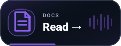
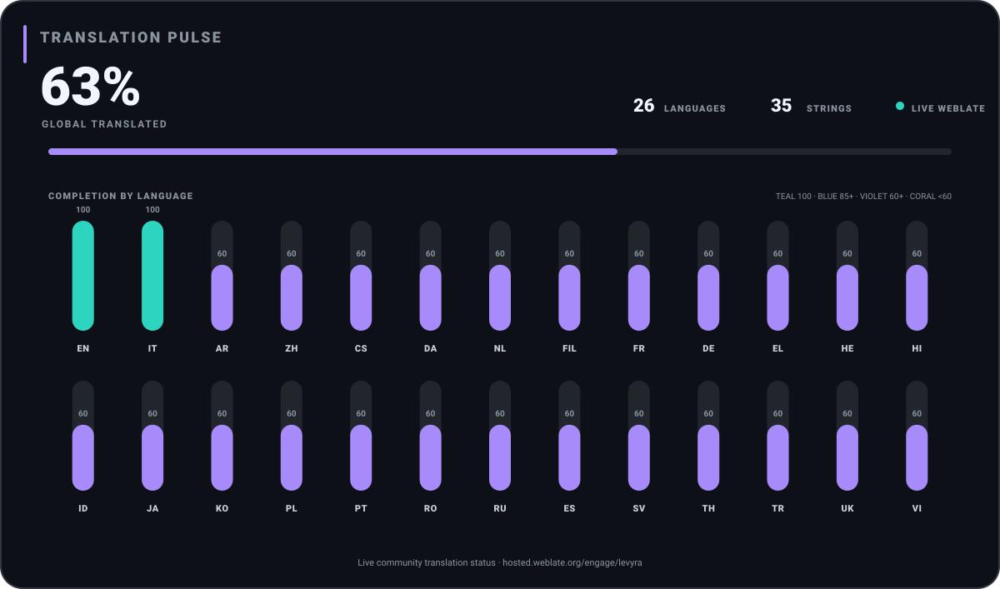
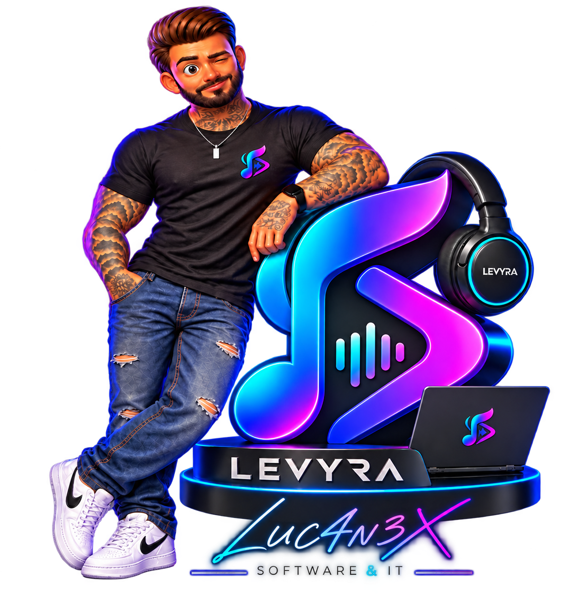

<picture>
  <source media="(prefers-color-scheme: light)" srcset="docs/assets/levyra-github-banner-light.webp">
  <source media="(prefers-color-scheme: dark)" srcset="docs/assets/levyra-github-banner.webp">
  
</picture>

# Hear every layer. No limits.

**A native music player for Android & Windows with streaming, local files, downloads, and a private offline library.**

  <a href="https://github.com/LUC4N3X/Levyra-deepsound/releases/latest"><picture><source media="(prefers-color-scheme: light)" srcset="docs/assets/levyra-release-mobile-light.svg 126w, docs/assets/levyra-release-light.svg 145w" sizes="(max-width: 480px) 126px, 145px"><source media="(prefers-color-scheme: dark)" srcset="docs/assets/levyra-release-mobile.svg 126w, docs/assets/levyra-release.svg 145w" sizes="(max-width: 480px) 126px, 145px"></picture></a>
  <a href="https://github.com/LUC4N3X/Levyra-deepsound/releases"><picture><source media="(prefers-color-scheme: light)" srcset="docs/assets/levyra-downloads-mobile-light.svg 126w, docs/assets/levyra-downloads-light.svg 145w" sizes="(max-width: 480px) 126px, 145px"><source media="(prefers-color-scheme: dark)" srcset="docs/assets/levyra-downloads-mobile.svg 126w, docs/assets/levyra-downloads.svg 145w" sizes="(max-width: 480px) 126px, 145px"></picture></a>
  <a href="LICENSE"><picture><source media="(prefers-color-scheme: light)" srcset="docs/assets/levyra-license-mobile-light.svg 126w, docs/assets/levyra-license-light.svg 145w" sizes="(max-width: 480px) 126px, 145px"><source media="(prefers-color-scheme: dark)" srcset="docs/assets/levyra-license-mobile.svg 126w, docs/assets/levyra-license.svg 145w" sizes="(max-width: 480px) 126px, 145px"></picture></a>
  <a href="https://github.com/LUC4N3X/Levyra-deepsound/stargazers"><picture><source media="(prefers-color-scheme: light)" srcset="docs/assets/levyra-stars-mobile-light.svg 126w, docs/assets/levyra-stars-light.svg 145w" sizes="(max-width: 480px) 126px, 145px"><source media="(prefers-color-scheme: dark)" srcset="docs/assets/levyra-stars-mobile.svg 126w, docs/assets/levyra-stars.svg 145w" sizes="(max-width: 480px) 126px, 145px"></picture></a>
  <a href="https://luc4n3x.github.io/Levyra-deepsound/"><picture><source media="(prefers-color-scheme: light)" srcset="docs/assets/levyra-wiki-mobile-light.svg 126w, docs/assets/levyra-wiki-light.svg 145w" sizes="(max-width: 480px) 126px, 145px"><source media="(prefers-color-scheme: dark)" srcset="docs/assets/levyra-wiki-mobile.svg 126w, docs/assets/levyra-wiki.svg 145w" sizes="(max-width: 480px) 126px, 145px"></picture></a>

<b>Download Levyra</b>

  
  
  
   
  
  
  
   
  
  
  
   
  

🌍 <b>Levyra speaks 36 languages</b> &nbsp;·&nbsp; <b>100% Android translation coverage</b>

  <code>100% Kotlin</code> &nbsp;·&nbsp; <code>Jetpack Compose</code> &nbsp;·&nbsp; <code>Compose Multiplatform</code> &nbsp;·&nbsp; <code>AndroidX Media3</code> &nbsp;·&nbsp; <code>libvlc</code> &nbsp;·&nbsp; <code>Zero Tracking</code>

---

> [!IMPORTANT]
> **Legal & responsible use · No piracy.** Levyra is independent open-source client software and does not host or distribute third-party music. It is built for lawful personal use and is not intended or promoted for copyright infringement, piracy, or unauthorized copying. Only access, save, convert, or export media when you have the rights, permission, licence, or other lawful basis to do so, and respect the applicable terms of third-party services.
>
> For details about third-party services, lawful use, downloads, and user responsibilities, please review the complete [Legal Notice](docs/legal/LEGAL.md). It applies to Levyra alongside this README.
>
> Levyra does not grant rights to third-party content and is not affiliated with or endorsed by YouTube, Google, JioSaavn, or other referenced services.

## ✦ The Pure Listening Philosophy

### 🎧 Music should feel like yours.

**Not rented. Not profiled. Not trapped.**

Levyra is made around a pretty simple idea: if you save music, build playlists, or spend months creating a listening history, that stuff should stay useful instead of disappearing the moment you leave the app.

 

### 💿 01 · Keep your offline library

Downloads are normal high-bitrate M4A files. By default they go to <code>Music/Levyra</code>, but you can pick another folder in Settings, including supported SD card locations. Artwork, artist, album, and lyrics can be written into the file too.

**No proprietary vault required.** You can take those files somewhere else, play them in the car, move them to a DAP, use them on a hi-fi system, or open them with another compatible player.

### 🎚️ 02 · Stay close to the sound

Android runs on Media3 / ExoPlayer and Windows has its own libvlc playback core. Both are native playback paths, not a web player wrapped inside an app.

<code>GAPLESS PLAYBACK</code> &nbsp;·&nbsp; <code>LOUDNESS-AWARE NORMALIZATION</code> &nbsp;·&nbsp; <code>AUTOEQ HEADPHONE CATALOG</code> &nbsp;·&nbsp; <code>LOW-OVERHEAD AUDIO</code>

### 🎙️ 03 · Remove everything between you and the song

LRCLIB provides synced lyrics with tap-to-seek karaoke, and SponsorBlock can automatically skip supported intros, silence, dialogue, and other sections that are not part of the music.

The goal is simple: **less interface friction, more music.**

### 🛡️ 04 · Keep your listening private

Play counts, listening time, streaks, playlists, and listening stats are calculated locally and stored in SQLite on your device.

**No analytics profile. No cookies. No mandatory Levyra account.**

  

    <b>Keep the file. Keep the history. Keep control.</b> 
    Offline playback is not a fallback in Levyra. It is control.
  

   

  
<b>INDEPENDENT RECOGNITION</b>

  

    
  

  

    <b>CHINESE DEVELOPER MEDIA COVERAGE</b> 
    <a href="https://www.oschina.net/news/502584">OSCHINA 开源中国</a> &nbsp;·&nbsp; <a href="https://blog.csdn.net/techforward/article/details/165886477">CSDN</a>
  

  
<b>OPEN-SOURCE QUALITY, TRUST &amp; COMPLIANCE</b>

  

      
  

  
Code quality · security best practices · licensing compliance · independently verifiable

---

## ✦ JioSaavn · Verified High-Quality Audio

### 🎧 Higher-quality audio, accepted only when Levyra knows it is the right recording.

If you enable it, Levyra can look for a higher-quality JioSaavn source before playback. The original track still owns the metadata, queue entry, artwork, lyrics, listening history, and recommendations.

<b>When a real 320 kbps match is found, the result is high-quality lossy audio in roughly the same class as TIDAL's 320 kbps compressed tier. On phones, Bluetooth headphones, car systems, and normal speakers the difference can be very small. It is still not lossless: TIDAL High and Max can use higher-fidelity FLAC up to Hi-Res 24-bit/192 kHz.</b>

<table align="center" width="100%">
  <tr valign="top">
    <td width="33%">
      <h3>🎚️ <b>Verified HQ Routing</b></h3>
      
Levyra asks for the higher-bitrate source only when it can actually use it, up to 320 kbps. If that tier is not available, it can fall back to 160 or 96 kbps instead.

    </td>
    <td width="33%">
      <h3>🧬 <b>Identity Lock</b></h3>
      
Before switching source, Levyra checks the title, artists, album, duration, explicit state, ISRC, and version markers. Remixes, live versions, acoustic versions, sped-up tracks, and unclear matches are left alone.

    </td>
    <td width="33%">
      <h3>🛡️ <b>Fail-Safe by Design</b></h3>
      
If the alternative source is stale, restricted, mismatched, unavailable, or simply not better, playback stays on the normal route. The queue and track identity are not swapped around just to force a match.

    </td>
  </tr>
</table>

  <code>OFF</code> &nbsp;·&nbsp;
  <code>AUTOMATIC</code> &nbsp;·&nbsp;
  <code>PREFER 320 KBPS</code>

---

## ✦ Audio Intelligence 3.0

### 🧠 The engine listens before it changes anything.

Loudness handling, transitions, and headphone correction all run through the same native DSP path. There is not a second processor stacked on top of the player.

<table align="center" width="100%">
  <tr valign="top">
    <td width="33%">
      <h3>🔊 <b>Honest Loudness</b></h3>
      
When a track already has loudness data, Levyra uses it. When it does not, the app estimates loudness in real time with a gated BS.1770-style meter. Loud tracks can be turned down, quiet tracks are not artificially boosted, and a −1 dBTP true-peak limiter protects the output.

    </td>
    <td width="33%">
      <h3>💿 <b>Album Continuity</b></h3>
      
Tracks that belong next to each other on the same release stay continuous even when crossfade is enabled. This matters for live albums, DJ mixes, and concept records. Levyra uses the catalog ID and track order instead of trusting the album title alone.

    </td>
    <td width="33%">
      <h3>🎧 <b>AutoEQ Headphone Catalog</b></h3>
      
You can search more than 8,800 headphone and earphone profiles, preview the curve, and apply it through the built-in 10-band equalizer. Profiles are downloaded only when needed, so the whole database is not bundled into the APK.

    </td>
  </tr>
</table>

  <code>BS.1770-4 GATED METER</code> &nbsp;·&nbsp;
  <code>ATTENUATION-ONLY</code> &nbsp;·&nbsp;
  <code>−1 dBTP LIMITER</code> &nbsp;·&nbsp;
  <code>8,800+ HEADPHONE PROFILES</code>

The loudness meter follows the ITU-R BS.1770-4 method (K-weighting, 400 ms gated blocks) as a real-time playback estimate. It is not meant to be a certified EBU R128 measurement tool.

---

## ✦ Interface & Experience Showcase

<picture>
  <source media="(prefers-color-scheme: light)" srcset="docs/assets/showcase/00_levyra_hero_showcase-light.webp">
  <source media="(prefers-color-scheme: dark)" srcset="docs/assets/showcase/00_levyra_hero_showcase.webp">
  
</picture>

  

| | |
| :---: | :---: |
| <picture><source media="(prefers-color-scheme: light)" srcset="docs/assets/showcase/01_playback_and_lyrics-light.webp"><source media="(prefers-color-scheme: dark)" srcset="docs/assets/showcase/01_playback_and_lyrics.webp"></picture> | <picture><source media="(prefers-color-scheme: light)" srcset="docs/assets/showcase/02_home_and_charts-light.webp"><source media="(prefers-color-scheme: dark)" srcset="docs/assets/showcase/02_home_and_charts.webp"></picture> |
| **Immersive Playback & Live Synced Lyrics** ExoPlayer playback · LRCLIB lyrics with route-aware sync · Multi-script romanization · 1:1 / 9:16 lyric cards | **Smart Orbit Feed & Global Charts** Your Orbit rotation · Live international Top 50 charts · Mood chips · Prefetch before playback |
| <picture><source media="(prefers-color-scheme: light)" srcset="docs/assets/showcase/03_search_and_artist-light.webp"><source media="(prefers-color-scheme: dark)" srcset="docs/assets/showcase/03_search_and_artist.webp"></picture> | <picture><source media="(prefers-color-scheme: light)" srcset="docs/assets/showcase/04_library_and_pulse-light.webp"><source media="(prefers-color-scheme: dark)" srcset="docs/assets/showcase/04_library_and_pulse.webp"></picture> |
| **Deep Search & Artist Immersion** Live search with artist results · Wikipedia biography cards · Full discography in chronological order | **Offline M4A Vault & Listening Pulse** Tagged M4A files with artwork · 7-day listening stats on device · Private SQLite storage |
| <picture><source media="(prefers-color-scheme: light)" srcset="docs/assets/showcase/05_video_and_samples-light.webp"><source media="(prefers-color-scheme: dark)" srcset="docs/assets/showcase/05_video_and_samples.webp"></picture> | <picture><source media="(prefers-color-scheme: light)" srcset="docs/assets/showcase/06_collections_and_genres-light.webp"><source media="(prefers-color-scheme: dark)" srcset="docs/assets/showcase/06_collections_and_genres.webp"></picture> |
| **Samples Clips & Comment Energy** Vertical preview clips · Music video feeds · Live comment-energy percentage | **Editorial Playlists & Genre Matrix** 4-tile editorial collections · Mood and genre browsing including Rap, Lo-Fi, Anime, Electronic and more |

 

<b>✦ Browse Complete Screen-by-Screen Gallery (15 High-Res Views)</b>

 

#### 🎵 Immersive Playback & Lyrics
| Now Playing Canvas | Synchronized Lyrics |
| :---: | :---: |
|  |  |
#### 🪐 Home & Discovery
| Home Selection & Orbit | Global Top 50 Charts | Editorial Collections |
| :---: | :---: | :---: |
|  |  |  |

#### 🔍 Search & Artist Universe
| Search Discovery & Recent | Live Artist Results | Artist Profile & Bio | Artist Discography |
| :---: | :---: | :---: | :---: |
|  |  |  |  |

#### 📊 Offline Vault & Listening Pulse
| Library Quick Picks | Listening Pulse Analytics | Playlist Details |
| :---: | :---: | :---: |
|  |  |  |

#### 🎬 Explore & Video Engine
| Vertical Samples Clips | Moods & Subgenre Matrix | Video Feed & Energy |
| :---: | :---: | :---: |
|  |  |  |

---
## ✦ Acoustic Architecture & Features

  <h3>🎧 <b>Everything in the signal path. Nothing in the way.</b></h3>
  
Playback, discovery, radio, lyrics, downloads, local music, Queue Spaces, recognition, local sync, privacy, and networking all live in the same native app.

  

    <code>12 CORE SYSTEMS</code> &nbsp;·&nbsp;
    <code>ANDROID + WINDOWS</code> &nbsp;·&nbsp;
    <code>LOCAL-FIRST</code> &nbsp;·&nbsp;
    <code>ZERO TRACKING</code>
  

 

<table align="center" width="100%">
  <tr valign="top">
    <td width="50%">
      <h3>🎚️ <b>Playback Core</b></h3>
      
<b>Fast, native, interruption-free.</b> The player is kept close to the platform, with low overhead and direct control over the playback session on Android and Windows.

      <ul>
        <li><b>Native Engines:</b> Media3 / ExoPlayer on Android and an isolated libvlc player on Windows.</li>
        <li><b>AAudio / Oboe Output:</b> Upstream Android builds can use an optional native AAudio output on supported devices. It stays behind the existing DSP chain and falls back to the normal AudioTrack path if the native output cannot be used safely.</li>
        <li><b>FFmpeg Decoder Fallback:</b> When Android's platform decoder genuinely cannot handle a supported audio stream, Levyra can retry through its bundled FFmpeg audio decoder instead of giving up on the track. Network, source-resolution, and DRM failures stay outside this fallback.</li>
        <li><b>Verified HQ Audio:</b> Android can use a verified alternative source up to 320 kbps without changing the original Levyra/YouTube track identity. If verification fails, it falls back normally.</li>
        <li><b>Gapless & Queue:</b> Gapless transitions, shuffle/repeat, queue Undo, and album continuity that avoids crossfading between consecutive tracks from the same release.</li>
        <li><b>Queue Spaces:</b> Keep several named queues instead of one disposable list. Spaces survive restarts and backups, and you can create, rename, duplicate, switch, clear, delete, or send tracks to another space without rebuilding everything.</li>
        <li><b>Tempo & Timing:</b> Speed and pitch controls, plus a built-in sleep timer.</li>
        <li><b>Configurable Player Gestures:</b> Customize artwork swipes, double-tap and long-press actions, seek steps, temporary speed, and edge controls for brightness or volume. The same gesture mapping is shared across player skins, with horizontal track swipes applied consistently to the full player and mini-player, and preferences preserved across restarts and Levyra backups.</li>
        <li><b>Android Auto:</b> Playback works with Android's car-focused media controls.</li>
        <li><b>Loudness Normalization:</b> Attenuation-only leveling from track loudness data, with a gated BS.1770-4-style meter when the track has no loudness metadata.</li>
        <li><b>Equalizer & AutoEQ:</b> 10-band EQ with presets, bass boost, virtualizer, preamp, and a searchable headphone correction catalog.</li>
        <li><b>SponsorBlock:</b> Can skip supported non-musical sections automatically during playback.</li>
        <li><b>Audio / Video Mode:</b> Switch between audio playback and native video when a video stream is available.</li>
      </ul>
    </td>
    <td width="50%">
      <h3>💾 <b>Offline Vault</b></h3>
      
<b>Your offline library stays portable.</b> Downloads stay as normal audio files, while music already on your device can live in the same library without a Levyra account.

      <ul>
        <li><b>Tagged M4A Files:</b> Cover art, artist, album, and lyrics can be embedded directly in the file.</li>
        <li><b>Configurable Download Storage:</b> Pick where Levyra saves music, including supported SD card locations. Artist / Album folders stay relative to the location you choose.</li>
        <li><b>Local-First Playback:</b> Existing downloads play directly from <code>Music/Levyra</code> or your chosen download folder.</li>
        <li><b>Device Library:</b> Android can index music already stored on the device through MediaStore, keep its local artwork and metadata, and make those tracks available for normal browsing and search.</li>
        <li><b>Library Scan:</b> The scanner reconciles storage changes, avoids duplicate entries, respects excluded folders, and handles files that disappear or move instead of leaving stale tracks behind.</li>
        <li><b>Levyra Vault:</b> Versioned <code>.levyra</code> backups can include settings, favorites, playlists, followed artists, history, and Queue Spaces without an online account.</li>
        <li><b>Verified Restore:</b> Restores check the manifest, SHA-256 checksums, compatibility, required sections, and rollback state before replacing local data.</li>
        <li><b>Automatic Protection:</b> Manual, scheduled, and pre-update backups support 3/5/10 retention and optional Android SAF destinations, with internal storage as the fallback.</li>
      </ul>
    </td>
  </tr>
  <tr valign="top">
    <td width="50%">
      <h3>🔍 <b>Discovery & Extraction</b></h3>
      
<b>Find it, resolve it, start it.</b> Search and stream resolution feed straight into playback instead of behaving like separate parts of the app.

      <ul>
        <li><b>Multi-Source Resolver:</b> The normal route prefers the best available Opus or AAC stream. Verified JioSaavn audio can be used as an alternative when enabled and matched to the same recording.</li>
        <li><b>Strict Match Guard:</b> Artist credits, album, duration, explicit state, ISRC, and version markers are checked so remixes, live cuts, covers, and unclear matches do not replace the track you asked for.</li>
        <li><b>Queue Prefetch:</b> Upcoming tracks can start buffering before you skip to them.</li>
        <li><b>Discovery Engine:</b> Global Top 50, Smart Orbit recommendations, and the Samples feed.</li>
        <li><b>Live Radio:</b> Real worldwide stations with country, language, category, and station-name search, local favorites and recents, ICY now-playing metadata, background playback, controlled reconnects, and a Media3 path kept separate from Song Radio and the normal music queue.</li>
      </ul>
    </td>
    <td width="50%">
      <h3>🎙️ <b>Lyrics & Visual Immersion</b></h3>
      
<b>Lyrics that move with the music.</b> Synced lyrics, lyric sharing, artwork motion, and Canvas are all handled inside the player.

      <ul>
        <li><b>Synced Lyrics:</b> LRCLIB lyrics with millisecond timing, tap-to-seek highlighting, a short active-line linger, and motion that follows Levyra's global animation setting. When animations are disabled, lyric transitions and scrolling stay non-animated.</li>
        <li><b>Route-Aware Latency:</b> On supported Android versions you can save Bluetooth lyric timing per device, with a normal global offset when the active route cannot be identified reliably.</li>
        <li><b>Manual Lyrics Sync:</b> Nudge synced lyrics earlier or later in 0.5-second steps, reset instantly, and save the timing globally or per Bluetooth route without rewriting the original lyric timestamps.</li>
        <li><b>Multi-Script Romanization:</b> Offline readable forms for Cyrillic, Greek and polytonic Greek, Arabic, Hebrew, Georgian, Devanagari, Gurmukhi, Bengali, plus the existing CJK, Kana, and Hangul paths.</li>
        <li><b>Lyric Sharing:</b> Select verses, copy or share them, or export 1080×1080 square and 1080×1920 story cards with RTL-aware layout and Unicode-safe text.</li>
        <li><b>Living Artwork:</b> Uses artwork-driven motion when a real Canvas is not available.</li>
        <li><b>Canvas & Preview:</b> Canvas controls in the player plus a full-screen zoomable artwork view.</li>
      </ul>
    </td>
  </tr>
  <tr valign="top">
    <td width="50%">
      <h3>📈 <b>Listening Intelligence</b></h3>
      
<b>Useful insight, computed locally.</b> Listening stats are useful without needing to send your history somewhere else.

      <ul>
        <li><b>Accurate Listening:</b> Playback time and play counts account for pauses, seeks, skips, and completion.</li>
        <li><b>Listening Pulse:</b> Weekly activity, your 24-hour listening rhythm, and artist distribution.</li>
        <li><b>Your Sound:</b> 7-day, 30-day, 6-month, and All Time views stored on the device.</li>
      </ul>
    </td>
    <td width="50%">
      <h3>🔤 <b>Typography & Readability</b></h3>
      
<b>Dense when useful. Clear everywhere.</b> Shared type and spacing rules keep titles and metadata readable across languages and larger font sizes.

      <ul>
        <li><b>Levyra Type Rhythm:</b> Shared line-height rules for titles, metadata, and multi-line text.</li>
        <li><b>Accessible Layout:</b> Tracking and spacing are kept safe for accents, descenders, and large font scales.</li>
        <li><b>Private by Default:</b> Listening statistics are calculated locally and do not leave the device.</li>
      </ul>
    </td>
  </tr>
  <tr valign="top">
    <td width="50%">
      <h3>🎛️ <b>Music Recognition 2.0</b></h3>
      
<b>Identify what is playing without an account.</b> Recognition can listen through the microphone or, when supported, capture audio already playing on the device.

      <ul>
        <li><b>Shazam-Compatible:</b> Acoustic fingerprint matching works without an account or stored service credentials.</li>
        <li><b>Dual Audio Capture:</b> Use the microphone or internal device playback through MediaProjection on Android 10+.</li>
        <li><b>AudD Fallback & History:</b> An optional AudD fallback can use a Keystore-protected token, and recognition history stays local.</li>
      </ul>
    </td>
    <td width="50%">
      <h3>📻 <b>Levyra Jam</b></h3>
      
<b>Shared listening, kept on the local network.</b> Nearby devices can share playback and queues without turning the session into a cloud service.

      <ul>
        <li><b>Local Network Listening:</b> Keep playback and queues in sync across devices on the same Wi-Fi.</li>
        <li><b>Host Authority & Permissions:</b> Choose host-only control, let guests add to the queue, or run a collaborative session.</li>
        <li><b>Mutual Auth Security:</b> Devices use an HMAC-SHA256 challenge-response handshake, with deep links for invites.</li>
      </ul>
    </td>
  </tr>
  <tr valign="top">
    <td width="50%">
      <h3>🛡️ <b>Network Resilience</b></h3>
      
<b>Flexible routing without hidden behavior.</b> DNS, proxies, bypasses, and diagnostics stay visible in settings instead of being hidden behind the player.

      <ul>
        <li><b>DNS-over-HTTPS:</b> Presets for Cloudflare, Google, AdGuard, and Quad9, plus custom HTTPS resolvers.</li>
        <li><b>HTTP & SOCKS Proxies:</b> Authenticated proxy support with Keystore-encrypted credentials and loop protection.</li>
        <li><b>Stream Bypass & Diagnostics:</b> Audio streams can bypass the proxy when you want them to, and there is an in-app network probe for troubleshooting.</li>
        <li><b>Verified Playback Recovery:</b> Levyra cross-checks YouTube player configurations from independent sources, keeps a verified last-known-good set, and can use a temporary fallback when YouTube changes unexpectedly without replacing the trusted cache.</li>
      </ul>
    </td>
    <td width="50%">
      <h3>🔗 <b>Integrations & Control</b></h3>
      
<b>Useful connections, never mandatory ones.</b> External services are optional. Core playback does not depend on signing in to them.

      <ul>
        <li><b>Scrobbling:</b> Optional Last.fm and ListenBrainz integration with bounded deduplication.</li>
        <li><b>Searchable Settings:</b> Search settings by title or keyword in 26 languages.</li>
        <li><b>Quick Settings Playback:</b> On Android, a dedicated Quick Settings tile can pause or resume the current Levyra session. When playback is idle, it opens Levyra without waking the full playback engine or starting music automatically.</li>
        <li><b>Video Subtitles:</b> Choose from available subtitle languages during native video playback.</li>
      </ul>
    </td>
  </tr>
  <tr valign="top">
    <td width="50%">
      <h3>🌙 <b>Levyra Ambient</b></h3>
      
<b>A quiet screen for a loud song.</b> An OLED-friendly now-playing view that uses the PlaybackService session you already have running. It does not start a second player.

      <ul>
        <li><b>Same Session:</b> Ambient attaches to the current MediaSession, so opening or closing it does not interrupt playback.</li>
        <li><b>Artwork or Canvas:</b> Shows Levyra Canvas when one is available, otherwise it falls back to the track artwork.</li>
        <li><b>Synced Lyric Line:</b> The current lyric follows playback next to the title, artist, and a small progress indicator.</li>
        <li><b>Burn-in Care:</b> Lower brightness, automatic dimming, periodic pixel shifting, and a simpler idle layout help reduce static OLED content.</li>
        <li><b>Proximity Blackout:</b> Optionally blacks out the screen while the proximity sensor is covered, useful in a pocket or on a nightstand.</li>
        <li><b>Tile & Screensaver:</b> Includes a Quick Settings tile and an Android <code>DreamService</code> for docked playback.</li>
      </ul>
    </td>
    <td width="50%">
      <h3>🗂️ <b>Library Organization</b></h3>
      
<b>Shape the library around how you actually listen.</b> Playlists, tags, on-device music, and recommendation controls stay local and under your control.

      <ul>
        <li><b>Local Library 2.0:</b> Browse and search music already on your phone alongside Levyra content, with local artwork and metadata kept intact.</li>
        <li><b>Local Tracks Everywhere:</b> On-device tracks work with playback, favorites, queues, MediaSession, Android Auto, search, and the rest of the normal library flow.</li>
        <li><b>Playlist Tags:</b> Create your own tags such as Rap, Gym, Relax, or Auto, and put more than one tag on a playlist.</li>
        <li><b>Tag Filtering:</b> Filter the Library by one or more tags without leaving the playlist view.</li>
        <li><b>Hidden Playlists:</b> Hide a playlist without deleting it, then bring it back from the dedicated filter. Tracks and metadata stay untouched.</li>
        <li><b>Artist Exclusions:</b> Keep an artist out of Home recommendations, Your Orbit, radio, autoplay, and mixes while still being able to search for and open that artist normally.</li>
        <li><b>Rediscover:</b> A Home shelf brings back favorites you have not played in a while using only listening history already stored on the device.</li>
      </ul>
    </td>
  </tr>
</table>

  One listening stack that stays fast, portable, private, and recoverable whether you are online or offline.

---

## ✦ Architecture & Engineering Blueprint

### ⚙️ Two native runtimes. One engineering language.

Android and Windows use separate platform code where they need to, but the project follows the same basic rules for state, playback reliability, and keeping data local.

 

<table align="center" width="100%">
  <thead>
    <tr>
      <th width="18%" align="left">Layer</th>
      <th width="41%" align="left">📱 Android</th>
      <th width="41%" align="left">💻 Windows</th>
    </tr>
  </thead>
  <tbody>
    <tr valign="top">
      <td><b>Interface</b> Surface</td>
      <td><b><a href="app/src/main/java/com/luc4n3x/levyra/ui"><code>ui/</code></a></b> Jetpack Compose screens, gestures, Canvas, and the rest of the Android UI.</td>
      <td><b><a href="desktop/app"><code>app/</code></a></b> Compose Multiplatform UI, windows, app lifecycle, and desktop updater.</td>
    </tr>
    <tr valign="top">
      <td><b>State</b> Orchestration</td>
      <td><b><a href="app/src/main/java/com/luc4n3x/levyra/viewmodel"><code>viewmodel/</code></a></b> Immutable UI state and the coordination between screens and app logic.</td>
      <td><b><a href="desktop/app"><code>app/</code></a></b> Desktop application lifecycle and UI coordination.</td>
    </tr>
    <tr valign="top">
      <td><b>Playback</b> Runtime core</td>
      <td><b><a href="app/src/main/java/com/luc4n3x/levyra/player"><code>player/</code></a> + <a href="levyra-native-audio"><code>levyra-native-audio/</code></a></b> Media3 / ExoPlayer owns the playback session, while the optional native layer adds AAudio / Oboe output and FFmpeg decoder fallback for upstream Android builds.</td>
      <td><b><a href="desktop/player"><code>player/</code></a></b> libvlc playback, hardware acceleration, tray controls, and global hotkeys.</td>
    </tr>
    <tr valign="top">
      <td><b>Data</b> Resolution</td>
      <td><b><a href="app/src/main/java/com/luc4n3x/levyra/data"><code>data/</code></a></b> Stream resolution, lyrics, prefetch, providers, and persistent local data.</td>
      <td><b><a href="desktop/core"><code>core/</code></a></b> Stream resolution, downloads, and local desktop storage.</td>
    </tr>
    <tr valign="top">
      <td><b>Output</b> Portable layer</td>
      <td><b><a href="app/src/main/java/com/luc4n3x/levyra/player/offline"><code>player/offline/</code></a></b> Offline export, M4A tagging, artwork, and portable audio files.</td>
      <td><b><a href="desktop/packaging"><code>packaging/</code></a></b> WiX MSI packaging and portable Windows builds.</td>
    </tr>
    <tr>
      <td colspan="3" align="center">
        <b>🧠 State ownership</b> &nbsp;·&nbsp; <b>⚡ Resolver resilience</b> &nbsp;·&nbsp; <b>💿 Portable data</b> 
        Keep state predictable, keep playback recoverable, and keep user data useful outside the app.
      </td>
    </tr>
  </tbody>
</table>

  Different runtimes where it matters. The same project rules underneath.

---

## ✦ Privacy Blueprint & Permissions

  <h3>🛡️ <b>Private by default. Transparent by design.</b></h3>
  

    <code>NO ADS</code> &nbsp;·&nbsp;
    <code>NO ANALYTICS</code> &nbsp;·&nbsp;
    <code>LOCAL LISTENING DATA</code> &nbsp;·&nbsp;
    <code>DIRECT CONNECTIONS</code>
  

<table align="center" width="100%">
  <tr valign="top">
    <td width="50%">
      <h3>🌐 <b>Network Transparency</b></h3>
      
<b>Only what playback needs.</b> Levyra connects directly to the services it uses. There is no Levyra tracking proxy sitting in the middle.

      <ul>
        <li><b>🎵 Streams:</b> Direct YouTube / YT Music CDN connections.</li>
        <li><b>📝 Lyrics:</b> LRCLIB and YouTube Music metadata queries.</li>
        <li><b>🖼️ Artwork:</b> Public Deezer, Apple Music, and Tidal catalog lookups.</li>
        <li><b>✂️ SponsorBlock:</b> Optional requests using truncated video-ID hashes.</li>
        <li><b>🚀 Updates:</b> Release checks through GitHub; disabled in F-Droid builds.</li>
      </ul>
    </td>
    <td width="50%">
      <h3>🔐 <b>Permission Surface</b></h3>
      
<b>Access stays narrow.</b> Android permissions are limited to what Levyra needs for playback, notifications, optional recognition, and offline export.

      <ul>
        <li><b><code>INTERNET</code> / <code>ACCESS_<wbr>NETWORK_STATE</code></b> Streaming and metadata.</li>
        <li><b><code>FOREGROUND_<wbr>SERVICE_<wbr>MEDIA_<wbr>PLAYBACK</code></b> Background playback and media controls.</li>
        <li><b><code>POST_<wbr>NOTIFICATIONS</code></b> Lockscreen controls and download updates.</li>
        <li><b><code>RECORD_<wbr>AUDIO</code></b> Used only when you choose microphone-based music recognition.</li>
        <li><b><code>WAKE_<wbr>LOCK</code></b> Keeps playback running while the screen is off.</li>
        <li><b><code>WRITE_<wbr>EXTERNAL_<wbr>STORAGE</code></b> Android ≤ 9 Used to export tagged M4A files to <code>Music/Levyra</code>.</li>
      </ul>
    </td>
  </tr>
</table>

---

## ✦ Translations

<a href="https://hosted.weblate.org/engage/levyra/">
  <picture>
    <source media="(max-width: 640px) and (prefers-color-scheme: light)" srcset="docs/assets/levyra-translation-pulse-mobile-light.svg">
    <source media="(max-width: 640px) and (prefers-color-scheme: dark)" srcset="docs/assets/levyra-translation-pulse-mobile.svg">
    <source media="(prefers-color-scheme: light)" srcset="docs/assets/levyra-translation-pulse-light.svg">
    <source media="(prefers-color-scheme: dark)" srcset="docs/assets/levyra-translation-pulse.svg">
    
  </picture>
</a>

 
<b>35 localized community translations + English · 30/30 Android strings per locale</b>
 
<a href="https://hosted.weblate.org/engage/levyra/"><b>Contribute or review translations on Weblate →</b></a>

---

## ✦ Community & Discovery

  
  &nbsp;&nbsp;
  
  &nbsp;&nbsp;
  

---

Contributions are welcome — see the [Levyra Documentation](https://luc4n3x.github.io/Levyra-deepsound/) for development guidelines.

---

## ✦ Author & Credits

<table width="100%">
  <tr>
    <td width="64%" valign="middle">
      <h3><code>Creator &amp; Lead Developer</code></h3>
      <h2><a href="https://github.com/LUC4N3X">LUC4N3X</a></h2>
      
<b>Independent developer building Levyra across Android and Windows.</b>

      

        I created Levyra and lead its product direction, architecture, playback stack, interface, local data, lyrics, downloads, reliability work, and release engineering. Most of the project is built hands-on in Kotlin, with platform-specific work where Android and Windows need it.
      

      

        <a href="https://github.com/LUC4N3X"><b>GitHub ↗</b></a>
        &nbsp;&nbsp;·&nbsp;&nbsp;
        <a href="https://luc4n3x.pages.dev/"><b>Website ↗</b></a>
      

      

        <code>Kotlin</code>&nbsp;&nbsp;
        <code>Jetpack Compose</code>&nbsp;&nbsp;
        <code>Media3 / ExoPlayer</code>&nbsp;&nbsp;
        <code>libvlc</code>&nbsp;&nbsp;
        <code>SQLite</code>
      

    </td>
    <td width="36%" align="center" valign="middle">
      
       
      <a href="https://luc4n3x.pages.dev/">luc4n3x.pages.dev</a>
    </td>
  </tr>
</table>

  <b>Branding credit</b> · Thanks to <a href="https://github.com/gauravbhindwar">@gauravbhindwar</a> for designing and contributing Levyra's new app logo in <a href="https://github.com/LUC4N3X/Levyra-deepsound/issues/525">#525</a>.

### Built With & Inspired By

* **[Metrolist](https://github.com/MetrolistGroup/Metrolist)** — Used as a reference for renderer-recovery backoff and BetterLyrics TTML parsing. The Levyra implementation is its own.
* **[PipePipeExtractor](https://github.com/InfinityLoop1308/PipePipeExtractor)** — LevyraExtractor is a Levyra-specific fork with additional stream resolution, playback reliability, diagnostics, and fallback work.
* **[NewPipe & PipePipe Communities](https://github.com/TeamNewPipe/NewPipeExtractor)** — A lot of the extractor foundation, service implementations, parsing work, and downstream knowledge comes from these projects and communities.
* **[zemer-cipher](https://github.com/ZemerTeam/zemer-cipher)** — Thanks to the Zemer team for its open-source work on YouTube cipher deobfuscation and PoToken generation.
* **[LRCLIB](https://lrclib.net/)** — The open lyric database and API used for Levyra's synchronized lyrics.

## ✦ License & Legal

Levyra is provided under the **[GNU GPL v3.0](LICENSE)**.

For third-party rights, lawful use, user responsibilities, warranty, and liability terms, see the complete **[Legal Notice](docs/legal/LEGAL.md)**.

---

  <b>🇮🇹 Made in Italy. Built for the world.</b>

