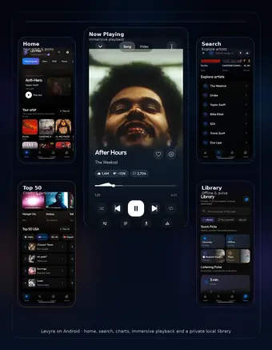
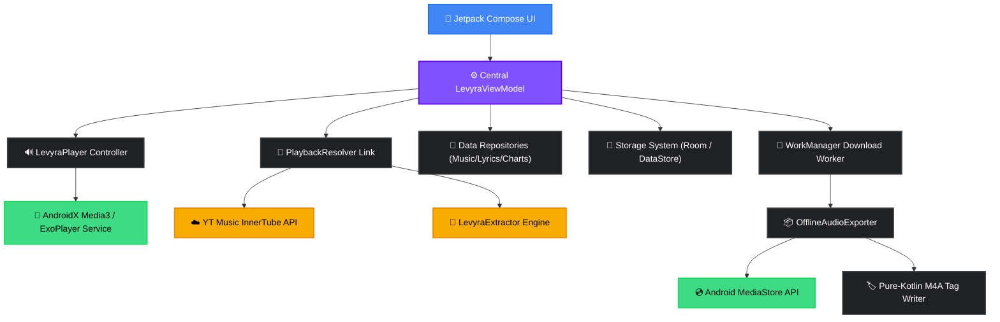

<div align="center">


# 🎶

### Stream everything. Keep what you love. Own every note.

<a href="https://github.com/LUC4N3X/Levyra-deepsound/releases/latest"></a>
<a href="https://github.com/LUC4N3X/Levyra-deepsound/releases?q=Levyra+Desktop&expanded=true"></a>
<a href="https://github.com/LUC4N3X/Levyra-deepsound/releases"></a>
<a href="LICENSE"></a>
<a href="https://github.com/LUC4N3X/Levyra-deepsound/stargazers"></a>

<br>

<a href="https://github.com/LUC4N3X/Levyra-deepsound/releases/latest">
  
</a>
<a href="https://github.com/LUC4N3X/Levyra-deepsound/releases?q=Levyra+Desktop&expanded=true">
  
</a>

<sub>**Android and Windows. No account. No ads.** · Signed APK · MSI / EXE / Portable ZIP</sub>

</div>

---


## ✦ About Levyra

<div align="center">

🎵 **Levyra** isn't another website wearing an app icon. It is a native music client for **Android and Windows**,<br>
built in Kotlin for people who want fast streaming, a private library and real offline playback.

On Android, downloads can become tagged **M4A files** in `Music/Levyra`. On Windows, Levyra keeps a persistent<br>
offline library with resumable downloads and automatically prefers the verified local file during playback.
**Your music experience stays on your device — whichever screen you use.**

<sub>*Every screen, every animation, every retry-on-bad-wifi was built by one developer who actually uses this app every day — and it shows.*</sub>

<br>

🛡️ &nbsp;**Privacy by Default** &nbsp;—&nbsp; <sub>Listening stats stay in a local database. No trackers, no telemetry, no analytics.</sub>

📥 &nbsp;**Real Files, Really Yours** &nbsp;—&nbsp; <sub>Tagged Android exports and persistent Windows offline files, not disposable cache blobs.</sub>

⚡ &nbsp;**Native Audio Engines** &nbsp;—&nbsp; <sub>Media3 / ExoPlayer on Android and libvlc on Windows.</sub>

<br>

`Kotlin` &nbsp;·&nbsp; `Jetpack Compose` &nbsp;·&nbsp; `Compose Multiplatform` &nbsp;·&nbsp; `Media3` &nbsp;·&nbsp; `libvlc`

</div>

---

## ✦ Features

<table width="100%">
<tr>
<td width="50%" valign="top">

### 🎨 Expressive Interface

**Dark-First, OLED-True:** Deep blacks and high contrast, built dark from day one — not dimmed as an afterthought.
**Fluid Navigation:** Home, Search, Library and Player tied together by custom micro-animations.
**Platform-Native Layouts:** Mobile-first navigation on Android and a full desktop sidebar, player dock and window lifecycle on Windows.
**Dual-State Player:** Immersive mobile playback on Android and a separate always-on-top mini player on Windows.
**Adaptive Styling:** Dynamic Material 3 on Android, coordinated light/dark surfaces and native title-bar styling on Windows.

</td>
<td width="50%" valign="top">

### ⚡ Rock-Solid Playback

**Native Playback:** Media3 + MediaSession on Android; libvlc, tray controls and single-instance lifecycle on Windows.
**Total Control:** Loop all/single, shuffle, playback speed tuning, sleep timers (15/30/60m).
**Audio Tuning:** In-app normalization, silence skipping, quality selectors (Auto/High/Low).
**SponsorBlock Built In:** Non-music and sponsored segments skipped automatically, in real time.

</td>
</tr>
<tr>
<td width="50%" valign="top">

### 📥 Downloads Done Right

**Android Exports:** Tagged M4A files written to the public `Music/Levyra` directory. Move them, back them up, keep them.
**Windows Offline Library:** Persistent local files with progress, cancellation, retry and HTTP Range resume.
**Reliable Completion:** Atomic finalization prevents half-written files from being treated as complete.
**Local-First Playback:** Levyra automatically uses the verified offline copy when it is available.

</td>
<td width="50%" valign="top">

### 🔍 Search & Stream Resolving

**Dual-Channel Resolver:** InnerTube + LevyraExtractor with smart Opus/M4A selection — when YouTube changes signatures, Levyra doesn't flinch.
**Intelligent Caching:** TTL-based stream cache cuts duplicate requests and loads tracks before you finish tapping.
**Predictive Search:** Live suggestions, categorized filters, instant top-result matching.
**Prefetching Engine:** Charts and queued songs load ahead of time. Zero-gap playback, every time.

</td>
</tr>
<tr>
<td width="50%" valign="top">

### 📊 Listening Pulse

**On-Device Stats:** Every Pulse metric is stored locally in Room — never uploaded as analytics or telemetry.
**Pulse Dashboard:** Total minutes, plays, day streak, completion rate, peak hour and a 7-day rhythm chart.
**True History:** Top artists ranked by real playtime, plus what you actually played — not what you searched once.

</td>
<td width="50%" valign="top">

### 🎵 Synced Lyrics

**LRCLIB Integration:** Synced and static lyrics fetched instantly from track metadata.
**Live Tracker:** Karaoke-precise scrolling synchronized with the active Android or Windows player.
**Graceful Fallback:** No timestamps? Clean static text. Never a blank screen.

</td>
</tr>
</table>

---

## ✦ A Look Inside

<div align="center">

<br>



<sub>*The redesigned Levyra experience: discovery, collections, immersive playback and a private offline library.*</sub>

<br>

</div>

---

## ✦ Architecture

Levyra ships two native clients from one repository. Android uses strict unidirectional data flow around a central ViewModel, while Windows is isolated under `desktop/` with its own Kotlin/JVM modules, state controllers, persistence, packaging and release channel. Both clients reuse LevyraExtractor and the shared localization catalog.

```text
📦 Android Application Specifications
├── Package Name      com.luc4n3x.levyra
├── Target SDK        35 (Android 15)
├── Min SDK           26 (Android 8.0)
├── Primary Language  100% Kotlin
├── UI Framework      Jetpack Compose + Material 3 (M3)
└── Audio Foundation  AndroidX Media3 / ExoPlayer Engine
```


```mermaid
graph TD
    %% Custom Styling Theme
    classDef ui fill:#4285F4,stroke:#1A73E8,stroke-width:2px,color:#fff;
    classDef vm fill:#7F52FF,stroke:#6200EE,stroke-width:2px,color:#fff;
    classDef core fill:#202124,stroke:#3C4043,stroke-width:2px,color:#fff;
    classDef engine fill:#3DDC84,stroke:#1DDB60,stroke-width:2px,color:#000;
    classDef ext fill:#F9AB00,stroke:#EA8600,stroke-width:2px,color:#000;

    UI["📱 Jetpack Compose UI"]:::ui --> VM["⚙️ Central LevyraViewModel"]:::vm
    
    VM --> Player["🔊 LevyraPlayer Controller"]:::core
    VM --> Resolver["🔗 PlaybackResolver Link"]:::core
    VM --> Repos["📂 Data Repositories (Music/Lyrics/Charts)"]:::core
    VM --> Store["💾 Storage System (Room / DataStore)"]:::core
    VM --> Work["🔄 WorkManager Download Worker"]:::core
    
    Player --> Media3["🎵 AndroidX Media3 / ExoPlayer Service"]:::engine
    
    Resolver --> InnerTube["☁️ YT Music InnerTube API"]:::ext
    Resolver --> Extractor["🔌 LevyraExtractor Engine"]:::ext
    
    Work --> Exporter["📦 OfflineAudioExporter"]:::core
    Exporter --> MediaStore["💿 Android MediaStore API"]:::engine
    Exporter --> Tagger["🏷️ Pure-Kotlin M4A Tag Writer"]:::core
```

| Layer | Responsibility | Project Directory |
|:---|:---|:---|
| **UI Presentation** | Composable screens, mini-player layouts, layout triggers, theme engines | [`ui/`](app/src/main/java/com/luc4n3x/levyra/ui) |
| **State Management** | Centralized ViewModel orchestrating single-source UI state | [`viewmodel/`](app/src/main/java/com/luc4n3x/levyra/viewmodel) |
| **Domain Logic** | Abstract domain entities, data models, validation boundaries | [`domain/`](app/src/main/java/com/luc4n3x/levyra/domain) |
| **Data & Network** | Web endpoints, charts API client, lyrics parser, preferences config | [`data/`](app/src/main/java/com/luc4n3x/levyra/data) |
| **Audio Pipeline** | Media3 foreground service, HLS, prefetching queue control | [`player/`](app/src/main/java/com/luc4n3x/levyra/player) |
| **Background Exports** | WorkManager pipeline, metadata tagging, MediaStore registrations | [`player/offline/`](app/src/main/java/com/luc4n3x/levyra/player/offline) |
| **Local Cache** | SQLite database, Room entities, and key-value preference stores | [`data/local/`](app/src/main/java/com/luc4n3x/levyra/data/local) |

### Windows Desktop architecture

```text
desktop/
├── core/       catalog, stream resolution, downloads and persistence
├── player/     queue model and libvlc audio implementation
├── app/        Compose UI, onboarding, library, updater and lifecycle
├── packaging/  Windows icon and jpackage resources
└── version.properties  independent Desktop version
```

The Windows client includes a persistent library, offline downloads, single-instance protection, `levyra://` deep links, crash reports, a mini player and verified in-place updates. See [`desktop/README.md`](desktop/README.md) for the complete Desktop documentation.

---

## ✦ Technical stack

Levyra is built natively for Android and Windows, with platform-specific playback engines and a shared focus on fast startup, local ownership and private listening data.

```yaml
system:
  language: "Kotlin 2.4.0"
  interface: "Jetpack Compose (Material 3)"
  state: "Mobius MVI"
audio:
  core: "AndroidX Media3 / ExoPlayer"
  resolver: "LevyraExtractor"
data:
  client: "OkHttp 5 (Brotli)"
  image_cache: "Coil 3"
  database: "Room (SQLite) + DataStore"
  downloads: "WorkManager background work scheduler"
build:
  engine: "Gradle Kotlin DSL + KSP"
  size_audit: "Spotify Ruler"
desktop:
  interface: "Compose Multiplatform"
  audio: "libvlc"
  storage: "%APPDATA%/Levyra"
  packaging: "jpackage + WiX"
```

### 📱 Core and UI
* **Kotlin 2.4.0**: A 100% native codebase built with coroutines and flow APIs for asynchronous streaming.
* **Jetpack Compose** (via Compose BOM): Declarative layouts with Material 3 components and system-wide dynamic color adaptation.
* **Mobius architecture**: A unidirectional data flow design (Model-Event-Effect-Update) for reliable player state transitions.
* **Compose Multiplatform Desktop**: Native Windows layouts, lifecycle, onboarding, library and player surfaces.

### 🎧 Audio pipeline
* **Media3 and ExoPlayer**: Android foreground playback with HTTP live streaming, caching and background controller sync.
* **libvlc**: Windows playback, system tray controls and local-file-first offline playback.
* **LevyraExtractor**: A custom resolver hosted on JitPack to parse playback streams from InnerTube endpoints.

### 📦 Storage and networking
* **OkHttp 5**: The underlying network client, using Brotli compression to save mobile bandwidth.
* **Room Database and DataStore**: Local SQLite and key-value storage for Android player history and preferences.
* **Desktop local stores**: JSON state, artwork cache and offline files under `%APPDATA%\Levyra`.
* **Coil 3**: Asynchronous image loading optimized for Jetpack Compose.
* **WorkManager**: An OS-managed background work scheduler for Android offline audio downloads.

### 🛠️ Build and bundle tools
* **Gradle Kotlin DSL**: Build configuration using version catalogs, KSP, and Kotlin script files.
* **Spotify Ruler**: A build analyzer that runs size audits and tracks dependency weights to keep the APK compact.
* **jpackage + WiX**: MSI, EXE and portable Windows distributions.

---

## ✦ Building from Source

### Android prerequisites
* Android Studio Jellyfish (or newer)
* Java Development Kit (JDK) 17
* Android SDK Platform 37 (`compileSdk = 37`, `targetSdk = 35`)
* Gradle 9.6.1 through the repository Gradle Wrapper

### Android build and install

```bash
# Clone the repository
git clone https://github.com/LUC4N3X/Levyra-deepsound.git
cd Levyra-deepsound

# Build and install the debug app on your connected device
./gradlew installDebug

# Compile a clean, optimized release build
./gradlew clean assembleRelease

# Analyze bundle size with Spotify Ruler
./gradlew :app:analyzeDebugBundle
```

The release APK lands in `app/build/outputs/apk/release/app-release.apk`.

### Windows build

Requirements: JDK 21, Windows x64, VLC 3.0.x/libvlc and WiX Toolset 3.14 for installers.

```powershell
git clone https://github.com/LUC4N3X/Levyra-deepsound.git
cd Levyra-deepsound\desktop
.\gradlew.bat check
.\gradlew.bat createReleaseDistributable
.\gradlew.bat packageReleaseMsi packageReleaseExe
```

Desktop artifacts are written to `desktop/app/build/compose/binaries/main-release/`.

For F-Droid reproducible-build verification, use the dedicated source-build
switch. It keeps the standard application ID, produces the unsigned rebuild
that F-Droid compares with Levyra's upstream-signed F-Droid APK, uses the
public InnerTube client key already documented in the source tree, and
disables Levyra's GitHub self-update prompt. F-Droid publishes the
upstream-signed APK only after the two builds match, preserving update
compatibility with GitHub installations:

```bash
./gradlew --no-daemon -PlevyraFdroidBuild=true :app:assembleRelease
```

Architecture and size-control notes live in `docs/APK_SIZE_RULER.md` and `docs/PLAYER_MOBIUS_SAMPLE_ARCHITECTURE.md`.

### Versioning & CI

Android and Windows use independent version sources and release tags.

```properties
# Android — gradle.properties
levyraVersionName=2.3.17
levyraVersionCode=2031700

# Windows — desktop/version.properties
levyraDesktopVersion=1.1.0
```

Android publishes `v<version>` releases and remains the repository's **Latest** channel. Windows publishes immutable `desktop-v<version>` releases with MSI, EXE, portable ZIP and SHA-256 files. Increasing the Android version never starts or publishes the Desktop build, and increasing the Desktop version never modifies Android or F-Droid releases.

`versionCode = major * 1_000_000 + minor * 10_000 + patch * 100 + build`, with every component bounded by the build logic and `build` restricted to `0–99`. The APK Artifact workflow verifies the signed APK independently from the Desktop Windows workflow.

---

## ✦ Privacy & data collection

Your listening habits are nobody's business, including mine.

* **No analytics frameworks**: There are no tracking SDKs or developer-operated telemetry services.
* **On-device statistics**: History, Pulse data, preferences and Desktop library state stay on the user's device.
* **Network interactions**: Actions like searching, loading artwork, showing SponsorBlock segments, fetching lyrics, or using account features contact third-party endpoints. These connections send standard client data, including your IP address, device headers, and cookies where applicable.

### Declared Android manifest permissions

```text
INTERNET & ACCESS_NETWORK_STATE       Streams music data and queries metadata.
FOREGROUND_SERVICE_MEDIA_PLAYBACK     Keeps audio playing when the app is backgrounded.
POST_NOTIFICATIONS                    Displays the playback controller notification.
WAKE_LOCK                             Prevents playback stutter when the CPU goes to sleep.
WRITE_EXTERNAL_STORAGE (≤ SDK 28)     Saves offline files on older Android versions.
```

---
## ✦ Contributing

Contributions are welcome. If you want to report a bug, suggest a feature, or submit a pull request, follow these steps:

1. Fork the repository.
2. Create a feature branch:
   ```bash
   git checkout -b feature/AmazingFeature
   ```
3. Commit your changes:
   ```bash
   git commit -m "Add some AmazingFeature"
   ```
4. Push to your branch:
   ```bash
   git push origin feature/AmazingFeature
   ```
5. Open a Pull Request.

### Custom distribution guidelines

If you build and distribute your own version of Levyra, please respect these rules:
* **Signing keys**: Generate your own Android keystores. Do not reuse existing keys.
* **Build names**: Follow the release naming schema `LEVYRA-<version>.apk` for Android and `LEVYRA-Windows-<version>-x64` for Windows.
* **Execution dispatching**: Run all database, storage, and network requests on background thread pools (`Dispatchers.IO`), keeping the UI thread responsive.
* **Resiliency**: Handle query timeouts gracefully with clear fallback routes.

---

## ✦ Credits

<table align="center">
  <tr>
    <td align="center" width="130">
      <a href="https://github.com/LUC4N3X">
        
      </a>
    </td>
    <td>
      <h3>LUC4N3X</h3>
      <strong>Creator · Lead Architect · Design Lead</strong>
      <br>
      <sub>Android and Desktop architecture · Media3 and libvlc orchestration · Offline pipelines · Automated release CI · UI/UX</sub>
      <br>
      <sub><em>One developer. No team, no shortcuts — every line, every pixel.</em></sub>
      <br><br>
      <a href="https://github.com/LUC4N3X"></a>
    </td>
  </tr>
</table>

<div align="center">

#### Standing on the Shoulders of Open Source

</div>

<table align="center">
  <tr>
    <th align="left">Project</th>
    <th align="left">Contribution</th>
  </tr>
  <tr>
    <td><a href="https://github.com/MetrolistGroup/Metrolist"><strong>Metrolist</strong></a></td>
    <td>Structural inspiration for UI conventions and modular styling</td>
  </tr>
  <tr>
    <td><a href="https://github.com/LUC4N3X/Levyra-deepsound/tree/main/third_party/LevyraExtractor"><strong>LevyraExtractor</strong></a></td>
    <td>Stream extraction core — GPL-3.0 fork maintained for Levyra</td>
  </tr>
  <tr>
    <td><a href="https://github.com/InfinityLoop1308/PipePipeExtractor"><strong>PipePipeExtractor</strong></a></td>
    <td>Upstream extractor foundation from the NewPipe/PipePipe ecosystem</td>
  </tr>
</table>

---

## 📜 Disclaimer

> [!WARNING]
> **Educational and Research Purposes Only**
> Levyra is an open-source client and does not host, upload, or index copyrighted files. The app interacts solely with public, third-party content endpoints. The user takes full responsibility for any usage that may violate local laws or third-party terms of service. The developers assume no liability for service changes, system blocks, or client misuse.

This project is **not affiliated with, funded, authorized, endorsed by, or in any way associated with** YouTube, Google LLC, or any of their affiliates and subsidiaries. All trademarks referenced belong to their respective owners.


---

<div align="center">

**Built independently. Engineered with purpose. Refined for listeners who expect more.**

⭐ **If Levyra has earned a place in your daily listening, support its development by starring the repository.**

</div>
