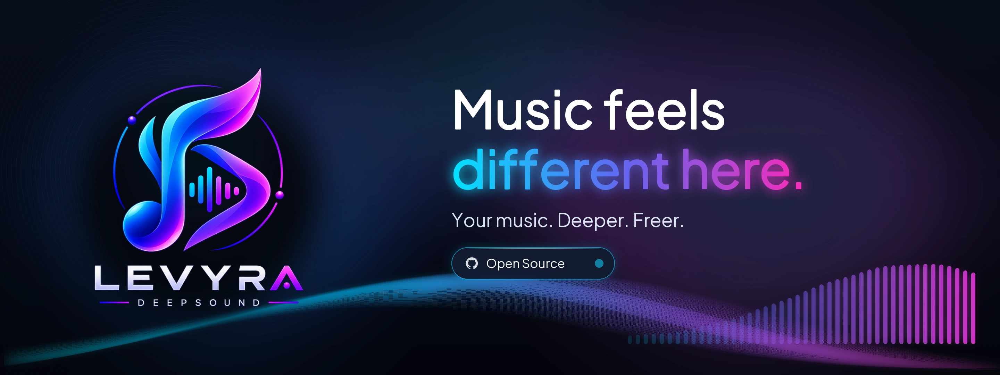

<div align="center">



# Hear every layer. No limits.

**A native music player, stream extractor, and private offline vault for Android & Windows.**

<p align="center">
  <a href="https://github.com/LUC4N3X/Levyra-deepsound/releases/latest"></a>
  <a href="https://github.com/LUC4N3X/Levyra-deepsound/releases"></a>
  <a href="LICENSE"></a>
  <a href="https://github.com/LUC4N3X/Levyra-deepsound/stargazers"></a>
</p>

### ✦ Download

<p align="center">
  <a href="https://github.com/LUC4N3X/Levyra-deepsound/releases/latest"></a>&nbsp;&nbsp;
  <a href="https://f-droid.org/packages/com.luc4n3x.levyra/"></a>
</p>
<p align="center">
  <a href="https://apps.obtainium.imranr.dev/redirect.html?r=obtainium://add/https://github.com/LUC4N3X/Levyra-deepsound"></a>&nbsp;&nbsp;
  <a href="https://github.com/LUC4N3X/Levyra-deepsound/releases?q=Levyra+Desktop&expanded=true"></a>
</p>

<p align="center">
  <code>100% Kotlin</code> &nbsp;·&nbsp; <code>Jetpack Compose</code> &nbsp;·&nbsp; <code>Compose Multiplatform</code> &nbsp;·&nbsp; <code>AndroidX Media3</code> &nbsp;·&nbsp; <code>libvlc</code> &nbsp;·&nbsp; <code>Zero Tracking</code>
</p>

</div>

---

## ✦ The Pure Listening Philosophy

Modern music streaming applications often treat music as temporary, disposable bandwidth—trapped behind proprietary walled gardens, mandatory subscriptions, battery-draining telemetry, and transient cache files that evaporate the moment your device goes offline.

**Levyra is built differently.** It treats music as art to be experienced with absolute acoustic precision and true digital ownership:

* 💿 **True Offline Ownership**: Downloads are standard, high-bitrate M4A audio files saved directly into your device storage (`Music/Levyra`). Album artwork, artists, and lyrics are embedded directly into the file container so your music plays flawlessly in your car, DAP, hi-fi system, or any media player.
* ⚡ **Tuned Low-Latency Audio Engines**: Android leverages a low-overhead **AndroidX Media3 & ExoPlayer** foreground audio pipeline for instant buffering, seamless gapless playback, and volume normalization. Windows runs a standalone **libvlc** engine with global keyboard shortcuts and system tray controls.
* 🎙️ **Live Karaoke Synced Lyrics**: Real-time scrolling lyrics powered by LRCLIB, featuring line-by-line vocal highlighting and interactive tap-to-seek scrubbing.
* ✂️ **Zero-Distraction Flow**: Native **SponsorBlock** automatically detects and skips music video intros, non-musical banter, skit dialogue, and silence—jumping straight into the sound.
* 🛡️ **100% Private On-Device Intelligence**: Your listening time, daily streaks, play counts, and playlists are calculated locally within a private SQLite database. Zero analytics, zero cookies, zero user profiling.

---

## ✦ Interface & Experience Showcase

<div align="center">


<br><br>

| | |
| :---: | :---: |
|  |  |
| **Immersive Playback & Live Synced Lyrics**<br><sub>ExoPlayer audio engine · Line-by-line LRCLIB synced lyrics · Song/Video toggle · SponsorBlock</sub> | **Smart Orbit Feed & Global Charts**<br><sub>Dynamic 'Your Orbit' rotation · Live Top 50 international charts · Mood chips · Instant prefetch</sub> |
|  |  |
| **Deep Search & Artist Immersion**<br><sub>Live search with artist bubbles · Wikipedia biography cards · Complete chronological discography</sub> | **Offline M4A Vault & Listening Pulse**<br><sub>Real tagged M4A files with art · On-device 7-day listening analytics · 100% private SQLite</sub> |
|  |  |
| **Samples Clips & Comment Energy**<br><sub>Vertical video teaser clips · Live music video feeds · Real-time 73% comment energy resonance</sub> | **Editorial Playlists & Genre Matrix**<br><sub>4-tile dynamic editorial collections · Expansive mood spectrum (Rap, Lo-Fi, Anime, Electronic)</sub> |

</div>

<br>

<details>
<summary><b>✦ Browse Complete Screen-by-Screen Gallery (15 High-Res Views)</b></summary>
<br>

<div align="center">

#### 🎵 Immersive Playback & Lyrics
| Now Playing Canvas | Synchronized Lyrics |
| :---: | :---: |
|  |  |

#### 🪐 Home & Discovery
| Home Selection & Orbit | Global Top 50 Charts | Editorial Collections |
| :---: | :---: | :---: |
|  |  |  |

#### 🔍 Search & Artist Universe
| Search Discovery & Recent | Live Artist Results | Artist Profile & Bio | Artist Discography |
| :---: | :---: | :---: | :---: |
|  |  |  |  |

#### 📊 Offline Vault & Listening Pulse
| Library Quick Picks | Listening Pulse Analytics | Playlist Details |
| :---: | :---: | :---: |
|  |  |  |

#### 🎬 Explore & Video Engine
| Vertical Samples Clips | Moods & Subgenre Matrix | Video Feed & Energy |
| :---: | :---: | :---: |
|  |  |  |

</div>

</details>

---

## ✦ Acoustic Architecture & Features

<table align="center" width="100%">
  <tr valign="top">
    <td width="50%">
      <h3>🎚️ <b>Pure Audio & Playback Engine</b></h3>
      <ul>
        <li><b>Dual Native Engines:</b> Media3 / ExoPlayer on Android and isolated libvlc on Windows.</li>
        <li><b>Playback Suite:</b> Gapless, shuffle/repeat, speed/pitch, sleep timer, and queue Undo.</li>
        <li><b>Smart Playback:</b> Android Auto, volume normalization, SponsorBlock skipping, and Audio / Video toggle.</li>
      </ul>
    </td>
    <td width="50%">
      <h3>💾 <b>Offline Audio Vault & File Exports</b></h3>
      <ul>
        <li><b>Tagged M4A Files:</b> Cover art, artist, album, and lyrics embedded directly in the file.</li>
        <li><b>Local-First Playback:</b> Existing offline files play instantly from <code>Music/Levyra</code>.</li>
        <li><b>Resilient Storage:</b> HTTP Range resume, atomic verification, and portable JSON backups.</li>
      </ul>
    </td>
  </tr>
  <tr valign="top">
    <td width="50%">
      <h3>🔍 <b>Stream Extraction & Discovery</b></h3>
      <ul>
        <li><b>Dual Resolver:</b> Highest-fidelity Opus or AAC with automatic fallback.</li>
        <li><b>Queue Prefetch:</b> Upcoming tracks buffer quietly before the skip.</li>
        <li><b>Discovery Engine:</b> Global Top 50, Smart Orbit recommendations, and Samples feed.</li>
      </ul>
    </td>
    <td width="50%">
      <h3>📊 <b>Karaoke Lyrics & Visual Immersion</b></h3>
      <ul>
        <li><b>Synced Lyrics:</b> Millisecond-aligned LRCLIB lyrics with tap-to-seek highlighting.</li>
        <li><b>Lyric Sharing:</b> Select verses, copy, share, or export a 1080×1080 Levyra card.</li>
        <li><b>Living Artwork:</b> Artwork-driven motion fallback when a real Canvas is unavailable.</li>
        <li><b>Canvas & Preview:</b> In-player Canvas control plus full-screen zoomable artwork preview.</li>
      </ul>
    </td>
  </tr>
  <tr valign="top">
    <td width="50%">
      <h3>📈 <b>Listening Insights</b></h3>
      <ul>
        <li><b>Accurate Listening:</b> Playback time and counted plays respect pause, seek, skip, and completion.</li>
        <li><b>Listening Pulse:</b> Weekly activity, 24-hour rhythm, and artist distribution.</li>
        <li><b>Your Sound:</b> 7-day, 30-day, 6-month, and All Time analysis stored on device.</li>
      </ul>
    </td>
    <td width="50%">
      <h3>🔤 <b>Readability & Typography</b></h3>
      <ul>
        <li><b>Levyra Type Rhythm:</b> Shared line-height scale for titles, metadata, and multi-line text.</li>
        <li><b>Accessible Layout:</b> Role-aware tracking with safe accents, descenders, and large font scales.</li>
        <li><b>Private by Default:</b> Listening statistics are computed locally and never leave the device.</li>
      </ul>
    </td>
  </tr>
</table>

---

## ✦ Architecture & Engineering Blueprint

<div align="center">
  <h3>🏗️ <b>Native architecture. Modular by design.</b></h3>
  <p>
    <code>ANDROID</code> &nbsp;·&nbsp;
    <code>WINDOWS</code> &nbsp;·&nbsp;
    <code>LOW-LATENCY PLAYBACK</code> &nbsp;·&nbsp;
    <code>LOCAL-FIRST STORAGE</code>
  </p>
</div>

Levyra is built from the ground up as a native, modular audio suite for Android and Windows.

<table align="center" width="100%">
  <tr valign="top">
    <td width="50%">
      <h3>📱 <b>Android Native Suite</b> (<code>app/</code>)</h3>
      <p><b>Modern Android stack.</b><br><sub>Compose-first UI, Media3 playback, offline export, and local data orchestration.</sub></p>
      <ul>
        <li>🎨 <b><a href="app/src/main/java/com/luc4n3x/levyra/ui"><code>ui/</code></a>:</b> Compose & Material 3 screens, gestures, Canvas, and OLED palettes.</li>
        <li>🧠 <b><a href="app/src/main/java/com/luc4n3x/levyra/viewmodel"><code>viewmodel/</code></a>:</b> Immutable UI state and unidirectional coordination.</li>
        <li>🎧 <b><a href="app/src/main/java/com/luc4n3x/levyra/player"><code>player/</code></a>:</b> Media3 / ExoPlayer foreground audio service.</li>
        <li>💾 <b><a href="app/src/main/java/com/luc4n3x/levyra/player/offline"><code>offline/</code></a>:</b> WorkManager exports, M4A tagging, and artwork.</li>
        <li>⚡ <b><a href="app/src/main/java/com/luc4n3x/levyra/data"><code>data/</code></a>:</b> Stream resolving, synced lyrics, prefetch, and Room data.</li>
      </ul>
    </td>
    <td width="50%">
      <h3>💻 <b>Windows Desktop Suite</b> (<code>desktop/</code>)</h3>
      <p><b>Standalone desktop core.</b><br><sub>Compose Multiplatform interface, libvlc playback, packaging, and desktop-native controls.</sub></p>
      <ul>
        <li>🖥️ <b><a href="desktop/app"><code>app/</code></a>:</b> Compose Multiplatform UI, windows, and updater.</li>
        <li>🔊 <b><a href="desktop/player"><code>player/</code></a>:</b> libvlc playback, hardware acceleration, tray, and global hotkeys.</li>
        <li>🌐 <b><a href="desktop/core"><code>core/</code></a>:</b> Stream resolver, downloads, and local app storage.</li>
        <li>📦 <b><a href="desktop/packaging"><code>packaging/</code></a>:</b> WiX MSI installer and portable distributions.</li>
      </ul>
    </td>
  </tr>
</table>

### ✦ Under the Hood

<sub>Three core systems keep Levyra predictable, resilient, and portable.</sub>

**01 · Unidirectional State Flow**<br>
Immutable ViewModel state keeps the Compose UI, MediaSession, and Android Auto synchronized.

**02 · Dual Stream Resolver**<br>
InnerTube and LevyraExtractor coordinate automatic fallback, fidelity selection, and queue prefetch.

**03 · Standard File Vault**<br>
Offline tracks are exported as tagged M4A files in `Music/Levyra`, ready for external players and car systems.

---

## ✦ Building from Source

### 📱 Android Build
**Prerequisites**: JDK 17, Android SDK Platform 37, Gradle 9.7.0.

```bash
# Clone the repository
git clone https://github.com/LUC4N3X/Levyra-deepsound.git
cd Levyra-deepsound

# Build and install debug APK to a connected device
./gradlew installDebug

# Compile optimized release APK
./gradlew clean assembleRelease
```
<sub>Output: `app/build/outputs/apk/release/app-release.apk`</sub>

### 💻 Windows Desktop Build
**Prerequisites**: JDK 21 LTS, Windows x64, VLC 3.0.x / libvlc, and WiX Toolset 3.14.

```powershell
cd desktop
.\gradlew.bat check
.\gradlew.bat createReleaseDistributable
.\gradlew.bat packageReleaseMsi packageReleaseExe
```
<sub>Output: `desktop/app/build/compose/binaries/main-release/`</sub>

<details>
<summary><b>✦ F-Droid Reproducible Build & Versioning Contract</b></summary>
<br>

**F-Droid Reproducible Verification:**
```bash
./gradlew --no-daemon -PlevyraFdroidBuild=true :app:assembleRelease
```

**Version Wiring Contract:**
```properties
# Android: gradle.properties
levyraVersionName=2.5.0
levyraVersionCode=2050000

# Windows: desktop/version.properties
levyraDesktopVersion=1.2.0
```
<sub>Version code formula: <code>major * 1_000_000 + minor * 10_000 + patch * 100 + build</code>.</sub>

</details>

---

## ✦ Privacy Blueprint & Permissions

<div align="center">
  <h3>🛡️ <b>Private by default. Transparent by design.</b></h3>
  <p>
    <code>NO ADS</code> &nbsp;·&nbsp;
    <code>NO ANALYTICS</code> &nbsp;·&nbsp;
    <code>LOCAL LISTENING DATA</code> &nbsp;·&nbsp;
    <code>DIRECT CONNECTIONS</code>
  </p>
</div>

<table align="center" width="100%">
  <tr valign="top">
    <td width="50%">
      <h3>🌐 <b>Network Transparency</b></h3>
      <p><b>Only what playback needs.</b><br><sub>Connections go directly to the services Levyra uses—never through a Levyra tracking proxy.</sub></p>
      <ul>
        <li><b>🎵 Streams:</b> Direct YouTube / YT Music CDN connections.</li>
        <li><b>📝 Lyrics:</b> LRCLIB and YouTube Music metadata queries.</li>
        <li><b>🖼️ Artwork:</b> Public Deezer, Apple Music, and Tidal catalog lookups.</li>
        <li><b>✂️ SponsorBlock:</b> Optional truncated video-ID hash requests.</li>
        <li><b>🚀 Updates:</b> GitHub release checks; disabled in F-Droid builds.</li>
      </ul>
    </td>
    <td width="50%">
      <h3>🔐 <b>Permission Surface</b></h3>
      <p><b>Access stays narrow.</b><br><sub>Android permissions are limited to playback, notifications, optional recognition, and offline export.</sub></p>
      <ul>
        <li><b><code>INTERNET</code> / <code>ACCESS_<wbr>NETWORK_STATE</code></b><br><sub>Streaming and metadata.</sub></li>
        <li><b><code>FOREGROUND_<wbr>SERVICE_<wbr>MEDIA_<wbr>PLAYBACK</code></b><br><sub>Background playback and media controls.</sub></li>
        <li><b><code>POST_<wbr>NOTIFICATIONS</code></b><br><sub>Lockscreen controls and download updates.</sub></li>
        <li><b><code>RECORD_<wbr>AUDIO</code></b><br><sub>Optional music recognition only.</sub></li>
        <li><b><code>WAKE_<wbr>LOCK</code></b><br><sub>Keeps playback active with the screen off.</sub></li>
        <li><b><code>WRITE_<wbr>EXTERNAL_<wbr>STORAGE</code></b> <sub>Android ≤ 9</sub><br><sub>Tagged M4A export to <code>Music/Levyra</code>.</sub></li>
      </ul>
    </td>
  </tr>
</table>

---

## ✦ Contributing

We welcome community contributions, bug fixes, localization, and performance enhancements.

### Engineering Workflow

1. **Fork & Branch**: Create a focused topic branch from `main`:
   ```bash
   git checkout -b feature/your-feature-name
   ```
2. **Architecture Contract**: Preserve unidirectional data flow (UDF), immutable Compose state, and low-latency audio pipelines.
3. **Quality Gate**: Run repository validation before submitting:
   ```bash
   python scripts/ai_quality_gate.py --profile fast
   ```
4. **Pull Request**: Open a PR with a concise description of changes and test verification evidence.

> [!TIP]
> **Scope & Guidelines**: Keep pull requests focused on a single concern. For major architectural changes or new feature proposals, please open an [Issue](https://github.com/LUC4N3X/Levyra-deepsound/issues) first to coordinate the implementation approach.

---

## ✦ Author & Credits

<table width="100%">
  <tr>
    <td width="125" align="center" valign="middle">
      <a href="https://github.com/LUC4N3X">
        
      </a>
    </td>
    <td valign="middle">
      <h3 style="margin: 0 0 6px 0;">
        <a href="https://github.com/LUC4N3X">LUC4N3X</a> &nbsp;·&nbsp; <code>Lead Systems Architect & Creator</code>
      </h3>
      <p style="margin: 0 0 10px 0;">
        Creator and lead systems architect of Levyra. Engineering low-latency Android audio pipelines (Media3 & ExoPlayer), standalone libvlc desktop cores, zero-telemetry SQLite vaults, and synchronized LRCLIB karaoke engines.
      </p>
      <div>
        <a href="https://github.com/LUC4N3X"></a>&nbsp;
        &nbsp;
        &nbsp;
        
      </div>
    </td>
  </tr>
</table>

<br>

### Acknowledgments

* **[Metrolist](https://github.com/MetrolistGroup/Metrolist)** — Reference for Levyra's renderer-recovery backoff policy and BetterLyrics TTML parsing behavior, reimplemented for Levyra.
* **[PipePipeExtractor](https://github.com/InfinityLoop1308/PipePipeExtractor)** — LevyraExtractor is maintained as a Levyra-specific fork of this project, with additional stream-resolution, playback-reliability, diagnostics, and fallback work.
* **[NewPipe & PipePipe Communities](https://github.com/TeamNewPipe/NewPipeExtractor)** — Foundational extractor architecture, service implementations, parser protocols, and downstream ecosystem work retained in LevyraExtractor.
* **[LRCLIB](https://lrclib.net/)** — Community synchronized lyric database and open API powering real-time karaoke synchronization.

---

## ✦ License & Legal Disclaimer

> [!NOTE]
> **Independent Open-Source Client & Fair Use**
> * **No Affiliation**: Independent open-source project. Not affiliated with, endorsed, or sponsored by Google LLC, YouTube, Alphabet Inc., Apple Inc., Deezer, Spotify, or Tidal. All trademarks belong to their respective owners.
> * **Zero Content Hosting**: Does not host, store, cache, or distribute copyrighted media files. Operates purely as a local user-agent querying public third-party endpoints. Media and metadata remain property of their respective copyright holders.
> * **User Responsibility**: Distributed for personal, educational, and research use. Users are solely responsible for compliance with applicable laws and third-party terms.
> * **License & Warranty**: Released under the **[GNU General Public License v3.0](LICENSE)** (GPL-3.0) without warranty of any kind, express or implied.

<div align="center">
  <sub>Crafted for sovereign sound. If you enjoy Levyra, consider starring the repository on GitHub. ⭐</sub>
  <br><br>
  
</div>