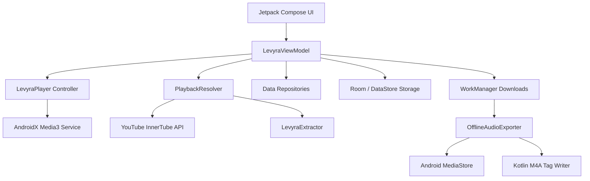

<div align="center">


# 🎵 Levyra

**A native music player and private offline audio library for Android and Windows.**

<p align="center">
  <a href="https://github.com/LUC4N3X/Levyra-deepsound/releases/latest"></a>
  <a href="https://github.com/LUC4N3X/Levyra-deepsound/releases"></a>
  <a href="LICENSE"></a>
  <a href="https://github.com/LUC4N3X/Levyra-deepsound/stargazers"></a>
</p>

### 📥 Download & Install

<p align="center">
  <a href="https://github.com/LUC4N3X/Levyra-deepsound/releases/latest"></a>&nbsp;&nbsp;
  <a href="https://apps.obtainium.imranr.dev/redirect.html?r=obtainium://add/https://github.com/LUC4N3X/Levyra-deepsound"></a>
</p>
<p align="center">
  <a href="https://github.com/LUC4N3X/Levyra-deepsound/releases?q=Levyra+Desktop&expanded=true"></a>
</p>

</div>

---

## 🎧 The listening experience

Levyra is built for listeners who care about how their music feels, sounds, and stays organized. Most modern streaming apps treat songs like disposable bandwidth, locked behind accounts, bloated algorithmic feeds, and temporary cache blobs that vanish when you step offline.

Levyra puts your music back in your hands:

* 💿 **Real audio files you keep**: When you download a track on Android, it saves as a tagged M4A file directly into your `Music/Levyra` directory. High-resolution album artwork, artist tags, and track metadata are baked in so your files play in any car stereo, DAP, or local player.
* ⚡ **Tuned native audio engines**: Android uses AndroidX Media3 and ExoPlayer for immediate buffering, gapless queueing, and low-latency audio routing. Windows runs an isolated libvlc pipeline with background playback and mini player controls.
* ✂️ **Music without interruptions**: Built-in SponsorBlock skips video intros, mid-track dialogue, skit scenes, and outro silence automatically, getting straight to the beat.
* 🛡️ **Zero tracking**: Listening minutes, play streaks, history, and playlists stay entirely inside a local SQLite database on your device.

<div align="center">
  <code>Kotlin</code> &nbsp;·&nbsp; <code>Jetpack Compose</code> &nbsp;·&nbsp; <code>Compose Multiplatform</code> &nbsp;·&nbsp; <code>Media3</code> &nbsp;·&nbsp; <code>libvlc</code>
</div>

---

## 🎶 Features

<table>
<tr>
<td width="50%" valign="top">

### 🔊 Pure sound and playback

* **Native audio pipelines**: AndroidX Media3 foreground audio service on Android; libvlc with global shortcuts and system tray controls on Windows.
* **Acoustic tuning**: Volume normalization to smooth out volume jumps between acoustic and loud tracks, plus silence skipping.
* **SponsorBlock for music**: Drops music video sketches, sponsors, and non-musical chatter before the song starts.
* **Playback flexibility**: Shuffle, repeat single or whole queue, custom playback speed, and sleep timers (15, 30, 60 minutes).

</td>
<td width="50%" valign="top">

### 💾 Offline vault and exports

* **Standard M4A files**: Android exports are standard audio files with embedded metadata and artwork, stored in `Music/Levyra`.
* **Desktop offline manager**: Windows maintains an offline library with HTTP Range chunk resuming, pause, and retry support.
* **Local-first playback**: If a track exists offline, Levyra plays the local file instantly without touching the network.
* **Atomic file writes**: Partial downloads are never marked as complete until tags and checksums are verified.

</td>
</tr>
<tr>
<td width="50%" valign="top">

### 🔍 Discovery and stream extraction

* **Clean stream selection**: Dual-resolver pipeline choosing the highest-fidelity Opus or AAC streams via InnerTube and LevyraExtractor.
* **Queue prefetching**: Upcoming songs in your queue pre-buffer ahead of time for immediate track transitions.
* **Intelligent caching**: TTL stream caching cuts duplicate queries and keeps navigation snappy.
* **Fast search**: Live search suggestions, instant artist matching, and categorized filters.

</td>
<td width="50%" valign="top">

### 🎤 Synced lyrics and listening pulse

* **Live synced lyrics**: Real-time scrolling lyrics powered by LRCLIB, synchronized with the playback position for sing-alongs.
* **Static lyrics fallback**: Clean text display when timestamped lyrics are unavailable.
* **Listening Pulse**: Local dashboard with total hours listened, daily streaks, completion rates, and peak listening times.
* **Playtime-based rankings**: Top artists and tracks ranked by real minutes played, not accidental taps.

</td>
</tr>
</table>

---

## 📱 Interface preview

<div align="center">
  
  <p><em>Levyra interface across discovery, playback, collections, and local offline library.</em></p>
</div>

---

## 🏛️ Architecture

Levyra ships two native clients from one repository:

* **Android** (`app/`): 100% Kotlin with Jetpack Compose and Material 3, orchestrated by a central ViewModel with AndroidX Media3 managing audio lifecycle.
* **Windows Desktop** (`desktop/`): Kotlin/JVM desktop client built with Compose Multiplatform, libvlc audio output, and local JSON/file persistence in `%APPDATA%\Levyra`.

Both clients share the core extractor and localization layers.

```text
Android specifications
├── Package name     com.luc4n3x.levyra
├── Target SDK       37
├── Min SDK          26 (Android 8.0)
├── Language         100% Kotlin
├── UI framework     Jetpack Compose + Material 3
└── Audio engine     AndroidX Media3 / ExoPlayer
```


```mermaid
graph TD
    UI["Jetpack Compose UI"] --> VM["LevyraViewModel"]
    
    VM --> Player["LevyraPlayer Controller"]
    VM --> Resolver["PlaybackResolver"]
    VM --> Repos["Data Repositories"]
    VM --> Store["Room / DataStore Storage"]
    VM --> Work["WorkManager Downloads"]
    
    Player --> Media3["AndroidX Media3 Service"]
    
    Resolver --> InnerTube["YouTube InnerTube API"]
    Resolver --> Extractor["LevyraExtractor"]
    
    Work --> Exporter["OfflineAudioExporter"]
    Exporter --> MediaStore["Android MediaStore"]
    Exporter --> Tagger["Kotlin M4A Tag Writer"]
```

| Layer | Responsibility | Path |
|:---|:---|:---|
| **UI** | Compose screens, sheets, mini player layouts, and theming | [`ui/`](app/src/main/java/com/luc4n3x/levyra/ui) |
| **State management** | Central ViewModel coordinating immutable UI state | [`viewmodel/`](app/src/main/java/com/luc4n3x/levyra/viewmodel) |
| **Domain** | Data models, domain entities, and playback contracts | [`domain/`](app/src/main/java/com/luc4n3x/levyra/domain) |
| **Data and network** | Endpoints, charts client, lyrics parsers, and preferences | [`data/`](app/src/main/java/com/luc4n3x/levyra/data) |
| **Audio pipeline** | Media3 foreground service, queue management, and prefetching | [`player/`](app/src/main/java/com/luc4n3x/levyra/player) |
| **Offline pipeline** | WorkManager export jobs, metadata tagging, and MediaStore registration | [`player/offline/`](app/src/main/java/com/luc4n3x/levyra/player/offline) |
| **Local storage** | Room SQLite entities, DAOs, and preferences store | [`data/local/`](app/src/main/java/com/luc4n3x/levyra/data/local) |

### Windows Desktop structure

```text
desktop/
├── core/               catalog, stream resolution, downloads, and storage
├── player/             queue model and libvlc audio integration
├── app/                Compose Multiplatform UI, window lifecycle, and updater
├── packaging/          Windows application icons and jpackage scripts
└── version.properties  Desktop release version
```

For detailed desktop documentation, see [`desktop/README.md`](desktop/README.md).

---

## ⚙️ Technical stack

```yaml
android:
  language: Kotlin 2.4.10
  ui: Jetpack Compose (Material 3)
  architecture: Unidirectional Data Flow / MVI
  audio: AndroidX Media3 / ExoPlayer
  networking: OkHttp 5 (Brotli)
  images: Coil 3
  database: Room (SQLite) + DataStore
  background_jobs: WorkManager
  build: Gradle Kotlin DSL + KSP

desktop:
  language: Kotlin / JVM (JDK 21)
  ui: Compose Multiplatform
  audio: libvlc
  storage: "%APPDATA%/Levyra"
  packaging: jpackage + WiX Toolset
```

---

## 🛠️ Building from source

### Android prerequisites

* Android Studio with Android Gradle Plugin 9.3.1 support
* Java Development Kit (JDK) 17
* Android SDK Platform 37 (`compileSdk = 37`, `targetSdk = 37`)
* Gradle 9.7.0 via the repository wrapper

```bash
# Clone the repository
git clone https://github.com/LUC4N3X/Levyra-deepsound.git
cd Levyra-deepsound

# Build and install debug build to a connected device
./gradlew installDebug

# Build release APK
./gradlew clean assembleRelease

# Analyze bundle size
./gradlew :app:analyzeDebugBundle
```

The output APK is generated at `app/build/outputs/apk/release/app-release.apk`.

### Windows Desktop build

Prerequisites: JDK 21, Windows x64, VLC 3.0.x/libvlc, and WiX Toolset 3.14 (for MSI/EXE installers).

```powershell
git clone https://github.com/LUC4N3X/Levyra-deepsound.git
cd Levyra-deepsound\desktop
.\gradlew.bat check
.\gradlew.bat createReleaseDistributable
.\gradlew.bat packageReleaseMsi packageReleaseExe
```

Build outputs are placed in `desktop/app/build/compose/binaries/main-release/`.

### F-Droid reproducible build

To verify the reproducible F-Droid build configuration:

```bash
./gradlew --no-daemon -PlevyraFdroidBuild=true :app:assembleRelease
```

To update F-Droid metadata from release commits:

```bash
python3 scripts/render_fdroid_metadata.py \
  --commit <40-character-release-commit> \
  --output fdroid-submission/metadata/com.luc4n3x.levyra.yml
```

### Versioning

Android and Windows release cycles are independent:

```properties
# Android: gradle.properties
levyraVersionName=2.3.20
levyraVersionCode=2032000

# Windows: desktop/version.properties
levyraDesktopVersion=1.2.0
```

Version codes follow `major * 1_000_000 + minor * 10_000 + patch * 100 + build` (build range: 0 to 99).

---

## 🔒 Privacy and network activity

Levyra does not include tracking SDKs, telemetry frameworks, or advertising services. Listening metrics and favorites never leave your device.

### External network connections

* **Playback and stream extraction**: Connects to YouTube and YouTube Music endpoints. A hidden WebView may run provider playback-security scripts locally when required for stream token decryption.
* **Metadata and artwork**: Fetched from public endpoints including Apple Music/iTunes, Deezer, Tidal, Qobuz, and Wikidata.
* **Lyrics**: Queried from YouTube Music, LRCLIB, and configured lyric providers.
* **SponsorBlock**: When enabled, queries the SponsorBlock API during playback to retrieve segment timestamps. Can be disabled in Settings.
* **Updates**: Official GitHub releases check for updates on startup. The F-Droid build disables this check.

### Android permissions

| Permission | Purpose |
|:---|:---|
| `INTERNET` & `ACCESS_NETWORK_STATE` | Streaming audio and fetching metadata |
| `FOREGROUND_SERVICE_MEDIA_PLAYBACK` | Continuous background audio playback |
| `POST_NOTIFICATIONS` | Media notification controls |
| `WAKE_LOCK` | Prevents CPU sleep during active audio playback |
| `WRITE_EXTERNAL_STORAGE` (SDK <= 28) | Writing offline audio files on older Android versions |

---

## 🤝 Contributing

Contributions are welcome. To get started:

1. Fork the repository.
2. Create a focused topic branch:
   ```bash
   git checkout -b feature/your-feature-name
   ```
3. Commit your changes with clear messages:
   ```bash
   git commit -m "Add playback speed presets to settings"
   ```
4. Push to your fork:
   ```bash
   git push origin feature/your-feature-name
   ```
5. Open a Pull Request with details about what was tested.

---

## 🌟 Credits and acknowledgments

<table align="center">
  <tr>
    <td align="center" width="120">
      <a href="https://github.com/LUC4N3X">
        
      </a>
    </td>
    <td>
      <strong>LUC4N3X</strong><br>
      Creator and lead developer<br>
      <sub>Architecture, playback engines, offline pipelines, and design.</sub><br>
      <a href="https://github.com/LUC4N3X"></a>
    </td>
  </tr>
</table>

### Open source foundations

* [**Metrolist**](https://github.com/MetrolistGroup/Metrolist): Design inspiration for Compose UI structure and theming.
* [**LevyraExtractor**](https://github.com/LUC4N3X/Levyra-deepsound/tree/main/third_party/LevyraExtractor): Custom stream extraction engine maintained for Levyra.
* [**PipePipeExtractor**](https://github.com/InfinityLoop1308/PipePipeExtractor): Extractor foundation from the NewPipe and PipePipe open-source community.

---

## 📜 License and disclaimer

> [!NOTE]
> **Educational and research use**
> Levyra is an open-source client application. It does not host, store, or distribute copyrighted media files. All streams and metadata are retrieved directly from public third-party endpoints.

This project is released under the **GNU General Public License v3.0 (GPL-3.0)**. See the [LICENSE](LICENSE) file for details.

This project is not affiliated with, sponsored by, or endorsed by Google LLC or YouTube. All trademarks belong to their respective owners.

<div align="center">
  <p>If you enjoy Levyra, consider starring the repository on GitHub.</p>
</div>
