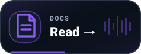
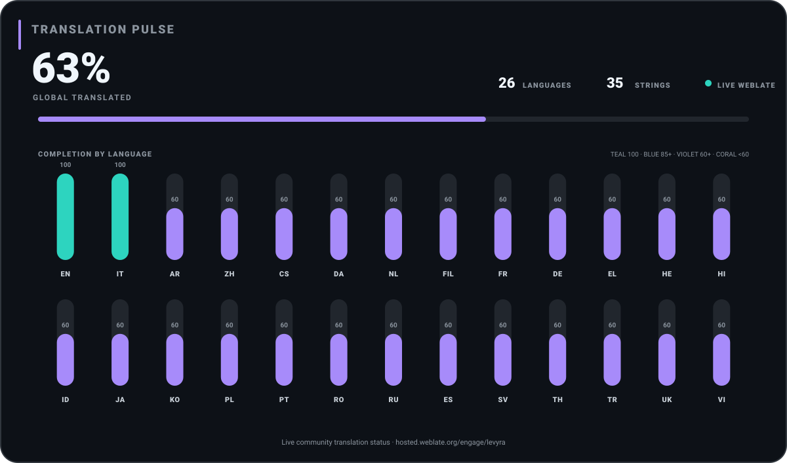
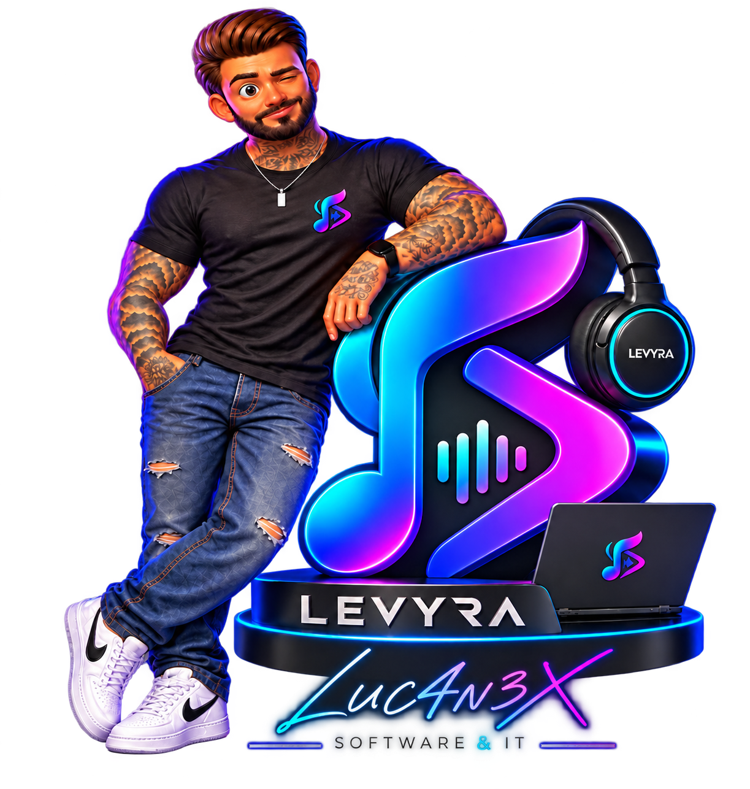

<picture>
  <source media="(prefers-color-scheme: light)" srcset="docs/assets/levyra-github-banner-light.webp?v=samsung-terrace-20261002-v2">
  <source media="(prefers-color-scheme: dark)" srcset="docs/assets/levyra-github-banner.webp?v=samsung-terrace-20261002-v2">
  
</picture>

# Levyra

**Open-source music player for Android and Windows.**

Play streamed music and your own files in the same app, save tracks for offline listening, and follow synced lyrics. Levyra does not need an account and does not track you.

  <a href="https://github.com/LUC4N3X/Levyra-deepsound/releases/latest"><picture><source media="(prefers-color-scheme: light)" srcset="docs/assets/levyra-release-mobile-light.svg 126w, docs/assets/levyra-release-light.svg 145w" sizes="(max-width: 480px) 126px, 145px"><source media="(prefers-color-scheme: dark)" srcset="docs/assets/levyra-release-mobile.svg 126w, docs/assets/levyra-release.svg 145w" sizes="(max-width: 480px) 126px, 145px"></picture></a>
  <a href="https://github.com/LUC4N3X/Levyra-deepsound/releases"><picture><source media="(prefers-color-scheme: light)" srcset="docs/assets/levyra-downloads-mobile-light.svg 126w, docs/assets/levyra-downloads-light.svg 145w" sizes="(max-width: 480px) 126px, 145px"><source media="(prefers-color-scheme: dark)" srcset="docs/assets/levyra-downloads-mobile.svg 126w, docs/assets/levyra-downloads.svg 145w" sizes="(max-width: 480px) 126px, 145px"></picture></a>
  <a href="LICENSE"><picture><source media="(prefers-color-scheme: light)" srcset="docs/assets/levyra-license-mobile-light.svg 126w, docs/assets/levyra-license-light.svg 145w" sizes="(max-width: 480px) 126px, 145px"><source media="(prefers-color-scheme: dark)" srcset="docs/assets/levyra-license-mobile.svg 126w, docs/assets/levyra-license.svg 145w" sizes="(max-width: 480px) 126px, 145px"></picture></a>
  <a href="https://github.com/LUC4N3X/Levyra-deepsound/stargazers"><picture><source media="(prefers-color-scheme: light)" srcset="docs/assets/levyra-stars-mobile-light.svg 126w, docs/assets/levyra-stars-light.svg 145w" sizes="(max-width: 480px) 126px, 145px"><source media="(prefers-color-scheme: dark)" srcset="docs/assets/levyra-stars-mobile.svg 126w, docs/assets/levyra-stars.svg 145w" sizes="(max-width: 480px) 126px, 145px"></picture></a>
  <a href="https://luc4n3x.github.io/Levyra-deepsound/"><picture><source media="(prefers-color-scheme: light)" srcset="docs/assets/levyra-wiki-mobile-light.svg 126w, docs/assets/levyra-wiki-light.svg 145w" sizes="(max-width: 480px) 126px, 145px"><source media="(prefers-color-scheme: dark)" srcset="docs/assets/levyra-wiki-mobile.svg 126w, docs/assets/levyra-wiki.svg 145w" sizes="(max-width: 480px) 126px, 145px"></picture></a>

 

  
  

 

<b>Download Levyra</b>

  
  
  
  

<b>More download options</b>

 

  
  
  
  
   
  
  
  

<b>Levyra speaks 37 languages</b> &nbsp;·&nbsp; <b>100% Android translation coverage</b>

  <code>100% Kotlin</code> &nbsp;·&nbsp; <code>Jetpack Compose</code> &nbsp;·&nbsp; <code>Compose Multiplatform</code> &nbsp;·&nbsp; <code>AndroidX Media3</code> &nbsp;·&nbsp; <code>libvlc</code> &nbsp;·&nbsp; <code>Zero Tracking</code>

---

> [!IMPORTANT]
> **Legal & responsible use · No piracy.** Levyra is independent open-source client software and does not host or distribute third-party music. It is built for lawful use and is not intended or promoted for copyright infringement, piracy, or unauthorized copying. Use Levyra only with media you are allowed to access or save, and follow the terms of any third-party service you use.
>
> For details about third-party services, lawful use, downloads, and user responsibilities, please review the complete [Legal Notice](docs/legal/LEGAL.md). It applies to Levyra alongside this README.
>
> Levyra does not grant rights to third-party content and is not affiliated with or endorsed by YouTube, Google, JioSaavn, or other referenced services.

## ✦ Why Levyra

I started Levyra because I wanted one player for the music I stream and the files I already have. I wanted local tracks to feel like part of the same library, with playlists, history and downloads that do not depend on a Levyra account.

Downloaded tracks are saved as normal audio files in your device storage. Local and streamed music can share the same library, playlists and queues, while listening data stays on the device.

As I kept using Levyra, I added the things I missed in other players: synced lyrics with timing controls, romanization, SponsorBlock, Queue Spaces, AutoEQ, Android Auto, music recognition, live radio, backups and a Windows version. They all use the same library and playback flow.

Some features rely on outside services for music, lyrics, artwork and metadata. Levyra itself stays open source, and your library remains under your control.

## ✦ JioSaavn · Verified high-quality audio

When high-quality audio is enabled, Levyra can use JioSaavn as another source for the same track. The track in your library does not change.

Before switching sources, Levyra checks that it found the right recording and that the stream matches the quality it claims to have. It can try the available 320, 160 and 96 kbps versions. If a stream is advertised as 320 kbps but measures below that range, Levyra does not show it as 320 kbps.

The match uses more than the song title. Levyra also checks performers and artist roles, album and release details, duration, explicit status, language, featured artists and version markers. When needed, it compares a search result with JioSaavn's track details so it can tell an original recording from a compilation, reissue or alternate version.

When a match passes those checks, Levyra can play the audio directly from JioSaavn's CDN. If that source is temporarily unavailable, or Levyra cannot verify the recording safely, playback stays on the normal source. Successful matches can be remembered so Levyra does not have to start the lookup from scratch every time.
Artwork, lyrics, queue position, listening history and recommendations still belong to the original Levyra track.

### Levyra Enhanced Audio

JioSaavn's 320 kbps streams already reach about 20 kHz, so little is missing from them and Levyra leaves them as they are. Enhanced Audio is meant for sources that lost more in encoding, such as a 128 kbps fallback where everything above 17 kHz was cut.

When Levyra detects a cut like that, it rebuilds the missing top end from the band just below it, similar to the SBR technique some codecs use. It only does this when the drop is steep and the band above it is empty, and it keeps the rebuilt highs a little quieter than the original recording would have had them. FLAC and other lossless files are never processed.

Enhanced Audio is on by default and can be turned off in Audio Settings. Technical Audio Info shows whether it is active on the current track or why it was skipped. A lossy stream stays lossy with Enhanced Audio on, and Levyra labels it that way.

  
<code>OFF</code> &nbsp;·&nbsp; <code>AUTOMATIC</code> &nbsp;·&nbsp; <code>PREFER&nbsp;320&nbsp;KBPS</code>

  Levyra checks the actual stream quality before using it and falls back automatically when JioSaavn is not a safe match.

---

## ✦ Interface & screenshots

  Browse radio and charts, open an artist, switch to video or follow synced lyrics. Your listening stats stay on your device.

  
  
  
  

  
  
  
  

  
  
  
  

  
  
  
  

  
  
  
  

---

## ✦ Features

- **Native playback**: Media3 and ExoPlayer on Android, libVLC through direct C bindings on Windows (no web wrappers).
- **Gapless & audio tuning**: uninterrupted album transitions, crossfade, pitch shifting, custom playback speed, 10-band EQ, and AutoEQ headphone profiles.
- **SponsorBlock**: automatically skips sponsored segments, intros, outros, and non-music chatter.
- **Audio & video modes**: one-tap switch between audio-only streaming and full video with subtitle tracks.
- **Clean offline downloads**: saved directly in device storage as standard M4A files with metadata, artwork, and lyrics.
- **Unified library**: local files and streamed tracks share the same playlists, favorites, and queues.
- **Queue Spaces**: keep multiple active listening sessions side by side without losing your current queue.
- **Synced lyrics**: tap-to-seek, manual timing adjustments, dedicated Bluetooth latency offset, and non-Latin romanization.
- **Visuals**: motion artwork on the Now Playing screen, falling back to animated album covers.
- **System integration**: Android Auto, lockscreen media controls, persistent notifications, and Quick Settings tile.
- **Song recognition**: on-device music identification through the microphone or internal audio, saved in local history.
- **Explore**: live radio stations, international charts, and genre or mood browsing.
- **Levyra Vault**: backup and restore playlists, favorites, history, and preferences in a single local file.
- **Private stats**: on-device play counts and listening hours, with optional Last.fm and ListenBrainz scrobbling.

For full technical notes, platform architecture, and build details, check the [documentation](https://luc4n3x.github.io/Levyra-deepsound/).

## ✦ Under the hood

I wanted Levyra to share as much logic as possible without forcing either platform into a web view or a sluggish cross-platform container. The architecture is split into a shared Kotlin core and two native runtimes.

#### - Android

The mobile client is pure native Kotlin. The interface is built with Jetpack Compose and Material 3, with database persistence on Room, preferences on DataStore, and local indexing through MediaStore. Audio runs directly on AndroidX Media3 and ExoPlayer, which connects audio focus, Bluetooth playback controls, lockscreen media sessions, Quick Settings, and Android Auto straight to Android system services. Release builds are optimized with R8, ProGuard, and Android Baseline Profiles.

#### - Windows

The desktop version runs Compose Multiplatform on modern JVM 21, but leaves audio decoding to libVLC through direct native C bindings (`vlcj`). That routes playback straight into system audio without bundling Chromium, Electron, or WebView runtimes. Preferences and library data are kept in lightweight local JSON files, so the app starts cleanly and stays light on system memory.

#### - Shared core

Stream resolution, YouTube extraction, and network retry fallbacks live in a shared Kotlin engine (`LevyraExtractor`). The engine runs OkHttp with Brotli compression and DNS-over-HTTPS, so network fixes and format updates apply to both Android and Windows from the same codebase.

#### - Native performance over web wrappers

Many cross-platform music players are essentially web browsers wrapped in an executable. They take seconds to spin up and eat memory just to sit idle in your system tray. Skipping web runtimes keeps startup quick and memory low, so the app behaves like real software built for the machine it runs on.

## ✦ Built in public · Zero tracking

Levyra is developed in public. Commits, pull requests, issues, and releases are all open, alongside the engineering rules I follow while maintaining the project. I use AI-assisted tools when they help with research, debugging, or review, but I treat generated code like any unverified draft: I review it, adapt it to the architecture, and test the affected parts before anything ships. [Read more about how I work on Levyra](docs/site/development-notes.md).

There is no telemetry, analytics, or advertising, and you do not need an account to use the app. Your playback history, listening statistics, playlists, and cached metadata stay on your device. When an online feature needs an external service (for streaming, lyrics, or optional scrobbling), Levyra connects to that provider directly. Microphone access is requested only when you actively trigger song identification, and you can route traffic through a custom proxy or DNS in settings.

For independent verification, an Apptizo scan of the F-Droid build confirmed zero third-party tracker SDKs ([view the Apptizo report](https://apptizo.com/app/levyra/)), and the Levyra 2.5.10 APK returned **0/68 detections** on [VirusTotal](https://www.virustotal.com/gui/file/f4508db409560441ab1779ff00546ba709520cea567fa769c17e783372487cd9?nocache=1).

## ✦ Translations

Levyra is available in 37 languages, with community translations maintained on Weblate.

 

<a href="https://hosted.weblate.org/engage/levyra/">
  <picture>
    <source media="(max-width: 640px) and (prefers-color-scheme: light)" srcset="docs/assets/levyra-translation-pulse-mobile-light.svg">
    <source media="(max-width: 640px) and (prefers-color-scheme: dark)" srcset="docs/assets/levyra-translation-pulse-mobile.svg">
    <source media="(prefers-color-scheme: light)" srcset="docs/assets/levyra-translation-pulse-light.svg">
    <source media="(prefers-color-scheme: dark)" srcset="docs/assets/levyra-translation-pulse.svg">
    
  </picture>
</a>

 

<a href="https://hosted.weblate.org/engage/levyra/"><b>Help translate Levyra on Weblate</b></a>

## ✦ Open-source acknowledgements

Levyra builds on ideas and work from several open-source projects:

- [Metrolist](https://github.com/MetrolistGroup/Metrolist): used as a reference for renderer recovery and BetterLyrics TTML parsing.
- [PipePipeExtractor](https://github.com/InfinityLoop1308/PipePipeExtractor): the starting architecture for LevyraExtractor, later adapted with Levyra's own stream resolution and retry handling.
- [NewPipeExtractor](https://github.com/TeamNewPipe/NewPipeExtractor): upstream extractor concepts and service foundations.
- [zemer-cipher](https://github.com/ZemerTeam/zemer-cipher): open-source work used for YouTube cipher deobfuscation and PoToken generation.
- [LRCLIB](https://lrclib.net/): provides the synchronized lyrics database and API.

Previous Levyra app logo designed by [@gauravbhindwar](https://github.com/gauravbhindwar) in [#525](https://github.com/LUC4N3X/Levyra-deepsound/issues/525). The current logo and visual identity are by [@LUC4N3X](https://github.com/LUC4N3X).

Contributions and bug reports are welcome. Technical documentation and architecture notes are in the [project documentation](https://luc4n3x.github.io/Levyra-deepsound/).

---

## ✦ Author & credits

### LUC4N3X · Creator & Maintainer

I build and maintain Levyra for Android and Windows, review incoming changes, and shape each release.

  <a href="https://github.com/LUC4N3X"><b>GitHub</b></a>
  &nbsp;·&nbsp;
  <a href="https://luc4n3x.pages.dev/"><b>Website</b></a>

  
  
  
  

  <b>Featured:</b>
  <a href="https://mailchi.mp/kotlinweekly/kotlin-weekly-530"><b>Kotlin Weekly</b></a>
  &nbsp;·&nbsp;
  <a href="https://techno360.in/levyra-review/"><b>Techno360</b></a>
  &nbsp;·&nbsp;
  <a href="https://australiabyaussie.com/levyra-open-source-music-player-gains-kotlin-spotlight/"><b>Australia By Aussie</b></a>
  &nbsp;·&nbsp;
  <a href="https://www.oschina.net/news/502584"><b>OSCHINA 开源中国</b></a>
  &nbsp;·&nbsp;
  <a href="https://blog.csdn.net/techforward/article/details/165886477"><b>CSDN</b></a>
  &nbsp;·&nbsp;
  <a href="https://www.securitylab.ru/blog/personal/SimlpeHacker/362601.php"><b>SecurityLab.ru</b></a>
  &nbsp;·&nbsp;
  <a href="https://www.geekparadize.fr/articles/levyra-lecteur-musical-open-source-android-windows"><b>GeekParadize</b></a>
  &nbsp;·&nbsp;
  <a href="https://www.opensalerno.it/levyra-musica-libera-da-account-pubblicita-e-tracciamento-un-nuovo-player-open-source-android-e"><b>OpenSalerno</b></a>
  &nbsp;·&nbsp;
  <a href="https://techolay.net/levyra-android-ve-windows-icin-acik-kaynak-muzik-oynaticisi/"><b>Techolay</b></a>
  &nbsp;·&nbsp;
  <a href="https://hysenlabs.com/en/projects/luc4n3x-levyra-deepsound"><b>Hysen Labs</b></a>
  &nbsp;·&nbsp;
  <a href="https://www.pitchhut.com/project/levyra-music-player"><b>PitchHut</b></a>

---

## ✦ Legal disclaimer and terms of use

#### Open source. Independent. Built for lawful use.

<code>NO PIRACY</code> &nbsp;·&nbsp; <code>NO CONTENT HOSTING</code> &nbsp;·&nbsp; <code>THIRD-PARTY RIGHTS RESPECTED</code>

Levyra is an independent open-source music player built for lawful use, research, and interoperability. It does not own, host, or distribute third-party music catalogs.

#### - Third-party services and content

Levyra is client-side software that runs on your device. It does not own or host music catalogs, artwork, lyrics, or video files. When you stream or search, Levyra connects to the external services needed for that feature. Those services can change, rate-limit, or restrict access at any time.

If there is a problem with media hosted by another service, contact that service or the relevant rights holder. If the issue is with something distributed as part of Levyra itself, use the GitHub issue tracker.

#### - Lawful use and user responsibility

Levyra is built for lawful use, research, and interoperability, not for piracy or copyright infringement. Streaming, downloading, format conversion, and offline caching are software features. They do not transfer copyright or ownership of third-party media.

Levyra may cache media temporarily for playback and can save user-requested downloads as standard media files. Neither feature gives you permission to redistribute third-party content. You are responsible for making sure your use of Levyra complies with applicable law and with the terms of any third-party service you choose to access.

#### - Regional availability and experimental network compatibility

Some streaming features depend on third-party services such as YouTube Music. Those services may be unavailable, filtered, or unreliable in some countries, networks, or accounts.

Some Levyra builds include optional experimental network compatibility tools that can change how YouTube requests are resolved, routed, or sent when the normal connection does not work. These are best-effort features. They can fail, slow playback, or stop working after a network or provider change, and Levyra does not guarantee that they will restore access.

Enabling a compatibility option does not grant access rights, unlock paid features, or make an otherwise restricted use authorized. You are responsible for following applicable law and the terms, account rules, and network policies that apply to the services you use.

Local playback and features that do not depend on the affected service continue to work independently.

#### - Support artists and creators

Levyra does not unlock paid subscriptions or grant access rights offered by third-party providers. If you want an official subscription experience, subscribe directly through the provider, including [YouTube Premium](https://www.youtube.com/premium), [YouTube Music Premium](https://www.youtube.com/musicpremium), or [Spotify Premium](https://www.spotify.com/premium/).

You can also support artists directly through licensed streaming services, music purchases, concerts, merchandise, and other official channels.

#### - Privacy

Levyra does not require a Levyra account and does not include telemetry, analytics, or ads. Network requests go directly to the services used by the features you enable, including optional integrations.

#### - Technical interoperability and access restrictions

Levyra includes client-side code for compatibility with external services. Depending on the feature, it may resolve streams, process requests and tokens, use alternate DNS or routing, or apply optional experimental connection methods.

Those capabilities do not grant permission to access a service, region, catalog item, account feature, subscription tier, or paid entitlement that you are not otherwise allowed to use. Availability and authorization remain governed by the service, your account, the network you are using, applicable terms, and applicable law. Network compatibility options are provided on a best-effort basis and may stop working at any time.

#### - Warranty and third-party availability

Levyra is released under the **[GNU GPL v3.0](LICENSE)** and is provided "as is", without warranty of any kind, to the fullest extent permitted by applicable law.

The GNU GPL v3.0 covers Levyra's source code. It does not grant rights to third-party content, trademarks, or service endpoints. Third-party services can change or disappear, so Levyra cannot guarantee that every stream, metadata source, artwork provider, lyrics source, or API will keep working.

#### Use Levyra responsibly

For the complete legal terms covering technical interoperability, user responsibilities, and third-party integrations, see the **[Legal Notice](docs/legal/LEGAL.md)**.

Using Levyra does not give you rights to content you are not otherwise allowed to access or use.

---

  <b>🇮🇹 Made in Italy. Built for the world.</b>

