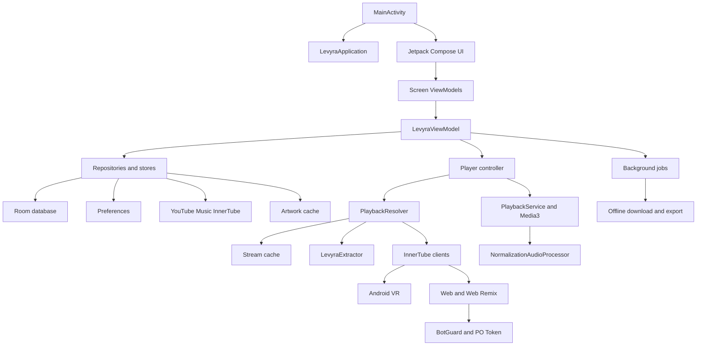

# Levyra Architecture
 
**Current application version:** 2.3.11
**Platform:** Android 8.0 and newer  
**Primary stack:** Kotlin, Jetpack Compose, AndroidX Media3, Room, WorkManager, OkHttp, Coil
 
---
 
## 1. Architectural goals
 
Levyra is designed around five non-negotiable goals:
 
1. user-triggered playback must begin through the lowest-latency valid path;
2. expensive fallback systems must not delay the common path;
3. startup and scrolling must remain responsive on low-RAM devices;
4. network, storage, decoding, and metadata work must remain outside the UI thread;
5. state visible to Compose must be stable, deduplicated, and independently projectable by screen.
 
These goals produce two priority classes:
 
```text
Critical path
├── track tap
├── stream cache lookup
├── active in-flight resolution
├── LevyraExtractor and Android VR race
├── MediaItem preparation
└── Media3 playback
 
Secondary path
├── Home refresh
├── chart enrichment
├── artwork persistence
├── Release Radar
├── diagnostics
└── speculative warm-up
```
 
The secondary path may yield, shrink, or wait. The critical path may not.
 
---
 
## 2. High-level topology
 

 
---
 
## 3. Application and UI layer
 
### 3.1 Application bootstrap
 
`LevyraApplication` owns process-wide objects such as the shared Coil image loader and startup instrumentation.
 
`MainActivity` performs the Android activity bootstrap, loads the configured theme, connects the Compose tree, and handles platform lifecycle integration.
 
### 3.2 Compose state model
 
Levyra uses unidirectional data flow:
 
```text
User input
→ ViewModel intent
→ repository, store, or player operation
→ immutable state update
→ screen projection
→ Compose rendering
```
 
Screen-specific ViewModels expose reduced projections so unrelated state changes do not force every screen to recompose.
 
The Home projection deliberately excludes continuously changing playback position. Progress is exposed separately through `HomePlaybackProgress`, allowing only the component that displays progress to update each tick.
 
### 3.3 Stable list identity
 
Lazy layouts require unique keys. Levyra uses stable media identifiers where available:
 
```text
Track       videoId
Album       browseId
Artist      channelId or browseId
Playlist    playlistId
```
 
Home sections may not always expose a remote unique identifier. Their key therefore combines normalized content identity with a positional fallback. The position prevents collisions when two sections have the same title and leading tracks, while the content portion keeps the key understandable and deterministic for the current payload.
 
---
 
## 4. Home startup architecture
 
### 4.1 Snapshot-first rendering
 
The Home pipeline restores previously saved content before requesting remote updates:
 
```text
Cold process start
├── load Home snapshot
├── load local history and preferences
├── resolve persistent artwork paths
├── publish usable local content
└── start remote refresh
```
 
Cached content is considered real content. It is not replaced by shimmer merely because a refresh is active.
 
### 4.2 Shimmer policy
 
`HomeLoadingPolicy` permits shimmer only when a section has no usable content and is actively loading.
 
```text
Usable content exists
→ keep content visible
→ suppress shimmer
 
No usable content exists and request is active
→ allow section shimmer
 
No usable content exists and no request is active
→ hide section or show empty state
```
 
This prevents loading placeholders from replacing real data during ordinary launches.
 
### 4.3 Interaction gate
 
`HomeInteractionGate` protects frame time while the user scrolls.
 
Its interaction state is stored as one immutable object inside `AtomicReference`:
 
```text
InteractionState
├── scrolling
└── lastInteractionMs
```
 
Both values are updated through compare-and-set. Background coroutines therefore cannot observe a new scrolling flag with an old timestamp.
 
Secondary work calls `awaitIdle()` before proceeding. The gate waits until:
 
1. scrolling has stopped;
2. the device-specific idle window has elapsed.
 
### 4.4 Device-specific startup work plans
 
`HomeStartupWorkPolicy` builds one of three work plans.
 
| Profile | Idle window | Priority artwork | Enrichment concurrency | Chart warm-up |
|:---|---:|---:|---:|---:|
| Standard | 420 ms | 6 | 2 | 2 |
| Power constrained | 600 ms | 3 | 1 | 1 |
| Low RAM | 700 ms | 2 | 1 | 0 |
 
The policy also limits refreshed artwork, persistent writes, chart enrichment, Release Radar artists, and releases per artist.
 
### 4.5 Playback warm-up remains separate
 
`StartupPlaybackWarmPolicy` is independent from the Home interaction gate.
 
| Profile | Delay | Track count | Concurrency |
|:---|---:|---:|---:|
| Standard | 100 ms | 3 | 1–2 |
| Power constrained | 140 ms | 1 | 1 |
| Low RAM | 180 ms | 1 | 1 |
 
This work may improve the next playback request, but a direct user tap never waits for it.
 
---
 
## 5. Artwork architecture
 
### 5.1 Shared image loader
 
Levyra uses one shared Coil `ImageLoader`. A single process-wide loader prevents fragmented memory and disk caches.
 
Artwork lookup order:
 
```text
Persistent local artwork
→ Coil memory cache
→ Coil disk cache
→ remote URL
```
 
Persistent files are stored separately from ordinary temporary cache entries for important startup artwork.
 
### 5.2 Adaptive memory budget
 
`ArtworkMemoryCachePolicy` computes the image-memory budget from:
 
- Android memory class;
- large-memory class;
- low-RAM state;
- runtime maximum heap.
 
The result is clamped to:
 
```text
Minimum       24 MB
Maximum      112 MB
Heap ceiling  25%
```
 
This prevents large modern devices from using an unnecessarily small cache and older devices from losing too much heap to decoded bitmaps.
 
### 5.3 Stable rendering
 
Persistent local files render without an unnecessary crossfade. Existing artwork remains visible during remote refresh instead of returning to a placeholder.
 
Artwork enrichment is bounded and batched. The Home state is published only after meaningful changes exist.
 
### 5.4 Startup diagnostics
 
`LevyraArtworkStartupMetrics` records:
 
- first real artwork latency;
- unique artwork requests;
- persistent-cache hits;
- remote requests;
- missing sources;
- load failures;
- model changes;
- placeholders shown after successful artwork;
- visible Home emissions;
- shimmer with usable content.
 
The report is persisted on `Dispatchers.IO` to:
 
```text
files/diagnostics/artwork-startup-metrics.json
```
 
---
 
## 6. Playback resolver
 
### 6.1 Resolution entry
 
`PlaybackResolver` receives a `Track` and resolves a playable stream.
 
```text
resolve(track)
├── validate cached stream URL
├── join existing in-flight Deferred
└── create immediate race
    ├── LevyraExtractor
    └── InnerTube resolver
```
 
The first valid result wins. Losing work is cancelled when safe.
 
### 6.2 In-flight deduplication
 
Concurrent requests for the same media key share one `Deferred`.
 
The map insertion is race-safe. When a newly created lazy `Deferred` loses `putIfAbsent`, it is cancelled before the existing request is awaited. This prevents an unstarted child from keeping the parent `coroutineScope` alive indefinitely.
 
### 6.3 InnerTube client order
 
The standard client path is:
 
```text
Android VR
→ Android Music
→ Android
→ iOS
→ Web Remix with PO Token
→ Web with PO Token
→ embedded fallback
```
 
Android VR is the primary profile:
 
```text
Client    ANDROID_VR
Version   1.65.10
Priority  0
Start     immediate
```
 
It remains first even when dynamic client-health ranking is active.
 
### 6.4 Client health
 
The resolver tracks per-client:
 
- successes;
- consecutive failures;
- average latency;
- temporary blocks;
- last update time.
 
Dynamic health can delay unhealthy fallback clients, but it does not demote Android VR.
 
### 6.5 Protected URL processing
 
Selected formats may contain `signatureCipher`, `s`, or `n`.
 
Processing order:
 
```text
Base URL
→ signature decipher
→ n transformation
→ streaming PO Token injection
→ final URL
```
 
Formats are ranked before JavaScript work. Only the selected candidate is transformed, and the JavaScript decoder starts only when the URL actually requires it.
 
---
 
## 7. YouTube playback security
 
### 7.1 Guest session
 
The session manager retains:
 
- `visitorData`;
- session generation;
- last update time;
- last rotation time.
 
Rotation may occur after:
 
- explicit rejected PO Token responses;
- explicit bot detection;
- abnormal `LOGIN_REQUIRED`;
- eligible repeated HTTP 403;
- HTTP 410;
- HTTP 429;
- automated-traffic warnings.
 
Geographic restrictions are not treated as bot failures. A cooldown prevents rotation loops.
 
### 7.2 PO Tokens
 
Levyra distinguishes:
 
- Player PO Token bound to one video ID;
- Streaming or GVS PO Token bound to the guest session.
 
The isolated WebView runtime performs BotGuard initialization and token generation only for profiles that need it.
 
```text
Player token
→ serviceIntegrityDimensions.poToken
 
Streaming token
→ final URL pot parameter
```
 
Tokens are cached with expiration safety margins and invalidated when their session rotates.
 
### 7.3 Runtime recovery
 
The security runtime can be rebuilt after failure. Sensitive token values are never written in full to logs.
 
---
 
## 8. YouTube Music Watch Context
 
`YoutubeMusicWatchRepository` treats `/youtubei/v1/next` as the central context for a selected track.
 
The parser extracts:
 
- radio queue;
- radio playlist ID;
- lyrics browse ID;
- related browse ID;
- album metadata;
- artists and browse IDs;
- duration;
- artwork;
- explicit state;
- video type;
- audio/video counterparts;
- continuation commands.
 
Supported continuation forms include:
 
- `nextRadioContinuationData`;
- `nextContinuationData`;
- `reloadContinuationData`;
- `continuationCommand`;
- `ctoken` and `continuation` requests.
 
Continuation tracks are deduplicated before queue insertion.
 
The parsed Watch Context is cached so queue, lyrics, and Related requests do not independently fetch the same response.
 
---
 
## 9. Related content and quality filtering
 
The Related parser supports mixed shelves containing:
 
- tracks;
- music videos;
- albums;
- playlists;
- artists;
- artist information.
 
Radio generation priority:
 
```text
Watch queue
→ Related tracks
→ text search
```
 
A shared quality filter rejects common alternate variants:
 
- karaoke;
- nightcore;
- slowed;
- slowed and reverb;
- sped up;
- reaction video;
- first reaction;
- reacts to.
 
The filter is contextual and does not reject legitimate titles merely containing the word `reaction`.
 
---
 
## 10. Lyrics architecture
 
The native YouTube Music path is:
 
```text
videoId
→ /next
→ lyricsBrowseId
→ /browse
```
 
The provider chain is:
 
```text
Synchronized YouTube Music
→ synchronized LRCLIB
→ plain YouTube Music
→ plain LRCLIB
→ YouTube Transcript
→ Lyrics.ovh
```
 
The parser supports timestamps, plain text, source attribution, multiple runs, and explicit line-break preservation.
 
Provider failures are isolated so one source cannot prevent later fallbacks.
 
---
 
## 11. Audio normalization
 
The resolver extracts:
 
```text
playerConfig.audioConfig.loudnessDb
playerConfig.audioConfig.perceptualLoudnessDb
```
 
Data flow:
 
```text
Player response
→ resolved stream
→ Track
→ JSON and payload codecs
→ MediaItem extras
→ PlaybackService
→ NormalizationAudioProcessor
```
 
The processor:
 
1. prefers perceptual loudness;
2. falls back to standard loudness;
3. converts decibels to linear gain;
4. attenuates loud masters;
5. prevents unsafe boost levels;
6. falls back to existing RMS normalization;
7. ramps gain changes gradually.
 
---
 
## 12. Media3 playback service
 
`PlaybackService` owns the long-running ExoPlayer and MediaSession lifecycle.
 
Responsibilities include:
 
- audio focus;
- notification and lock-screen controls;
- queue and MediaItem transitions;
- playback recovery;
- normalization processor integration;
- SponsorBlock coordination;
- background playback;
- media-session commands;
- player state publication to the application layer.
 
The UI does not own ExoPlayer directly.
 
---
 
## 13. Persistent queue
 
The Room-backed queue stores:
 
- ordered media entries;
- active index;
- playback position;
- shuffle state;
- repeat state;
- queue metadata required for reconstruction.
 
Queue restoration occurs independently from Home refresh, allowing playback state to survive process death.
 
Precache work is cancelled or recalculated when queue identity changes.
 
---
 
## 14. Downloads and offline export
 
The offline pipeline is based on WorkManager and MediaStore.
 
```text
Download request
→ Room task
→ WorkManager worker
→ stream resolution
→ bounded network copy
→ content-length validation
→ metadata and artwork tagging
→ MediaStore registration
→ completed Room state
```
 
Output directory:
 
```text
Music/Levyra
```
 
Workers use retry policies for eligible network failures and reject incomplete media files.
 
---
 
## 15. Local persistence
 
Room stores structured application state including:
 
- favorite tracks;
- playlists;
- playback queue;
- download tasks;
- completed downloads;
- listening history;
- listening events.
 
Preferences store lightweight settings such as theme, content locale, playback options, and feature toggles.
 
Home snapshots and important artwork use dedicated local files where atomic replacement is required.
 
---
 
## 16. Threading and concurrency rules
 
### Main thread
 
Allowed:
 
- Compose state publication;
- lightweight UI mapping;
- Android lifecycle callbacks;
- direct player commands that are non-blocking.
 
Not allowed:
 
- network requests;
- database queries;
- file writes;
- artwork persistence;
- JSON diagnostic persistence;
- blocking decoder work.
 
### IO dispatcher
 
Used for:
 
- network requests;
- Room operations;
- files and MediaStore;
- artwork persistence;
- diagnostic reports;
- download copying.
 
### Structured concurrency
 
- Resolver races are scoped and cancelled after a winner.
- In-flight requests are deduplicated.
- Background startup work waits on the interaction gate.
- Concurrency is bounded by device profile.
- Session and interaction state use atomic snapshots where multi-field consistency matters.
 
---
 
## 17. Error handling and recovery
 
The resolver differentiates:
 
- unavailable content;
- geographic restriction;
- invalid or expired URLs;
- signature failure;
- token rejection;
- bot detection;
- transport timeout;
- repeated HTTP status failures.
 
Recovery may include:
 
- trying the next client;
- refreshing JavaScript decoder state;
- invalidating cached streams;
- rebuilding the BotGuard runtime;
- rotating guest session;
- regenerating PO Tokens;
- falling back from video to audio-compatible sources.
 
Geographic restrictions do not trigger security-session churn.
 
---
 
## 18. Tests and release gates
 
Regression coverage includes:
 
- Watch queue and continuation parsing;
- lyrics and Related browse IDs;
- audio/video counterparts;
- mixed Related shelves;
- lyrics provider priority;
- unwanted-variant filtering;
- BotGuard parsing;
- guest-session rotation;
- geographic-restriction exclusion;
- loudness persistence and priority;
- resolver latency budgets;
- parallel-resolution behaviour;
- Home shimmer policy;
- adaptive image-memory budgets;
- artwork startup metrics;
- low-RAM startup plans;
- atomic interaction-gate behaviour;
- Home section key uniqueness.
 
Release verification commands:
 
```bash
./gradlew --no-daemon :app:lintRelease
./gradlew --no-daemon testReleaseUnitTest
./gradlew --no-daemon assembleRelease
```
 
GitHub Actions also checks APK structure, artifact naming, version metadata, workflow duplication, and accidental release of sensitive files.
 
---
 
## 19. Project layout
 
```text
app/src/main/java/com/luc4n3x/levyra
├── architecture       Experimental architectural primitives
├── data               Repositories, resolver, caches, preferences, network logic
│   ├── local          Room entities and DAOs
│   ├── network        Shared HTTP construction
│   └── security       Request-header and key handling
├── domain             Immutable models and domain engines
├── feature            Feature-oriented player foundations
├── player             Media3 service, audio processors, policies, offline pipeline
├── ui                 Compose UI, navigation, themes, visual components
└── viewmodel          Root and screen-specific state projections
 
LevyraExtractor
├── extractor          Extraction implementation
└── timeago-parser     Supporting parser module
```
 
---
 
## 20. Extension rules
 
New features should preserve these invariants:
 
- user taps must bypass secondary startup gates;
- every lazy item requires a unique stable key;
- multi-field cross-thread state must be atomically published;
- network and disk work must not run on the main thread;
- fallback systems must remain lazy;
- new Home data should not replace usable content with loading placeholders;
- low-RAM plans must remain bounded;
- every resolver or navigation change should include a regression test.
