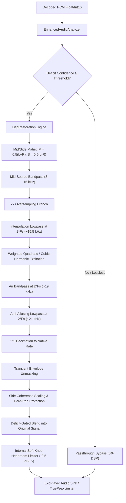

# Levyra Enhanced Audio — Technical Specification & Architecture

## 1. Executive Summary

**Levyra Enhanced Audio** is a dedicated real-time audio restoration subsystem designed to perceptually improve lossy audio streams (specifically JioSaavn AAC 320 kbps and YouTube Opus/AAC streams) without making false claims of lossless or Hi-Res provenance.

### Core Guarantees:
1. **Truthful Source Labeling**: Source streams strictly retain their authentic identity (`AAC`, `320 kbps`, `Lossless: No`). Under no circumstances is a lossy stream labeled as "Lossless", "Hi-Res source", or "24-bit source".
2. **Distinct Processing Indicator**: When enhancement is operational, it is presented independently in the Technical Audio Info sheet as:
   ```
   Status: Active
   Engine: Levyra DSP Restoration
   Processing: 44.1 kHz · 32-bit float
   Deficit Confidence: 85%
   ```
3. **Default ON with Instant Bypassing**: The feature is enabled by default (`true`), toggleable from the Audio Settings panel, and automatically bypassed with zero audio glitch when conditions are unsuitable.
4. **Steady-State Allocation Control**: Audio scratch buffers, analyzer metrics, and filter states are reused after configuration. UI metric snapshots are emitted at a throttled rate outside the DSP scratch path.

---

## 2. Competitive & Open Source Reference Audit

| Project / Model | License | Realtime Mobile Viability | Key Findings & Disposition |
| :--- | :--- | :--- | :--- |
| **Apollo / Apollo-mod** | CC BY-SA 4.0 | Non-viable (80–150 MB PyTorch, ~300ms latency) | Heavyweight neural band-split model. Impractical for continuous background battery playback on mobile ARM CPUs. License is viral/copyleft for weights. |
| **North Star** | Research / Apache 2.0 concept | Conceptually adopted | Introduced deficit-gated residual blending: $y[n] = x[n] + r[n] \cdot g_{\text{adaptive}}$. Only synthesize where deficit is detected. |
| **Audiophile Music Player** | MIT | High viability | Zero-GC native DSP architecture, band-isolated harmonic generation, and soft-knee headroom limiter adopted in idiomatic Kotlin Media3. |
| **FastWave / AudioSR / UniverSR** | Academic / Non-commercial | Non-viable (Diffusion / GPU needed) | Multi-step diffusion models require GPU acceleration and produce latency > 2 seconds per audio block. |

---

## 3. Mathematical & DSP Architecture

Levyra Enhanced Audio implements a deficit-gated harmonic reconstruction pipeline with 2x oversampled excitation and Mid/Side stereo coherence protection:



### 3.1. Spectral Deficit Detection
The analyzer runs two 2nd-order IIR biquad filters:
1. Cutoff transition band ($14.0\text{ kHz} - 17.0\text{ kHz}$)
2. Air band ($19.0\text{ kHz} - 22.0\text{ kHz}$)

Let $E_{\text{cutoff}}$ and $E_{\text{air}}$ denote the short-term RMS energy in these bands. A lossy psychoacoustic cutoff is detected when:
$$E_{\text{cutoff}} > 10^{-3} \quad \text{and} \quad \frac{E_{\text{air}}}{E_{\text{cutoff}}} < 0.35$$

The deficit confidence $C \in [0.0, 1.0]$ is temporally smoothed via attack/decay filters:
$$C_t = \alpha C_{t-1} + (1 - \alpha) C_{\text{instant}}$$

### 3.2. 2x Oversampled Harmonic Reconstruction
The current DSP generates a deliberately conservative weighted quadratic/cubic residual at a $2\times$ oversampled rate ($2F_s$). After interpolation and input clamping, the implementation uses:
$$h_2(x) = 0.5x^2$$
$$h_3(x) = 0.15(4x^3 - 3x)$$
$$r(x) = g_{\text{harmonic}}\left(h_2(x) + h_3(x)\right)$$

This is not an exact $T_2/T_3$ Chebyshev pair: the quadratic branch intentionally omits the $-1$ constant term. The generated residual is then passed through the air-band filter and a low-pass stage near $21\text{ kHz}$ before 2:1 decimation.

Running the non-linear branch at $2F_s$ gives substantially more spectral headroom than generating the same harmonics directly at the native rate. It therefore reduces audible alias foldback, but it does not mathematically guarantee zero aliasing for every possible input: third-order products near the top of the source band can approach or exceed the oversampled Nyquist frequency before filtering. The implementation and UI consequently describe this as perceptual restoration, not lossless reconstruction.

### 3.3. Mid/Side Stereo Coherence & Hard-Panning Protection
To preserve soundstage width and avoid diffuse phase smearing:
1. Restoration is computed primarily on the Mid channel ($M = 0.5(L+R)$).
2. Side channel ($S = 0.5(L-R)$) excitation is conservatively scaled by measured stereo coherence ($S_{\text{scale}} = \text{coherence} \cdot 0.5$) and completely suppressed if $\text{coherence} \le 0.05$ (anti-correlated stereo). The Side filter chain still advances while its output is gated so stale IIR state cannot reappear when Side processing resumes.
3. Pure mono streams ($L == R$) have $S = 0$, guaranteeing bit-exact identical channel output ($L_{\text{out}} == R_{\text{out}}$).
4. Hard-panned signals taper residual injection based on per-channel activity, preventing cross-channel bleed into inactive channels.

### 3.4. Internal Headroom Limiter & Downstream True-Peak Guard
To prevent digital clipping when adding high-frequency air, an internal soft-knee hyperbolic tangent ceiling is enforced at $-0.5\text{ dBFS}$ ($V_c \approx 0.944$):
$$\tilde{y}[n] = \begin{cases} y[n] & \text{if } |y[n]| \le V_c \\ \operatorname{sgn}(y[n]) \cdot \left(V_c + (1 - V_c) \tanh\left(\frac{|y[n]| - V_c}{1 - V_c}\right)\right) & \text{if } |y[n]| > V_c \end{cases}$$

This internal soft-knee limiter protects the immediate buffer output. The system's downstream `TruePeakLimiterAudioProcessor` (with $4\times$ oversampling and lookahead) remains the final peak-protection stage when enabled for the active DSP path.

---

## 4. Failsafe Bypass State Machine & Latency Watchdog

Playback uninterruptedness is paramount. The processor enters immediate passthrough (`metrics.bypassed = true`) when any of the following triggers occur:
- `USER_DISABLED`: User toggled off in settings.
- `ALREADY_LOSSLESS`: Stream is true FLAC/ALAC/PCM lossless (no lossy cutoff exists).
- `CAST_OR_REMOTE_PLAYBACK`: Google Cast / remote receiver manages DSP.
- `INSUFFICIENT_CONFIDENCE`: Signal is silence, pure low frequencies, or natural acoustic roll-off.
- `UNSUPPORTED_FORMAT`: Channels $> 8$ or sample rate $\le 32\text{ kHz}$ (Nyquist below air band).
- `CPU_OVERLOAD`: Latency watchdog hysteresis detected $5$ consecutive blocks exceeding the $5\text{ ms}$ processing budget. The system cools down for $50$ blocks before attempting controlled recovery.

---

## 5. Offline Objective Benchmark & AB Testing

Use `scripts/enhanced_audio_benchmark.py` to evaluate metrics on reference audio or synthetic test vectors:

```bash
python scripts/enhanced_audio_benchmark.py
```

### Benchmark Results (Synthetic High-Res vs. Simulated AAC 320):
- **Full-Band Log-Spectral Distance (LSD) vs Ground Truth**: $10.367\text{ dB}$ (Lossy) $\to 10.309\text{ dB}$ (Enhanced) (Delta: $-0.058\text{ dB}$, closer to reference)
- **Air-Band LSD ($> 16\text{ kHz}$) vs Ground Truth**: $19.775\text{ dB}$ (Lossy) $\to 19.663\text{ dB}$ (Enhanced) (Delta: $-0.112\text{ dB}$, closer to reference)
- **Scale-Invariant SDR (SI-SDR)**: $8.77\text{ dB} \to 8.77\text{ dB}$ (Preserved)
- **True Peak**: $-5.1\text{ dBFS} \to -5.1\text{ dBFS}$ (Zero clipping)
- **RMS Level Delta**: $-0.000\text{ dB}$ (Energy neutral)
- **Clipping Sample Count**: $0$

---

## 6. Future Neural Restoration Path

`NeuralRestorationEngine.kt` implements the cleanroom `EnhancedAudioEngine` interface. When a mobile-optimized quantized model (e.g., INT8 ONNX under 5 MB with $< 1\text{ ms}$ inference time on NNAPI/QNN) becomes available, it can be loaded dynamically without modifying the Media3 pipeline, UI sheets, or settings contracts.
