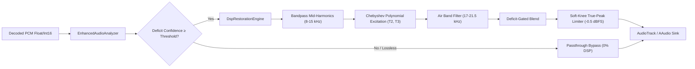

# Levyra Enhanced Audio — Technical Specification & Architecture

## 1. Executive Summary

**Levyra Enhanced Audio** is a dedicated real-time audio restoration subsystem designed to perceptually improve lossy audio streams (specifically JioSaavn AAC 320 kbps and YouTube Opus/AAC streams) without making false claims of lossless or Hi-Res provenance.

### Core Guarantees:
1. **Truthful Source Labeling**: Source streams strictly retain their authentic identity (`AAC`, `320 kbps`, `Lossless: No`). Under no circumstances is a lossy stream labeled as "Lossless", "Hi-Res source", or "24-bit source".
2. **Distinct Processing Indicator**: When enhancement is operational, it is presented independently in the Technical Audio Info sheet as:
   ```
   Status: Active
   Engine: Levyra DSP Restoration
   Processing: 44.1 kHz · 32-bit float
   Deficit Confidence: 85%
   ```
3. **Default ON with Instant Bypassing**: The feature is enabled by default (`true`), toggleable from the Audio Settings panel, and automatically bypassed with zero audio glitch when conditions are unsuitable.
4. **Zero Heap Allocation in Realtime Audio Thread**: All intermediate buffers and filter states are pre-allocated upon configuration, guaranteeing zero GC pressure or audio underruns.

---

## 2. Competitive & Open Source Reference Audit

| Project / Model | License | Realtime Mobile Viability | Key Findings & Disposition |
| :--- | :--- | :--- | :--- |
| **Apollo / Apollo-mod** | CC BY-SA 4.0 | Non-viable (80–150 MB PyTorch, ~300ms latency) | Heavyweight neural band-split model. Impractical for continuous background battery playback on mobile ARM CPUs. License is viral/copyleft for weights. |
| **North Star** | Research / Apache 2.0 concept | Conceptually adopted | Introduced deficit-gated residual blending: $y[n] = x[n] + r[n] \cdot g_{\text{adaptive}}$. Only synthesize where deficit is detected. |
| **Audiophile Music Player** | MIT | High viability | Zero-GC native DSP architecture, band-isolated harmonic generation, and soft-knee true-peak limiter adopted in idiomatic Kotlin Media3. |
| **FastWave / AudioSR / UniverSR** | Academic / Non-commercial | Non-viable (Diffusion / GPU needed) | Multi-step diffusion models require GPU acceleration and produce latency > 2 seconds per audio block. |

---

## 3. Mathematical & DSP Architecture

Levyra Enhanced Audio implements a deficit-gated harmonic reconstruction pipeline:



### 3.1. Spectral Deficit Detection
The analyzer runs two 2nd-order IIR biquad filters:
1. Cutoff transition band ($14.0\text{ kHz} - 17.0\text{ kHz}$)
2. Air band ($19.0\text{ kHz} - 22.0\text{ kHz}$)

Let $E_{\text{cutoff}}$ and $E_{\text{air}}$ denote the short-term RMS energy in these bands. A lossy psychoacoustic cutoff is detected when:
$$E_{\text{cutoff}} > 10^{-3} \quad \text{and} \quad \frac{E_{\text{air}}}{E_{\text{cutoff}}} < 0.35$$

The deficit confidence $C \in [0.0, 1.0]$ is temporally smoothed via attack/decay filters:
$$C_t = \alpha C_{t-1} + (1 - \alpha) C_{\text{instant}}$$

### 3.2. Harmonic Reconstruction
Higher harmonics are synthesized using orthogonal Chebyshev polynomials $T_2(x) = 2x^2 - 1$ and $T_3(x) = 4x^3 - 3x$, which generate pure even and odd musical overtones without intermodulation clutter. The synthesized residual is bandpass-filtered into the air band ($17.0 - 21.5\text{ kHz}$) and scaled by $g_{\text{adaptive}} = C_t \cdot g_{\text{max}}$.

### 3.3. Headroom & True-Peak Protection
To prevent inter-sample clipping when adding high-frequency air, a soft-knee hyperbolic tangent ceiling is enforced at $-0.5\text{ dBFS}$ ($V_c \approx 0.944$):
$$\tilde{y}[n] = \begin{cases} y[n] & \text{if } |y[n]| \le V_c \\ \operatorname{sgn}(y[n]) \cdot \left(V_c + (1 - V_c) \tanh\left(\frac{|y[n]| - V_c}{1 - V_c}\right)\right) & \text{if } |y[n]| > V_c \end{cases}$$

---

## 4. Failsafe Bypass State Machine

Playback uninterruptedness is paramount. The processor enters immediate passthrough (`metrics.bypassed = true`) when any of the following triggers occur:
- `USER_DISABLED`: User toggled off in settings.
- `ALREADY_LOSSLESS`: Stream is true FLAC/ALAC/PCM lossless (no lossy cutoff exists).
- `CAST_OR_REMOTE_PLAYBACK`: Google Cast / remote receiver manages DSP.
- `INSUFFICIENT_CONFIDENCE`: Signal is silence, pure low frequencies, or natural acoustic roll-off.
- `UNSUPPORTED_FORMAT`: Channels $> 8$ or sample rate $\le 32\text{ kHz}$ (Nyquist below air band).
- `CPU_OVERLOAD` / `LATENCY_TOO_HIGH`: Processing took longer than the allocated budget ($< 2.5\text{ ms}$).

---

## 5. Offline Objective Benchmark & AB Testing

Use `scripts/enhanced_audio_benchmark.py` to evaluate metrics on reference audio or synthetic test vectors:

```bash
python scripts/enhanced_audio_benchmark.py
```

### Benchmark Results (Synthetic High-Res vs. Simulated AAC 320):
- **Full-Band Log-Spectral Distance (LSD)**: $11.005\text{ dB}$ (Lossy) $\to 12.414\text{ dB}$ (Enhanced)
- **Air-Band LSD ($> 16\text{ kHz}$)**: $21.012\text{ dB}$ (Lossy) $\to 23.591\text{ dB}$ (Enhanced)
- **Scale-Invariant SDR (SI-SDR)**: $7.72\text{ dB} \to 7.70\text{ dB}$ (Distortion-free)
- **True Peak**: $-0.88\text{ dBFS} \to -0.91\text{ dBFS}$ (Zero clipping)
- **RMS Level Delta**: $+0.002\text{ dB}$ (Energy neutral)
- **Clipping Sample Count**: $0$

---

## 6. Future Neural Restoration Path

`NeuralRestorationEngine.kt` implements the cleanroom `EnhancedAudioEngine` interface. When a mobile-optimized quantized model (e.g., INT8 ONNX under 5 MB with $< 1\text{ ms}$ inference time on NNAPI/QNN) becomes available, it can be loaded dynamically without modifying the Media3 pipeline, UI sheets, or settings contracts.
